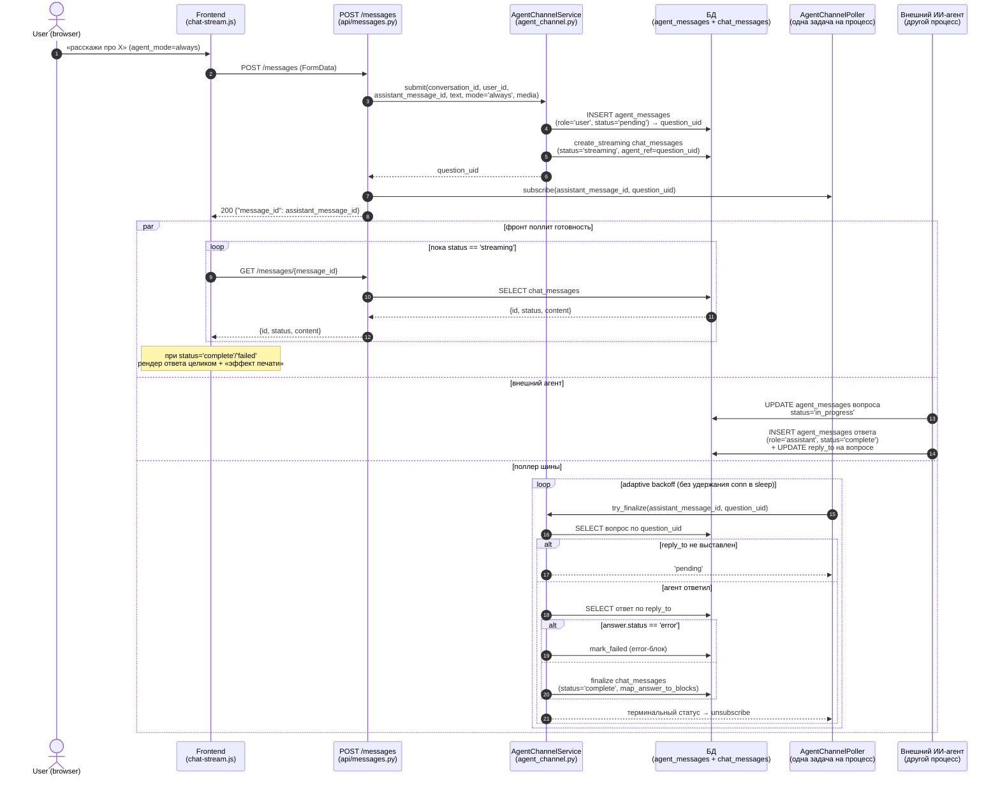
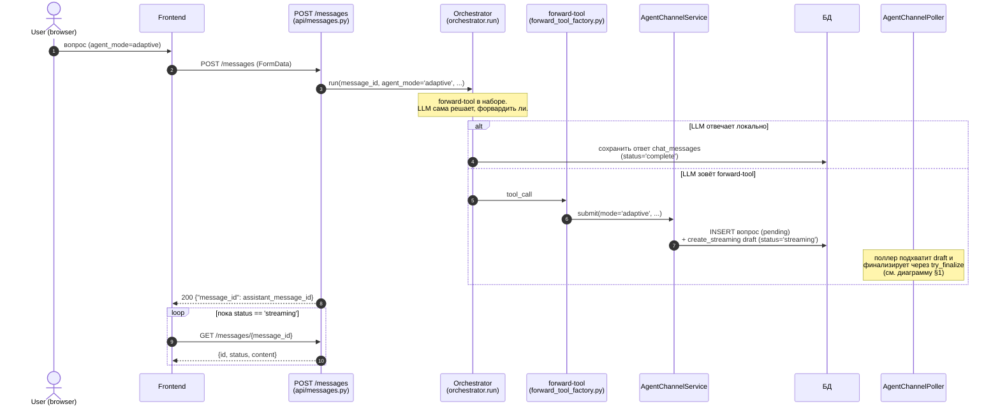

# Forward к внешнему ИИ-агенту — sequence-диаграмма

Документ описывает полный путь от пользовательского сообщения до ответа
внешнего ИИ-агента через единую bus-таблицу `agent_messages`. Транспорт —
**poll-only, без SSE**: POST на отправку сообщения отдаёт `message_id`, а фронт
затем поллит готовность ответа GET-запросом до терминального статуса и рендерит
ответ целиком с декоративным «эффектом печати» (token-стриминга нет).

См. также:
- [`docs/guides/developer-guide.md §7.8`](../guides/developer-guide.md#78-внешний-ии-агент-через-таблицы-бд) — внешний ИИ-агент через таблицы БД (обзор)
- [`docs/integrations/external-agent-imitation.sql`](../integrations/external-agent-imitation.sql) — SQL-стенд имитации внешнего агента
- [`docs/architecture/chat-frontend-architecture.md`](chat-frontend-architecture.md) — frontend-клиент чата

---

## 0. Модель данных и режимы

**Bus-таблица `agent_messages`** (единая, заменяет прежние три таблицы):
`id` (VARCHAR(36)), `chat_id`, `user_id`, `conversation_id`,
`role` CHECK(`user`/`assistant`/`tool`), `content` TEXT, `media` JSONB,
`metadata` JSONB, `reply_to`, `buttons` JSONB,
`status` CHECK(`pending`/`in_progress`/`complete`/`error`/`timeout`),
`created_at`, `updated_at`. На Greenplum: PK `(id, chat_id)`,
`DISTRIBUTED BY (chat_id)`. Роль `tool` разрешена схемой, но приложением пока не
обрабатывается.

**Связь с чатом**: `chat_messages.agent_ref VARCHAR(36)` — ссылка из
ассистент-сообщения (draft) на `id` строки-вопроса в шине.

**Режимы тумблера «База знаний ОАРБ»** (form-параметр `agent_mode`, localStorage
ключ `assistant_oarb_mode`, 3 позиции):

| Позиция UI | `agent_mode` | Поведение POST /messages |
|---|---|---|
| Выключен | `off` | Локальная LLM/GigaChat синхронно через `orchestrator.run(...)` |
| Адаптивный | `adaptive` | Оркестратор с forward-tool в наборе — сам решает, форвардить ли |
| Всегда | `always` | Прямой проброс вопроса в bus, оркестратор не запускается |

Две другие БЗ («источников», «инструментов») в UI выключены.

---

## 1. Режим «Всегда» (`always`): прямой проброс в агента

**Ключевые контракты:**

- **Поллер — единственный writer** в `chat_messages` для draft'а: `create_streaming`
  на старте, `finalize`/`mark_failed` по результату `try_finalize`. Фронт лишь
  опрашивает готовность.
- **Таймаут**: при превышении `ANSWER_TIMEOUT_SEC` (600) поллер вызывает
  `mark_timeout` → draft → `failed` с error-блоком (`build_timeout_error_block`),
  вопросу в шине ставится `status='timeout'`.
- **Reconcile после рестарта**: поллер при старте поднимает подписки из
  streaming-черновиков `chat_messages` (`get_streaming_drafts`).

---

## 2. Режим «Адаптивный» (`adaptive`): оркестратор решает сам

Режим `off` идентичен `adaptive` по транспорту, но forward-tool в наборе нет:
оркестратор всегда отвечает локально, draft сразу сохраняется со
`status='complete'`.

---

## 3. Маппинг ответа агента в блоки сообщения

`AgentChannelService.map_answer_to_blocks(row)` собирает список блоков из
строки-ответа в порядке:

1. **reasoning** — из `metadata.thinking` (если есть);
2. **text** — `content` (обрезается до `MAX_BLOCK_TEXT_SIZE` = 262144);
3. **buttons** — из `buttons` JSONB, `block_id` шаблоном `{id}:btn:0`;
   `button_translator.translate_buttons` переводит `action_id` ChatTool в
   client-action `open_url`;
4. **media** — `image`/`file` из `media` JSONB;
5. **error** — если `answer.status == 'error'`.

---

## 4. Лимит одновременных запросов

`AgentMessageRepository.count_active_for_user` вызывается **до** записи в БД.
Если активных запросов пользователя `>= max_parallel_streams_per_user`
(`CHAT__MAX_PARALLEL_STREAMS_PER_USER`, default 3) — бросается `ChatLimitError`
→ HTTP 422 с дружелюбным сообщением, ни вопрос, ни draft не создаются.

---

## 5. Граничные случаи

| Случай | Что произойдёт |
|---|---|
| Поллер ещё не дошёл до `try_finalize`, агент уже ответил | GET вернёт `status='streaming'` (draft не финализирован); следующий тик поллера выполнит `finalize`, фронт увидит `complete` на очередном опросе |
| Агент проставил `reply_to`, но строка-ответ не найдена | `try_finalize` логирует предупреждение и оставляет draft в `streaming` до таймаута |
| Ответ агента со `status='error'` | `try_finalize` → `mark_failed` с error-блоком из ответа, фронт показывает крестик |
| Превышен `ANSWER_TIMEOUT_SEC` | `mark_timeout`: draft → `failed` (error-блок таймаута), вопрос в шине → `timeout` |
| Рестарт uvicorn посреди ожидания | Поллер при старте поднимает подписки из streaming-черновиков `chat_messages` и продолжает опрос; draft остаётся виден в истории как `streaming` |
| Пользователь отправил N форвардов параллельно | Каждый получает свой `message_id`/вопрос; при `>= max_parallel_streams_per_user` активных — `ChatLimitError` (422) до записей |

---

## 6. Где смотреть в коде

- POST/GET messages — `app/domains/chat/api/messages.py` (`send_message`, `get_message`)
- AgentChannelService — `app/domains/chat/services/agent_channel.py`
  (`submit`, `try_finalize`, `mark_timeout`, `map_answer_to_blocks`, `build_timeout_error_block`)
- AgentChannelPoller — `app/domains/chat/services/agent_channel_poller.py`
  (`subscribe`/`unsubscribe`/`_tick`/`_run` adaptive-backoff, reconcile из streaming-черновиков, `start`/`stop`/`get_status`)
- button_translator — `app/domains/chat/services/button_translator.py` (`translate_buttons`)
- forward-tool (adaptive) — `app/domains/chat/services/forward_tool_factory.py`
- bus-репозиторий — `app/domains/chat/repositories/agent_message_repository.py` (`count_active_for_user`, `get_by_uid`)
- chat_messages streaming-методы — `app/domains/chat/repositories/message_repository.py`
  (`create_streaming`/`finalize`/`mark_failed`/`get_streaming_drafts`)
- настройки — `AgentChannelSettings` (`app/domains/chat/settings.py`),
  env-префикс `CHAT__AGENT_CHANNEL__`: `TABLE_NAME=agent_messages`,
  `POLL_MIN_INTERVAL_SEC=2.0`, `POLL_MAX_INTERVAL_SEC=10.0`,
  `POLL_BACKOFF_MULTIPLIER=1.5`, `ANSWER_TIMEOUT_SEC=600`, `MAX_BLOCK_TEXT_SIZE=262144`
- фоновый хук — `chat.agent_channel_poller`
- Frontend — `static/js/shared/chat/chat-stream.js`, `chat-messages.js`
