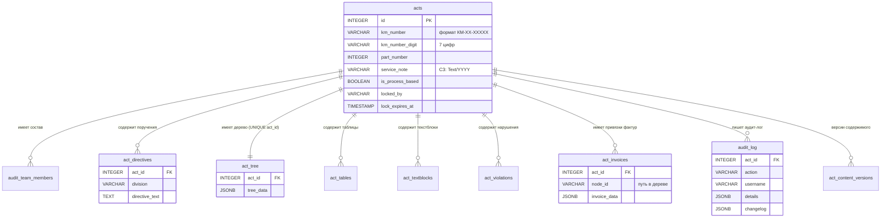
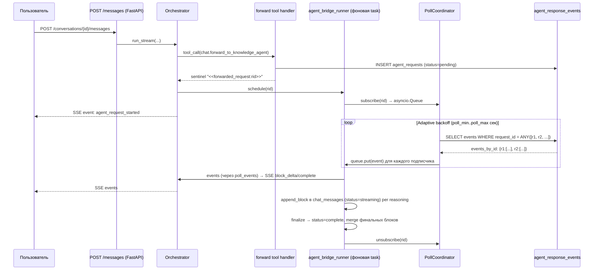

# Гайд-бук разработчика — Audit Workstation

## Связанные документы

- [`docs/onboarding.md`](onboarding.md) — план онбординга нового разработчика (день 1 / неделя 1 / недели 2-4).
- [`docs/troubleshooting.md`](troubleshooting.md) — типовые проблемы (запуск, БД, чат, JupyterHub proxy) и решения.
- [`docs/deployment-runbook.md`](deployment-runbook.md) — пошаговый чек-лист deploy / старт-проверка / rollback.
- [`docs/operations-recovery.md`](operations-recovery.md) — operator playbook: что делать при инцидентах в проде (forward-runner завис, singleton-lock, batcher overflow, denied access).
- [`docs/frontend-architecture.md`](frontend-architecture.md) — **единый deep-dive по фронту** (constructor + portal + shared): глобальные синглтоны, порядок скриптов, AppState/StorageManager/LockManager, per-node render API, диалоги, безопасность, a11y, CSS. Чат — отдельным документом ниже.
- [`docs/chat-frontend-architecture.md`](chat-frontend-architecture.md) — deep-dive по фронт-архитектуре чата: 11 ядерных модулей, SSE-маршрутизация, режимы inline/modal/popup.
- [`docs/external-agent-imitation.sql`](external-agent-imitation.sql) — SQL-сниппеты для имитации внешнего ИИ-агента (см. §7.8).
- [`docs/agent-bridge-cleanup.sql`](agent-bridge-cleanup.sql) — готовый retention-скрипт для `agent_*` таблиц (см. §9.6).
- [`docs/manual-qa-external-agent-bridge.md`](manual-qa-external-agent-bridge.md) — чек-лист ручного QA моста к внешнему агенту.
- [`docs/data-model-acts.md`](data-model-acts.md) — модель данных дерева актов.
- [`docs/logging.md`](logging.md) — формат логов и `request_id`-трассировка.
- [`docs/polling-bridge-production-checklist.md`](polling-bridge-production-checklist.md) — операторский чек-лист для forward-моста.
- [`docs/adding-chat-tool.md`](adding-chat-tool.md) — краткий чек-лист добавления нового chat-tool.
- [`docs/forward-sequence.md`](forward-sequence.md) — sequence-диаграммы forward'а (live / reload+switch / refresh, краевые случаи).

## Оглавление

- [1. Обзор проекта и быстрый старт](#1-обзор-проекта-и-быстрый-старт)
  - [1.1 Назначение и основные возможности](#11-назначение-и-основные-возможности)
  - [1.2 Требования](#12-требования)
  - [1.3 Установка и первый запуск](#13-установка-и-первый-запуск)
  - [1.4 Структура репозитория](#14-структура-репозитория)
- [2. Архитектура и принципы](#2-архитектура-и-принципы)
  - [2.1 3-tier layered architecture](#21-3-tier-layered-architecture)
  - [2.2 Жизненный цикл приложения](#22-жизненный-цикл-приложения)
  - [2.3 Adapter pattern для мультиБД](#23-adapter-pattern-для-мультибд)
  - [2.4 Domain plugin system](#24-domain-plugin-system)
  - [2.5 Middleware stack](#25-middleware-stack)
- [3. Backend: структура и паттерны](#3-backend-структура-и-паттерны)
  - [3.1 Слои: API -> Services -> Repositories](#31-слои-api---services---repositories)
  - [3.2 FastAPI Depends (DI)](#32-fastapi-depends-di)
  - [3.3 Shared API — как добавить эндпоинт](#33-shared-api--как-добавить-эндпоинт)
  - [3.4 Domain API — как добавить эндпоинт в домен](#34-domain-api--как-добавить-эндпоинт-в-домен)
  - [3.5 Pydantic-схемы](#35-pydantic-схемы)
  - [3.6 Обработка ошибок](#36-обработка-ошибок)
  - [3.7 Полный путь запроса от HTTP до БД](#37-полный-путь-запроса-от-http-до-бд)
- [4. Frontend: 3-зонная архитектура](#4-frontend-3-зонная-архитектура)
  - [4.1 Зоны и страницы](#41-зоны-и-страницы)
  - [4.2 Как добавить новый JS-модуль или CSS-компонент](#42-как-добавить-новый-js-модуль-или-css-компонент)
- [5. Доменная система: создание нового домена](#5-доменная-система-создание-нового-домена)
  - [5.1 Минимальная структура домена](#51-минимальная-структура-домена)
  - [5.2 DomainDescriptor: поля и назначение](#52-domaindescriptor-поля-и-назначение)
  - [5.3 Пошаговый пример: создание домена с нуля](#53-пошаговый-пример-создание-домена-с-нуля)
  - [5.4 Настройки домена (settings_registry)](#54-настройки-домена-settings_registry)
  - [5.5 Навигация (NavItem)](#55-навигация-navitem)
  - [5.6 Knowledge bases и chat_system_prompt](#56-knowledge-bases-и-chat_system_prompt)
  - [5.7 Жизненный цикл домена](#57-жизненный-цикл-домена)
  - [5.8 Зависимости между доменами](#58-зависимости-между-доменами)
- [6. База данных](#6-база-данных)
  - [6.1 Схема: основные и справочные таблицы](#61-схема-основные-и-справочные-таблицы)
  - [6.2 Адаптеры (PostgreSQL vs Greenplum)](#62-адаптеры-postgresql-vs-greenplum)
  - [6.3 Пул подключений (asyncpg)](#63-пул-подключений-asyncpg)
  - [6.4 BaseRepository: паттерн работы с БД](#64-baserepository-паттерн-работы-с-бд)
  - [6.5 Миграции](#65-миграции)
  - [6.5a Как добавить CHECK constraint](#65a-как-добавить-check-constraint)
  - [6.6 JSON/JSONB утилиты](#66-jsonjsonb-утилиты)
  - [6.7 Как добавить новое поле в таблицу](#67-как-добавить-новое-поле-в-таблицу)
  - [6.8 Пример: добавление новой таблицы](#68-пример-добавление-новой-таблицы)
  - [6.9 Добавление UA-справочника](#69-добавление-ua-справочника)
- [7. AI-ассистент](#7-ai-ассистент)
  - [7.1 Архитектура: chat domain](#71-архитектура-chat-domain)
  - [7.1a Профили LLM-провайдера (sglang/openrouter/openai/gigachat)](#71a-профили-llm-провайдера)
  - [7.2 ChatTool и ChatToolParam](#72-chattool-и-chattoolparam)
  - [7.3 Реестр chat tools](#73-реестр-chat-tools)
  - [7.4 Agent loop](#74-agent-loop)
  - [7.4a Resilience: retry + circuit breaker + fallback](#74a-resilience-retry--circuit-breaker--fallback)
  - [7.4b Resilience доменных батчеров и фоновых задач](#74b-resilience-доменных-батчеров-и-фоновых-задач)
  - [7.5 Knowledge bases](#75-knowledge-bases)
  - [7.6 Пример: добавление нового chat tool](#76-пример-добавление-нового-chat-tool)
  - [7.7 Фронтенд: event-driven архитектура чата](#77-фронтенд-event-driven-архитектура-чата)
  - [7.8 Внешний ИИ-агент через таблицы БД](#78-внешний-ии-агент-через-таблицы-бд)
  - [7.9 Action-handlers и ClientActionBlock](#79-action-handlers-и-clientactionblock)
- [8. Тестирование](#8-тестирование)
  - [8.1 Стек и структура](#81-стек-и-структура)
  - [8.2 Фикстуры: сброс реестров](#82-фикстуры-сброс-реестров)
  - [8.4 Тестирование сервисов и репозиториев](#84-тестирование-сервисов-и-репозиториев)
  - [8.5 Пример: тест для нового эндпоинта](#85-пример-тест-для-нового-эндпоинта)
- [9. Деплой и инфраструктура](#9-деплой-и-инфраструктура)
  - [9.1 Standalone (uvicorn)](#91-standalone-uvicorn)
  - [9.2 За JupyterHub proxy](#92-за-jupyterhub-proxy)
  - [9.3 За reverse proxy (HTTPS)](#93-за-reverse-proxy-https)
  - [9.4 Конфигурация: .env и Pydantic Settings](#94-конфигурация-env-и-pydantic-settings)
    - [9.4.1 Примеры .env для LLM-профилей](#941-примеры-env-для-llm-профилей)
    - [9.4.2 MIME-типы файлов чата (дефолт)](#942-mime-типы-файлов-чата-дефолт)
    - [9.4.3 Settings-архитектура по доменам](#943-settings-архитектура-по-доменам)
  - [9.5 Полная таблица переменных окружения](#95-полная-таблица-переменных-окружения)
  - [9.5a Observability: HTTP metrics и MetricsBatcher](#95a-observability-http-metrics-и-metricsbatcher)
  - [9.5b Diagnostics endpoint и observability_registry](#95b-diagnostics-endpoint-и-observability_registry)
  - [9.5c Audit-лог отказов доступа (access_denied_audit)](#95c-audit-лог-отказов-доступа-access_denied_audit)
  - [9.6 Retention agent-bridge таблиц](#96-retention-agent-bridge-таблиц)
- [10. Acts domain deep-dive](#10-acts-domain-deep-dive)
  - [10.1 Доменная терминология](#101-доменная-терминология)
  - [10.2 Структура дерева акта](#102-структура-дерева-акта)
  - [10.3 Жизненный цикл акта](#103-жизненный-цикл-акта)
  - [10.4 Lock-механизм и inactivity dialog](#104-lock-механизм-и-inactivity-dialog)
  - [10.5 Версионирование и аудит-лог](#105-версионирование-и-аудит-лог)
  - [10.6 Экспорт](#106-экспорт)
  - [10.7 Фактуры (invoice attachment)](#107-фактуры-invoice-attachment)
  - [10.8 URL страницы акта](#108-url-страницы-акта)
  - [10.9 Фронтенд: AppState и StorageManager](#109-фронтенд-appstate-и-storagemanager)
- [11. Chat domain deep-dive](#11-chat-domain-deep-dive)
  - [11.1 Слои сервисов и их роли](#111-слои-сервисов-и-их-роли)
  - [11.2 Orchestrator: итерации agent loop](#112-orchestrator-итерации-agent-loop)
  - [11.3 ToolCallAccumulator: сборка стрим-fragments](#113-toolcallaccumulator-сборка-стрим-fragments)
  - [11.4 GigaChat-адаптер: native functions[] под капотом](#114-gigachat-адаптер-native-functions-под-капотом)
  - [11.5 BlockEmitter: единый эмиттер SSE-блоков](#115-blockemitter-единый-эмиттер-sse-блоков)
  - [11.6 agent_bridge_runner и PollCoordinator: фоновое сохранение ассистент-сообщений](#116-agent_bridge_runner-и-pollcoordinator-фоновое-сохранение-ассистент-сообщений)
  - [11.7 Server-authoritative state для forward'а (chat_messages.status)](#117-server-authoritative-state-для-forwardа-chat_messagesstatus)
- (§12 и §13 — зарезервированы)
- [14. API contracts (list, limits, error envelope)](#14-api-contracts-list-limits-error-envelope)
  - [14.1 Paginated response](#141-paginated-response)
  - [14.2 Pagination limits и UI-паттерн Load More](#142-pagination-limits-и-ui-паттерн-load-more)
  - [14.3 Error envelope](#143-error-envelope)
  - [14.4 Kerberos handler — special-case](#144-kerberos-handler--special-case)

---

## 1. Обзор проекта и быстрый старт

### 1.1 Назначение и основные возможности

Audit Workstation — веб-приложение для создания и управления актами аудиторских проверок. Все пользовательские интерфейсы и доменная терминология на русском языке.

**Основные возможности:**

- Создание и редактирование актов проверок с иерархической структурой (дерево разделов)
- Работа с таблицами, текстовыми блоками и карточками нарушений
- Экспорт актов в DOCX, Markdown и текстовый формат
- Система блокировок для совместной работы (exclusive editing)
- AI-ассистент с function-calling для извлечения и анализа данных актов
- Аудит-лог изменений и версионирование содержимого
- Прикрепление фактур к пунктам акта (Hive/Greenplum)
- Ролевая модель доступа (Куратор, Руководитель, Редактор, Участник)

**Доменная терминология:**

| Термин | Описание |
|--------|----------|
| КМ-номер | Номер контрольного мероприятия (формат `КМ-XX-XXXXX`) |
| Служебная записка | Номер документа при отправке руководству (формат `Текст/ГГГГ`) |
| Поручение (directive) | Задача структурному подразделению на исправление/улучшение |
| Фактура (invoice) | Привязка к таблице данных в Hive/Greenplum |

Полная доменная терминология актов (форматы, валидация, роли, протекшен) — в §10.1.

### 1.2 Требования

| Компонент | Минимум | Назначение |
|-----------|---------|-----------|
| Python | 3.11 | Runtime |
| PostgreSQL | 14 | Основная БД (разработка и production) |
| Greenplum | 6.x | Альтернативная БД (DataLab) |
| Kerberos `kinit` | — | Только для Greenplum (auth) |

Точные версии Python-пакетов — в `requirements.txt`.

### 1.3 Установка и первый запуск

**Локальная разработка (PostgreSQL):**

```bash
# 1. Клонировать репозиторий
git clone <repo-url>
cd "Act Constructor"

# 2. Создать виртуальное окружение
python -m venv venv
source venv/bin/activate  # Linux/Mac
venv\Scripts\activate     # Windows

# 3. Установить зависимости
pip install -r requirements.txt

# 4. Создать .env (скопировать из шаблона)
cp .env.example .env
# Отредактировать .env — указать параметры БД

# 5. Запустить
python -m app.main
```

Приложение будет доступно по адресу `http://localhost:8005` (порт берётся из `SERVER__PORT`; в `.env.example` задан `8005`).

**DataLab / JupyterHub (Greenplum):**

```bash
# 1. Авторизоваться через Kerberos
kinit

# 2. Настроить .env
DATABASE__TYPE=greenplum
DATABASE__GP__HOST=gp_dns_pkap1123_audit.gp.df.sbrf.ru
DATABASE__GP__SCHEMA=s_grnplm_ld_audit_da_project_4

# 3. Запустить
python -m app.main
```

Таблицы создаются автоматически при первом запуске.

### 1.4 Структура репозитория

```
Act Constructor/
├── app/                          — основной пакет приложения
│   ├── main.py                   — точка входа FastAPI (app factory, lifespan)
│   ├── core/                     — ядро (config, middleware, domain registry)
│   ├── db/                       — БД (adapters, connection pool, base repository)
│   ├── domains/                  — доменные плагины (acts, admin, ck_*)
│   ├── api/v1/                   — shared API (auth, system, roles)
│   ├── routes/                   — shared HTML routes
│   ├── schemas/                  — shared Pydantic-модели
│   ├── services/                 — shared сервисы
│   ├── formatters/               — shared утилиты форматирования
│   └── integrations/             — shared интеграции
├── static/                       — CSS, JS, изображения
│   ├── css/                      — 3-зонная CSS архитектура
│   └── js/                       — 3-зонная JS архитектура
├── templates/                    — Jinja2 шаблоны
├── tests/                        — pytest тесты
├── docs/                         — документация
├── scripts/                      — вспомогательные скрипты
├── acts_storage/                 — файловое хранилище актов (StorageService)
├── .env.example                  — шаблон конфигурации
├── requirements.txt              — зависимости
├── requirements-dev.txt          — dev-зависимости (pytest и т.д.)
└── pytest.ini                    — конфигурация pytest
```

---

## 2. Архитектура и принципы

### 2.1 3-tier layered architecture

Приложение построено по трехслойной архитектуре с доменной plugin-системой:

```
Browser (vanilla JS)
    ↓ HTTP/JSON + HTML
FastAPI Application (app/main.py)
    ├── Middleware (HTTPS → RequestSize → RateLimit)
    ├── Shared HTML Routes (portal — landing page)
    ├── Shared API Routes (auth, system, roles)
    ├── Domain Plugin Registry (domain_registry.py)
    │   └── acts/     — API, routes, services, repositories
    │   └── admin/    — API, routes, services, repositories
    │   └── chat/     — AI-ассистент (SSE-стриминг, conversation persistence)
    │   └── ck_*/     — верификация метрик
    └── Database Layer
        ├── Connection Pool (asyncpg)
        ├── Adapters (PostgreSQL | Greenplum)
        └── Base Repository (conn + adapter)
```

**Принципы:**
- Каждый слой зависит только от нижележащего
- Бизнес-логика в сервисах, SQL-запросы в репозиториях
- API-эндпоинты тонкие — только вызов сервисов и возврат результата
- Домены изолированы друг от друга (кроме явных зависимостей)

**ER-диаграмма ключевых таблиц домена `acts`:**



> Уникальность акта обеспечивается парой `(km_number_digit, part_number)` **на уровне приложения** (`ActCrudService.create_act`), а не БД-констрейнтом: на Greenplum `DISTRIBUTED BY` должен быть подмножеством каждого `UNIQUE` (см. §6.5), а DB-UNIQUE по этой паре потребовал бы либо `DISTRIBUTED REPLICATED` (копия на каждом сегменте), либо смены distribution с потерей co-location. Это сознательный компромисс, не баг.

### 2.2 Жизненный цикл приложения

Приложение управляется фабрикой `create_app()` в `app/main.py`.

**Порядок инициализации:**

```
1. Settings         — загрузка конфигурации из .env
2. Logging          — настройка уровня логирования
3. discover_domains() — сканирование app/domains/* с регистрацией Settings и chat_tools
4. Middleware       — добавление в обратном порядке (см. раздел 2.5)
5. Static files     — монтирование /static и /favicon.ico
6. Exception handlers — регистрация обработчиков ошибок
7. Router registration:
   ├── Shared HTML routes
   ├── Shared API routes
   └── Domain API/HTML routes    — автоматически через domain_registry
8. Lifespan startup (при запуске ASGI-сервера):
   ├── ensure_directories()                — проверка templates/ и static/
   ├── init_db(settings)                   — создание asyncpg пула
   ├── create_tables_if_not_exist(domains) — автосоздание таблиц из schema.sql
   ├── domain.on_startup()                 — per-domain, в порядке топосорта
   ├── get_startup_hooks()                 — инфраструктурные hooks (см. §5.7)
   └── singleton_lock.acquire()            — захват per-process блокировки
```

**Финальный порядок инфраструктурных startup-hooks** (регистрируются в `_build_domain`, выполняются в порядке регистрации):

1. `acts.audit_log_batcher`
2. `acts.expired_locks_cleanup`
3. `admin.http_metrics_batcher`
4. `admin.access_denied_audit_batcher`
5. `admin.db_pool_monitor`
6. `chat.tool_metrics_batcher`
7. `chat.poll_coordinator`
8. `chat.audit_log_batcher`
9. `chat.agent_events_cleanup`

Что делает каждый hook — в §9.5b (один раздел, без дублирования).

**Порядок остановки:**

```
1. get_shutdown_hooks() — в обратном порядке регистрации
2. domain.on_shutdown() — в обратном порядке (только стартовавшие домены)
3. close_db()           — закрытие asyncpg пула
```

> **Важно:** startup-hooks вызываются **после** `discover_domains` / `settings_registry` / `init_db`, но **до** singleton-lock. Это нужно, чтобы инфраструктурные сервисы (батчеры, фоновые таски) видели готовый pool и зарегистрированные Settings, но не работали в воркере, у которого singleton-lock уже занят другим процессом.

**Защита от частичного старта:** если домен N падает при startup, вызываются `on_shutdown()` для доменов 1..N-1:

```python
started: list = []
for d in domains:
    if d.on_startup:
        await d.on_startup(app)
    started.append(d)
# При ошибке:
for d in reversed(started):
    if d.on_shutdown:
        await d.on_shutdown(app)
```

### 2.3 Adapter pattern для мультиБД

Приложение поддерживает две СУБД через паттерн Adapter. Подробнее см. [раздел 6.2](#62-адаптеры-postgresql-vs-greenplum).

```
DatabaseAdapter (абстрактный)
    ├── PostgreSQLAdapter   — имена с префиксом, CASCADE, GIN-индексы
    └── GreenplumAdapter    — schema-квалифицированные имена с префиксом, BIGSERIAL, Kerberos
```

Адаптер выбирается при старте по значению `DATABASE__TYPE` и доступен глобально через `get_adapter()`.

### 2.4 Domain plugin system

Домены обнаруживаются автоматически сканированием директории `app/domains/`. Каждый домен — изолированный Python-пакет с `__init__.py`, экспортирующим `_build_domain() -> DomainDescriptor`.

Подробнее о создании доменов см. [раздел 5](#5-доменная-система-создание-нового-домена).

**Текущие домены:**

| Домен | Статус | Описание |
|-------|--------|----------|
| `acts` | Основной | Создание и управление актами |
| `admin` | Активный | Администрирование, управление ролями |
| `chat` | Активный | AI-ассистент (conversations, SSE-стриминг, function-calling, файлы). Фронтенд: event-driven (11 модулей через ChatEventBus) |
| `ck_fin_res` | Активный | ЦК Финансовый результат — верификация метрик FR |
| `ck_client_exp` | Активный | ЦК Клиентский опыт — верификация метрик CS |
| `ua_data` | Активный | Справочные данные УА — словари процессов, ТБ, подразделений, метрик нарушений. Зависит от `admin` |

### 2.5 Middleware stack

В `create_app()` подключаются шесть middleware. В Starlette порядок выполнения обратный порядку регистрации: последний `add_middleware` обрабатывает запрос первым.

**Порядок выполнения при запросе:**

```
Запрос → RequestId → HttpMetrics → RateLimit → RequestSizeLimit → SecurityHeaders → HTTPSRedirect → FastAPI → Ответ
```

| Middleware | Назначение |
|-----------|-----------|
| `RequestIdMiddleware` | Берёт `X-Request-ID` из заголовка или генерирует свой. Кладёт в `ContextVar`, возвращает в заголовке ответа. Стоит внутри всех остальных, чтобы request_id виделся в логах любого слоя. |
| `HttpMetricsMiddleware` | Меряет latency и пишет HTTP-метрики через batched `HttpMetricsService` (см. §9.5a). При выключенном admin.http_metrics_enabled только меряет, в БД не пишет. |
| `RateLimitMiddleware` | Per-IP лимит запросов через TTLCache. Дефолт — 1024 req/min. |
| `RequestSizeLimitMiddleware` | Ограничивает размер тела запроса. Реализован как raw ASGI: `BaseHTTPMiddleware` буферизует тело до `dispatch()`, а здесь нужно резать по байтам в стриме. |
| `SecurityHeadersMiddleware` | Ставит CSP / HSTS / X-Frame-Options. Стоит снаружи RateLimit/RequestSize, чтобы заголовки попадали и в их 413/429-ответы. |
| `HTTPSRedirectMiddleware` | Переписывает `scheme` на `https` по заголовкам `x-forwarded-proto` / `x-scheme`. Outermost — должен отработать до SecurityHeaders, который опирается на scheme. |

Все классы — в `app/core/middleware.py`, кроме `HttpMetricsMiddleware` (он лежит в `app/core/middlewares/http_metrics.py`).

---

## 3. Backend: структура и паттерны

### 3.1 Слои: API -> Services -> Repositories

```
Эндпоинт (HTTP)
    ↓ FastAPI Depends()
Service (бизнес-логика)
    ├── AccessGuard — проверка доступа
    ├── Repository  — SQL-запросы
    ├── Валидация, трансформация
    └── Repository  — сохранение
    ↓
Ответ клиенту
```

**Shared API** (`app/api/v1/`):

```
app/api/v1/
├── routes.py              — главный роутер (агрегирует shared endpoints)
├── deps/
│   ├── auth_deps.py       — get_username() — проверка авторизации
│   └── role_deps.py       — require_admin() — проверка роли Админ
└── endpoints/
    ├── auth.py            — GET /me, /validate
    ├── roles.py           — /roles/ (интеграция с admin доменом)
    └── system.py          — health, version
```

**Domain API** (`app/domains/acts/api/`):

```
app/domains/acts/api/
├── __init__.py            — get_api_routers() → [(router, prefix, tags)]
├── management.py          — CRUD + блокировка
├── content.py             — загрузка/сохранение содержимого
├── export.py              — экспорт в форматы
├── invoice.py             — работа с фактурами
├── audit_log.py           — история операций
└── users.py               — поиск пользователей для autocomplete участников
```

**Сервисы домена актов:**

| Сервис | Файл | Назначение |
|--------|------|-----------|
| `ActCrudService` | `act_crud_service.py` | CRUD, управление метаданными |
| `ActLockService` | `act_lock_service.py` | Блокировка с инактивностью |
| `ActContentService` | `act_content_service.py` | Содержимое (дерево, таблицы, текст) |
| `ActInvoiceService` | `act_invoice_service.py` | CRUD фактур, валидация метрик |
| `ExportService` | `export_service.py` | Форматирование через ThreadPoolExecutor |
| `StorageService` | `storage_service.py` | Файловый I/O (`acts_storage/`) |
| `AuditLogService` | `audit_log_service.py` | История операций, восстановление версий |
| `AccessGuard` | `access_guard.py` | Проверка доступа и прав |

**Репозитории домена актов** (`app/domains/acts/repositories/`):

| Репозиторий | Файл | Назначение |
|-------------|------|-----------|
| `ActCrudRepository` | `act_crud.py` | CRUD-операции с метаданными актов |
| `ActContentRepository` | `act_content.py` | Чтение дерева, таблиц, текстблоков, нарушений |
| `ActContentVersionRepository` | `act_content_version.py` | Снимки содержимого для истории |
| `ActLockRepository` | `act_lock.py` | Блокировка актов (pessimistic locking) |
| `ActAccessRepository` | `act_access.py` | Управление доступом и правами |
| `ActInvoiceRepository` | `act_invoice.py` | CRUD фактур |
| `ActAuditLogRepository` | `act_audit_log.py` | Запись и чтение журнала операций |
| `ActUsersRepository` | `act_users.py` | Поиск пользователей в справочнике (autocomplete) |

**Форматтеры экспорта** (`app/domains/acts/formatters/`):

| Форматтер | Файл | Назначение |
|-----------|------|-----------|
| `DocxFormatter` | `docx_formatter.py` | Экспорт акта в DOCX (python-docx) |
| `MarkdownFormatter` | `markdown_formatter.py` | Экспорт акта в Markdown |
| `TextFormatter` | `text_formatter.py` | Экспорт акта в plain text |

Базовый класс форматтеров — `app/domains/acts/formatters/base_formatter.py` (общий интерфейс и обход дерева).

Общие утилиты в `app/domains/acts/formatters/utils/`:

| Утилита | Файл | Назначение |
|---------|------|-----------|
| `formatting_utils.py` | Текстовые утилиты | Форматирование строк, отступов |
| `html_utils.py` | HTML-утилиты | Парсинг и очистка HTML-контента |
| `json_utils.py` | JSON-утилиты | Трансформация JSON-структур |
| `table_utils.py` | Табличные утилиты | Форматирование табличных данных |

### 3.2 FastAPI Depends (DI)

Все сервисы получают `asyncpg.Connection` из пула через async generator:

```python
# app/domains/acts/deps.py
async def get_crud_service(
    settings: Settings = Depends(get_settings),
) -> AsyncGenerator[ActCrudService, None]:
    async with get_db() as conn:
        yield ActCrudService(conn=conn, settings=settings)
```

**Цепочка зависимостей:**

```
Эндпоинт
    ↓ Depends()
    ├── get_username() → str (или HTTPException 401)
    └── get_crud_service() → async generator
        └── get_db() → asyncpg.Connection из пула
            └── Service.__init__(conn, settings)
                └── Repository(conn)
                    └── self.adapter = get_adapter()
```

Connection автоматически возвращается в пул после завершения запроса.

**Auth dependency** (`app/api/v1/deps/auth_deps.py`):

```python
def get_username() -> str:
    username = get_current_user_from_env()
    if not username:
        raise HTTPException(status_code=401, detail="Требуется авторизация")
    return username
```

### 3.3 Shared API — как добавить эндпоинт

**Шаг 1.** Добавить функцию в существующий файл `app/api/v1/endpoints/*.py` или создать новый:

```python
# app/api/v1/endpoints/auth.py
@router.post("/logout", status_code=200)
async def logout(username: str = Depends(get_username)):
    logger.info(f"Пользователь {username} вышел из системы")
    return {"message": "Успешно вышли из системы"}
```

**Шаг 2.** Если создан новый файл — зарегистрировать в `app/api/v1/routes.py`:

```python
from app.api.v1.endpoints import auth, system, roles, new_module

ROUTERS = [
    (auth, "/auth", ["Авторизация"]),
    (system, "/system", ["Системные операции"]),
    (roles, "/roles", ["Роли пользователей"]),
    (new_module, "/new", ["Новый модуль"]),  # добавить
]
```

Результат: эндпоинт доступен по `POST /api/v1/auth/logout`.

### 3.4 Domain API — как добавить эндпоинт в домен

**Шаг 1.** Создать файл `app/domains/acts/api/status.py`:

```python
from fastapi import APIRouter, Depends
from app.api.v1.deps.auth_deps import get_username
from app.domains.acts.deps import get_crud_service

router = APIRouter()

@router.get("/{act_id}/status")
async def get_act_status(
    act_id: int,
    username: str = Depends(get_username),
    service: ActCrudService = Depends(get_crud_service),
):
    act = await service.get_act(act_id, username)
    return {"act_id": act.id, "locked": act.locked_by is not None}
```

**Шаг 2.** Зарегистрировать в `app/domains/acts/api/__init__.py`:

```python
from app.domains.acts.api.status import router as status_router

def get_api_routers():
    return [
        # ... существующие
        (status_router, "/acts", ["Статус актов"]),
    ]
```

Результат: `GET /api/v1/acts/{act_id}/status`.

### 3.5 Pydantic-схемы

Схемы запросов и ответов определяются в `app/domains/acts/schemas/`:

| Файл | Модели |
|------|--------|
| `act_metadata.py` | `ActCreate`, `ActUpdate`, `AuditTeamMember`, `ActDirective`, `UserSearchResult` |
| `act_content.py` | `ActItemSchema`, `TableSchema`, `TextBlockSchema`, `ViolationSchema`, `ActDataSchema`, `ActSaveResponse` |
| `act_invoice.py` | `InvoiceSave`, `MetricItem` |
| `act_audit_log.py` | Модели для аудит-лога |
| `act_responses.py` | Модели ответов API (списки актов, метаданные, статусы) |

Схемы чата определены в домене `app/domains/chat/schemas/`:

```python
# app/domains/chat/schemas/requests.py
class CreateConversationRequest(BaseModel):
    domain_name: str | None = None
    context: dict | None = None

class UpdateConversationRequest(BaseModel):
    title: str

# app/domains/chat/schemas/responses.py
class ConversationResponse(BaseModel):
    id: int
    title: str
    domain_name: str | None
    created_at: datetime
    updated_at: datetime

class MessageResponse(BaseModel):
    id: int
    role: str
    content: list[dict]
    created_at: datetime
```

Сообщения отправляются через `FormData` (message + files + domains), не через JSON body.

### 3.6 Обработка ошибок

**Базовый класс** (`app/core/exceptions.py`):

```python
class AppError(Exception):
    status_code: int = 500
    code: ClassVar[str] = "app-error"  # kebab-case, уникальный на подкласс

    def __init__(self, message: str) -> None:
        self.message = message
        self.extra: dict[str, Any] = {}  # доп. поля envelope-а
        super().__init__(message)

    def to_envelope(self) -> dict[str, Any]:
        envelope = {"detail": self.message, "code": self.code}
        if self.extra:
            envelope["extra"] = self.extra
        return envelope
```

**Унифицированный error envelope** для всех HTTP-ответов:

```json
{"detail": "Человекочитаемое сообщение", "code": "kebab-case-machine-code", "extra": {...}}
```

`extra` — опциональный объект с типизированными доп. полями (например `{"locked_by": "11111111", "locked_until": "..."}` для `ActLockError`). Если у исключения нет доп. полей, `extra` в envelope **отсутствует**, не `null`.

**Доменные исключения**:

| Исключение | HTTP-код | `code` | Назначение |
|-----------|----------|--------|-----------|
| `ActNotFoundError` | 404 | `act-not-found` | Акт не найден |
| `AccessDeniedError` | 403 | `access-denied` | Нет доступа |
| `InsufficientRightsError` | 403 | `insufficient-rights` | Роль не позволяет |
| `ActLockError` | 409 | `act-locked` | Конфликт блокировки (extra: locked_by, locked_until) |
| `KmConflictError` | 409 | `km-number-exists` | КМ уже существует (extra: km_number, current_parts, next_part) |
| `ActValidationError` | 400 | `act-validation` | Бизнес-валидация |
| `UnsupportedFormatError` | 400 | `act-unsupported-format` | Неподдерживаемый формат экспорта |
| `ActExportValidationError` | 400 | `act-export-validation` | Бизнес-валидация при экспорте |
| `ActExportTimeoutError` | 408 | `act-export-timeout` | Таймаут экспорта |
| `ManagementRoleRequiredError` | 403 | `act-management-role-required` | Требуется Куратор/Руководитель |
| `InvoiceError` | 400 | `act-invoice-error` | Ошибка фактуры |
| `ChatLimitError` | 422 | `chat-limit-exceeded` | Превышен лимит чата |
| `ChatFileValidationError` | 422 | `chat-file-validation` | Файл не прошёл валидацию |
| `ChatFileNotFoundError` | 404 | `chat-file-not-found` | Файл чата не найден |
| `ChatToolValidationError` | 400 | `chat-tool-validation` | ChatTool: невалидный вызов |
| `ChatStreamAlreadyActiveError` | 429 | `chat-stream-already-active` | Уже идёт активный SSE |
| `ChatRateLimitError` | 429 | `chat-rate-limit` | Per-user rate-limit (extra: retry_after_sec) |
| `ConversationNotFoundError` | 404 | `conversation-not-found` | Беседа не найдена |
| `ConversationLockedError` | 409 | `conversation-locked` | Беседа занята активным стримом |
| `OptimisticLockFailed` | 409 | `chat-optimistic-lock-failed` | Optimistic lock в agent_request |
| `UserNotFoundError` | 404 | `admin-user-not-found` | Пользователь не найден |
| `RoleNotFoundError` | 404 | `admin-role-not-found` | Роль не найдена |
| `AdminAccessDeniedError` | 403 | `admin-access-denied` | Не админ |
| `LastAdminError` | 409 | `admin-last-admin` | Последний админ |
| `FRRecordNotFoundError` | 404 | `ck-fin-res-record-not-found` | FR-запись не найдена |
| `FRValidationError` | 400 | `ck-fin-res-validation` | FR-валидация |
| `CSRecordNotFoundError` | 404 | `ck-client-exp-record-not-found` | CS-запись не найдена |
| `CSValidationError` | 400 | `ck-client-exp-validation` | CS-валидация |

`AppError` напрямую (без подкласса) → `code = "app-error"` (fallback, используется в обёртках OSError/MemoryError в `ExportService`).

**Не-AppError-обработчики** в `main.py` тоже добавляют `code`:
- `UniqueViolationError` → 409 + `code: db-unique-violation`
- `CheckViolationError` → 422 + `code: db-check-violation`
- `HTTPException` (FastAPI) → status + `code: http-error`
- любой `Exception` → 500 + `code: internal-server-error`

**Special-case** — Kerberos handler не меняет формат: возвращает `{"error": "kerberos_token_expired", "detail": ..., "instructions": [...], "action_required": "kinit"}`. Это сознательное исключение — фронт показывает развёрнутую инструкцию, формат завязан на UI.

**Exception handlers** регистрируются в `main.py` и работают автоматически:

```python
@app.exception_handler(AppError)
async def app_error_handler(request, exc):
    if _is_html_request(request):
        return _render_error_page(request, exc.status_code)
    return JSONResponse(status_code=exc.status_code, content=exc.to_envelope())
```

Нет необходимости в try-except в эндпоинтах — достаточно бросить исключение из сервиса.

### 3.7 Полный путь запроса от HTTP до БД

Пример: `GET /api/v1/acts/list` — получение списка актов.

```
1. HTTP запрос → Middleware chain (HTTPS → Size → RateLimit)
2. FastAPI routing → acts/api/management.py:get_acts_list()
3. Depends(get_username) → извлечение username из окружения
4. Depends(get_crud_service):
   a. get_db() → asyncpg.Connection из пула
   b. ActCrudService(conn, settings)
5. service.list_acts(username):
   a. self._crud.get_user_acts(username) → SQL SELECT
   b. Возврат [ActListItem, ...]
6. FastAPI → JSON response → клиент
7. Connection возвращается в пул (async generator cleanup)
```

---

## 4. Frontend: 3-зонная архитектура

> **Deep-dive по фронту — в [`docs/frontend-architecture.md`](frontend-architecture.md)** (15 глав, ~1200 строк): глобальные синглтоны и порядок скриптов, AppConfig и JupyterHub-proxy, AppState (Proxy deep-tracking), StorageManager (state machine + persistence), LockManager и inactivity, Tree/items/per-node render API, PreviewManager, диалоги, Acts manager, безопасность, accessibility, CSS-каскад, открытые техдолги. Этот §4 — короткое содержание для тех, кто пришёл за обзором.
>
> **Чат-фронт — отдельно**: [`docs/chat-frontend-architecture.md`](chat-frontend-architecture.md), плюс event-driven раздел §7.7 ниже.

### 4.1 Зоны и страницы

Vanilla JS (ES6+), **без бандлера и без npm-зависимостей**. Браузер грузит десятки `<script defer>` в строго заданном порядке, модули общаются через глобальные синглтоны на `window` (см. `frontend-architecture.md` §2). ES-modules не используются — упрощает деплой в JupyterHub без node-tooling'а.

| Зона | `static/js/` | Назначение |
|------|--------------|------------|
| `shared/` | 25 модулей (вкл. 12 модулей чата + `ck/*` + `dialog/*`) | Кросс-зональный код: `AppConfig`, `APIClient`, `AuthManager`, `Notifications`, `SafeHTML`, `ErrorBoundary`, `DialogBase`/`DialogManager`, `FilterEngine` |
| `portal/` | 22 модуля | Sidebar-страницы: landing, acts-manager, admin, ck-fin-res, ck-client-exp |
| `constructor/` | 54 модуля | Редактор актов (`/constructor?act_id=N`): state/, tree/, items/, table/, textblock/, violation/, preview/, dialog/, context-menu/, header/, validation/, services/ |

Всего ~101 JS-файл и ~78 CSS-файлов (свежие цифры — `frontend-architecture.md` §1.1).

**Страницы приложения:**

| Страница | URL | Базовый шаблон | JS точка входа |
|----------|-----|---------------|----------------|
| Landing | `GET /` | `base_portal.html` | `landing-page.js` |
| Acts Manager | `GET /acts` | `base_portal.html` | `acts-manager-page.js` |
| Constructor | `GET /constructor?act_id=X` | `base_constructor.html` | `app.js` |
| Admin | `GET /admin` | `base_portal.html` | `admin-page.js` |
| ЦК (`/ck-fin-res`, `/ck-client-exp`) | `base_portal.html` (extends `_ck_layout.html`) | `ck-*-page.js` |

**CSS — 3 entry-point файла**, каждый для своей зоны:

```
static/css/entry/{shared,portal,constructor}.css
portal.css     → @import './shared.css' → base/ + shared/
constructor.css → @import './shared.css' + constructor-specific (45 файлов в каскаде)
```

CSS-переменные (576 шт.) — `static/css/base/variables.css`. Cache-busting через Jinja-фильтр `versioned` (`{{ 'css/entry/...' | versioned }}`).

**Jinja2** — две независимые базы наследования: `templates/portal/base_portal.html` и `templates/constructor/base_constructor.html`. Деталь и порядок `<script>` — `frontend-architecture.md` §2.

<!-- 4.2-4.6 поглощены в frontend-architecture.md (§2, §3, §4, §5, §13). Эта секция оставлена тонкой как навигационная. -->

### 4.2 Как добавить новый JS-модуль или CSS-компонент

**Добавление JS-модуля:**

1. Создать файл в соответствующей зоне: `static/js/<zone>/<module>.js`.
2. Опубликовать singleton через `window.X = ...` (НЕ `const X = ...` — в `<script>`-блоке `const` создаёт Script-scope-переменную и **не** становится свойством `window`). Деталь и реестр всех singletons — `frontend-architecture.md` §2.
3. Добавить `<script defer>` тег в базовый шаблон зоны (`base_portal.html` или `base_constructor.html`). **Порядок критичен** — зависимости раньше потребителей. Snapshot-тест: `tests/test_template_script_order.py`.
4. Все `fetch` и навигации — через `AppConfig.api.getUrl()` (иначе 404 под JupyterHub-proxy). См. `frontend-architecture.md` §3.

**Добавление CSS-компонента:**

1. Создать файл: `static/css/<zone>/<category>/<component>.css`.
2. Добавить `@import` в entry point зоны:
   - `static/css/entry/shared.css` — автоматически доступен везде.
   - `static/css/entry/portal.css` — только portal-страницы.
   - `static/css/entry/constructor.css` — только редактор.


---

## 5. Доменная система: создание нового домена

### 5.1 Минимальная структура домена

```
app/domains/<name>/
├── __init__.py          — обязательно: _build_domain() → DomainDescriptor
├── settings.py          — опционально: BaseModel с настройками
├── deps.py              — опционально: FastAPI Depends
├── exceptions.py        — опционально: наследники AppError
├── _lifecycle.py        — опционально: on_startup / on_shutdown
├── api/
│   ├── __init__.py      — get_api_routers() → [(router, prefix, tags)]
│   └── <endpoints>.py   — APIRouter
├── routes/
│   ├── __init__.py      — get_html_routers() → [router]
│   └── <pages>.py       — HTML-роуты (Jinja2)
├── services/            — бизнес-логика
├── repositories/        — доступ к БД (наследуют BaseRepository)
├── schemas/             — Pydantic-модели
├── integrations/
│   └── chat_tools.py    — определения ChatTool для AI
└── migrations/
    ├── postgresql/schema.sql
    └── greenplum/schema.sql
```

### 5.2 DomainDescriptor: поля и назначение

```python
@dataclass
class DomainDescriptor:
    name: str                    # уникальное имя домена
    api_routers: list[tuple]     # [(router, prefix, tags), ...]
    html_routers: list           # [router, ...]
    settings_class: type | None  # BaseModel для загрузки из .env
    exception_handlers: dict     # {ExcClass: handler_fn}
    dependencies: list[str]      # имена доменов-зависимостей
    on_startup: Callable | None  # async def on_startup(app)
    on_shutdown: Callable | None # async def on_shutdown(app)
    package_path: Path | None    # заполняется автоматически
    chat_tools: list[ChatTool]   # инструменты для AI
    nav_items: list[NavItem]     # элементы sidebar
    knowledge_bases: list        # базы знаний для AI
    chat_system_prompt: str      # промпт для AI-ассистента
    migration_substitutions: dict # плейсхолдеры для schema.sql
```

### 5.3 Пошаговый пример: создание домена с нуля

Создадим домен `reports` для генерации отчетов.

**Шаг 1: `__init__.py`**

```python
"""Домен отчетов."""

def _build_domain():
    from app.core.domain import DomainDescriptor, NavItem
    from app.domains.reports.api import get_api_routers
    from app.domains.reports.routes import get_html_routers
    from app.domains.reports.settings import ReportsSettings

    return DomainDescriptor(
        name="reports",
        api_routers=get_api_routers(),
        html_routers=get_html_routers(),
        settings_class=ReportsSettings,
        dependencies=["acts"],  # зависит от домена актов
        nav_items=[
            NavItem(
                label="Отчеты",
                url="/reports",
                icon_svg='<path d="..." stroke="currentColor"/>',
                order=15,
                active_page="reports",
                chat_domains=["reports", "acts"],
                group="Аудит",
            ),
        ],
    )
```

**Шаг 2: `settings.py`**

```python
from pydantic import BaseModel

class ReportsSettings(BaseModel):
    max_report_size_mb: float = 50.0
    default_format: str = "docx"
```

**Шаг 3: `api/__init__.py`**

```python
from app.domains.reports.api.endpoints import router

def get_api_routers():
    return [(router, "/reports", ["Отчеты"])]
```

**Шаг 4: `api/endpoints.py`**

```python
from fastapi import APIRouter, Depends
from app.api.v1.deps.auth_deps import get_username

router = APIRouter()

@router.get("/list")
async def list_reports(username: str = Depends(get_username)):
    return {"reports": []}
```

**Шаг 5: `migrations/postgresql/schema.sql`**

```sql
CREATE TABLE IF NOT EXISTS reports (
    id BIGSERIAL PRIMARY KEY,
    title TEXT NOT NULL,
    created_by VARCHAR(50) NOT NULL,
    created_at TIMESTAMP DEFAULT CURRENT_TIMESTAMP
);
```

После создания файлов домен обнаружится автоматически при запуске приложения.

### 5.4 Настройки домена (settings_registry)

Доменные настройки загружаются из `.env` с префиксом `NAME__`. Механизм работы:

1. `discover_domains()` находит `settings_class` в `DomainDescriptor`
2. `settings_registry.register(name, cls)` динамически создает `BaseSettings`-класс с префиксом
3. Pydantic загружает значения из `.env` и валидирует

```python
# app/core/settings_registry.py
def _load_from_env(name: str, cls: type[BaseModel]) -> BaseModel:
    # Для домена "reports" с ReportsSettings:
    # Создаёт временный BaseSettings с env_prefix="REPORTS__"
    # Загружает REPORTS__MAX_REPORT_SIZE_MB, REPORTS__DEFAULT_FORMAT
    loader_cls = type(
        f"_{name}_Loader",
        (BaseSettings,),
        {
            "__annotations__": cls.__annotations__.copy(),
            "model_config": SettingsConfigDict(
                env_prefix=f"{name.upper()}__",
                env_nested_delimiter="__",
                env_file=str(env_file),
            ),
        },
    )
    return cls.model_validate(loader_cls().model_dump())
```

**Использование в коде:**

```python
from app.core.settings_registry import get as get_domain_settings
settings = get_domain_settings("reports")
print(settings.max_report_size_mb)  # 50.0
```

### 5.5 Навигация (NavItem)

`NavItem` определяет элемент в боковой навигации (sidebar):

```python
@dataclass
class NavItem:
    label: str              # "Управление актами"
    url: str                # "/acts"
    icon_svg: str           # SVG-содержимое иконки
    order: int = 100        # сортировка (меньше = выше)
    active_page: str = ""   # для маркирования активной страницы
    chat_domains: list[str] # домены для фильтрации chat tools на странице
    group: str = ""         # группировка в sidebar
```

Все `nav_items` из всех доменов собираются и отображаются в sidebar через `get_nav_items_grouped()`.

### 5.6 Knowledge bases и chat_system_prompt

**Knowledge bases** — декларация баз знаний для AI-ассистента:

```python
KnowledgeBase(
    key="knowledge_base_oarb",      # ключ для localStorage
    label="База Знаний ОАРБ",       # отображаемое имя
    description="Поиск по базе...", # для toggle в UI
)
```

На текущий момент knowledge bases собираются на фронтенде (`ChatContext.getEnabledKnowledgeBases()`), но не передаются в API. Это место для будущей RAG-интеграции.

**`chat_system_prompt`** добавляется к базовому системному промпту при вызовах чата, если домен указан в фильтре `request.domains`.

### 5.7 Жизненный цикл домена

Есть два механизма управления lifespan-логикой домена:

**1. Per-domain hooks (`DomainDescriptor.on_startup` / `on_shutdown`)** — высокоуровневые. Вызываются с откатом: если N-й домен упал — для доменов 1..N-1 отрабатывают `on_shutdown`.

```python
# _lifecycle.py
async def on_startup(app: FastAPI) -> None:
    """Вызывается при старте приложения."""
    # Инициализация ресурсов, ThreadPoolExecutor, начальные данные.

async def on_shutdown(app: FastAPI) -> None:
    """Вызывается при остановке."""
    # Очистка ресурсов.
```

Домен `acts` использует `on_startup` для создания ThreadPoolExecutor (экспорт) и `on_shutdown` для его остановки. Домен `admin` — для seed'а ролей из справочника пользователей.

**2. Инфраструктурные hooks (`register_startup_hook` / `register_shutdown_hook`)** — для фоновых задач, батчеров, координаторов. Регистрируются доменом в момент `_build_domain()` (через локальную функцию `register_lifespan_hooks`); `app/main.py` итерирует их в общем lifespan-цикле через `get_startup_hooks()` / `get_shutdown_hooks()`. Контракт:

- Startup-hooks выполняются **после** `discover_domains` / `settings_registry` / `init_db`, но **до** singleton-lock.
- Shutdown-hooks — в **обратном порядке регистрации**.
- При падении startup-hook'а — частичный откат через уже выполненные shutdown-hooks.

Образец — `app/domains/admin/_lifecycle.py::register_lifespan_hooks` (HTTP-метрик батчер):

```python
def register_lifespan_hooks() -> None:
    from app.core.domain_registry import register_shutdown_hook, register_startup_hook

    async def _start_http_metrics_batcher(app: FastAPI) -> None:
        batcher = MetricsBatcher(flush_callback=..., max_batch_size=..., ...)
        await batcher.start()
        set_http_metrics_batcher(batcher)
        app.state.http_metrics_batcher = batcher

    async def _stop_http_metrics_batcher(app: FastAPI) -> None:
        batcher = getattr(app.state, "http_metrics_batcher", None)
        set_http_metrics_batcher(None)
        if batcher is not None:
            await batcher.stop()

    register_startup_hook("admin.http_metrics_batcher", _start_http_metrics_batcher)
    register_shutdown_hook("admin.http_metrics_batcher", _stop_http_metrics_batcher)
```

Текущие зарегистрированные hooks (порядок startup) — см. §2.2.

**3. Cross-domain factory-registry (`register_factory` / `get_factory` / `has_factory`)** — реестр фабрик доменных компонентов под строковым ключом (конвенция: `"<домен>.<компонент>"`). Используется для cross-domain DI без прямого импорта классов.

```python
# admin регистрирует фабрику справочника пользователей
register_factory("admin.user_directory", _user_directory_factory)

# acts использует её через get_factory без import UserDirectoryRepository
from app.core.domain_registry import get_factory
factory = get_factory("admin.user_directory")
async for repo in factory():
    users = await repo.search(query)
```

Это позволяет домену `acts` зависеть от `admin` через **интерфейс** (контракт фабрики), а не через прямой импорт реализации. Регистрация — на этапе `_build_domain()` (через `register_factories()`), до того как любой потребитель запросит фабрику в Depends.

**4. `add_domain_change_listener(listener)`** — callback-инвалидаторы для кешей, зависящих от состава доменов. Вызываются при `register_domains` / `reset_registry`. Используется навигационным кешем (`app/core/navigation.py`, TTL 60 сек) — при изменении состава доменов nav-кеш сбрасывается немедленно.

### 5.8 Зависимости между доменами

Поле `dependencies: dict[str, str]` в `DomainDescriptor` определяет порядок инициализации. Ключ — имя домена-зависимости; значение — короткое описание причины зависимости (логируется, помогает понять «зачем это здесь» через год). `discover_domains()` в `app/core/domain_registry.py` строит граф зависимостей и выполняет топологическую сортировку (алгоритм Кана) — домены инициализируются в порядке, при котором каждая зависимость уже зарегистрирована.

```python
# Пример: acts зависит от admin (для справочника пользователей)
DomainDescriptor(
    name="acts",
    dependencies={"admin": "справочник пользователей IUserDirectory"},
)
```

Циклические зависимости и ссылки на незарегистрированные домены вызывают `RuntimeError` при старте. Порядок регистрации виден в логах `lifespan` — полезно для отладки «почему мой домен инициализируется до своей зависимости».

**DI между доменами — через factory-registry, не через прямые импорты.** Раньше `acts/deps.py` напрямую импортировал `UserDirectoryRepository` из `admin.services`; теперь `get_users_repository()` идёт через `domain_registry.get_factory("admin.user_directory")`. Контракт фабрики — async-генератор репозитория, готовый к использованию в FastAPI Depends. Преимущества:

- `acts` зависит от **интерфейса** (фабрика возвращает что-то, что умеет `search()`), а не от конкретного класса `UserDirectoryRepository`.
- Тесты `acts` могут зарегистрировать стаб через `register_factory("admin.user_directory", fake_factory)` без monkey-patch'а импортов.
- Перестановка реализации в admin не ломает acts, пока контракт фабрики стабилен.

См. §5.7 пункт 3 для деталей API.

---

## 6. База данных

### 6.1 Схема: основные и справочные таблицы

> **Префикс таблиц.** Все таблицы доменов `acts`, `chat` и `admin` имеют общий префикс из `DATABASE__TABLE_PREFIX` (по умолчанию `t_db_oarb_audit_act_`). В таблицах и в коде ниже имена приведены без префикса для краткости — реальное имя в БД: `t_db_oarb_audit_act_<имя>` (на GP дополнительно квалифицируется схемой `{SCHEMA}.`). Подстановкой занимаются адаптеры (`PostgreSQLAdapter.get_table_name`, `GreenplumAdapter.get_table_name`).

**Домен актов — 11 таблиц:**

| Таблица | Назначение | Связь |
|---------|-----------|-------|
| `acts` | Метаданные акта, блокировка | Главная |
| `audit_team_members` | Состав аудиторской группы | FK → acts, CASCADE |
| `act_directives` | Поручения (привязка к п.5) | FK → acts, CASCADE |
| `act_tree` | Иерархическая структура (JSONB) | FK → acts, CASCADE, UNIQUE |
| `act_tables` | Табличные данные (grid JSONB) | FK → acts, CASCADE |
| `act_textblocks` | Текстовые блоки с форматированием | FK → acts, CASCADE |
| `act_violations` | Карточки нарушений | FK → acts, CASCADE |
| `act_invoices` | Прикрепленные фактуры | FK → acts, CASCADE |
| `{REF_HADOOP_TABLES}` | Реестр таблиц Hadoop для поиска фактур | Справочная |
| `audit_log` | Журнал операций (JSONB details) | FK → acts, CASCADE |
| `act_content_versions` | Снимки содержимого для истории | FK → acts, CASCADE |

**Домен администрирования — 4 таблицы:**

| Таблица | Назначение |
|---------|-----------|
| `{REF_USER_TABLE}` | Справочник пользователей (ФИО, должность, подразделение) |
| `roles` | Справочник ролей (Админ, Цифровой акт, ЦК...) |
| `user_roles` | Связь пользователь → роль |
| `admin_audit_log` | Журнал действий администраторов (назначение/снятие ролей) |

**Домен ЦК Фин.Рез. (`ck_fin_res`) — 1 таблица:**

| Таблица | Назначение |
|---------|-----------|
| `t_db_oarb_ck_fr_validation` | Результаты верификации метрик FR (факты риска) |

Связанная таблица `t_db_oarb_ck_validation_reestr_metric` (реестр метрик, формат ФР00001) управляется ETL и в приложении не создаётся. VIEW `v_db_oarb_ck_fr_validation` (JOIN на `t_db_oarb_ua_sub_number` по `act_sub_number_id`) создаётся вне приложения средствами ETL/DBA.

**Домен ЦК Клиентский опыт (`ck_client_exp`) — 1 таблица:**

| Таблица | Назначение |
|---------|-----------|
| `t_db_oarb_ck_cs_validation` | Результаты верификации метрик CS (клиентский опыт) |

VIEW `v_db_oarb_ck_cs_validation` (JOIN на `t_db_oarb_ua_sub_number` по `km_id`) создаётся вне приложения средствами ETL/DBA.

**Домен справочных данных (`ua_data`) — 18 таблиц:**

Содержит словари и справочники, используемые другими доменами:

| Таблица | Назначение |
|---------|-----------|
| `t_db_oarb_ua_process_dict` | Словарь бизнес-процессов |
| `t_db_oarb_ua_terbank_dict` | Справочник территориальных банков |
| `t_db_oarb_ua_gosb_dict` | Справочник ГОСБ |
| `t_db_oarb_ua_vsp_dict` | Справочник ВСП |
| `t_db_oarb_ua_channel_dict` | Словарь каналов |
| `t_db_oarb_ua_product_dict` | Словарь продуктов |
| `t_db_oarb_ua_subsidiary_dict` | Словарь дочерних компаний |
| `t_db_oarb_ua_departments` | Справочник подразделений |
| `t_db_oarb_ua_violation_metric_dict` | Словарь метрик нарушений |
| `t_db_oarb_ua_team_dict` | Справочник команд |
| `t_db_oarb_ua_team_member_by_km` | Участники команд по КМ |
| `t_db_oarb_ua_sub_number` | Номера подактов (служебные записки) |
| `t_db_oarb_ua_violation_clients` | Клиенты нарушений |
| `t_db_oarb_ua_violation_facts` | Факты нарушений |
| `t_db_oarb_ua_violation_fr_metric` | Метрики нарушений FR |
| `t_db_oarb_ua_violation_cs_metric` | Метрики нарушений CS |
| `t_db_oarb_ua_violation_mkr_metric` | Метрики нарушений MKR |
| `t_db_oarb_ua_violation_ior_metric` | Метрики нарушений IOR |

**Справочные таблицы (из schema.sql домена актов):**

| Плейсхолдер | Назначение |
|-------------|-----------|
| `{REF_HADOOP_TABLES}` | Реестр таблиц Hadoop для поиска фактур |
| `{REF_METRIC_DICT}` | Словарь метрик для валидации |
| `{REF_PROCESS_DICT}` | Словарь процессов |
| `{REF_SUBSIDIARY_DICT}` | Словарь подразделений |

**Ключевые constraints таблицы `acts`:**

```sql
CONSTRAINT check_km_number_format
    CHECK (km_number ~ '^КМ-\d{2}-\d{5}$'),
CONSTRAINT check_km_number_digit_length
    CHECK (LENGTH(km_number_digit) = 7),
CONSTRAINT check_service_note_format
    CHECK (service_note IS NULL OR service_note ~ '^.+/\d{4}$'),
CONSTRAINT check_part_number_positive
    CHECK (part_number > 0),
CONSTRAINT check_total_parts_positive
    CHECK (total_parts > 0),
CONSTRAINT check_inspection_dates
    CHECK (inspection_end_date >= inspection_start_date),
CONSTRAINT check_service_note_consistency
    CHECK (service_note IS NULL OR sent_for_review = true),
UNIQUE(km_number_digit, part_number)  -- только в PG-схеме; на GP — app-level (см. §6.5)
```

> **Уникальность `(km_number_digit, part_number)` на Greenplum обеспечивается на уровне приложения** (`ActCrudService.create_act` проверяет наличие активного дубля перед INSERT), а не БД-констрейнтом. Причина — правило `DISTRIBUTED BY ⊆ UNIQUE` (§6.5): для DB-UNIQUE пришлось бы либо `DISTRIBUTED REPLICATED` (копия на каждом сегменте — приемлемо для маленьких таблиц, но требует миграции данных), либо composite-PK с обязательным `id` (меняет distribution). Это сознательный выбор, не баг.

**Роли в `audit_team_members`:**

| Роль | Права |
|------|-------|
| Куратор | Управление доступом и метаданными |
| Руководитель | Изменение содержимого, аудит-лог |
| Редактор | Редактирование содержимого |
| Участник | Только просмотр |

### 6.2 Адаптеры (PostgreSQL vs Greenplum)

Абстрактный `DatabaseAdapter` (`app/db/adapters/base.py`) определяет интерфейс:

```python
class DatabaseAdapter(ABC):
    # Основные абстрактные методы
    @abstractmethod
    def get_table_name(self, base_name: str) -> str: ...
    @abstractmethod
    def qualify_table_name(self, name: str, schema: str = "") -> str: ...
    @abstractmethod
    def get_serial_type(self) -> str: ...
    @abstractmethod
    def get_index_strategy(self) -> str: ...
    @abstractmethod
    def supports_cascade_delete(self) -> bool: ...
    @abstractmethod
    def supports_on_conflict(self) -> bool: ...
    @abstractmethod
    def get_current_schema(self) -> str: ...

    # Методы создания таблиц
    @abstractmethod
    async def create_tables(self, conn, sql: str) -> None: ...
    @abstractmethod
    async def _get_existing_tables(self, conn) -> set[str]: ...

    # Статические утилиты
    @staticmethod
    def _extract_table_names_from_sql(sql: str) -> list[str]: ...
    @staticmethod
    def _split_sql_statements(sql: str) -> list[str]: ...

    # Конкретные методы
    def qualify_column(self, column: str, table: str) -> str: ...
```

**Сравнение реализаций:**

| Аспект | PostgreSQL | Greenplum |
|--------|-----------|-----------|
| Имена таблиц | `{PREFIX}acts` | `{SCHEMA}.{PREFIX}acts` |
| Auto-increment | `SERIAL` | `BIGSERIAL` |
| CASCADE DELETE | Да | Нет (ручное управление) |
| ON CONFLICT | Да | Нет (DELETE + INSERT) |
| Индексы | GIN на JSONB | BTREE |
| Аутентификация | Пароль | Kerberos (kinit) |

Оба адаптера используют общие плейсхолдеры `{SCHEMA}` и `{PREFIX}` в `schema.sql`. PG-адаптер подставляет `{SCHEMA}.` → `""` и `{PREFIX}` → `DATABASE__TABLE_PREFIX`; GP-адаптер — `{SCHEMA}` → реальную схему и `{PREFIX}` → тот же префикс. За счёт этого имена таблиц совпадают в обеих СУБД (минус schema-qualifier на PG).

```python
class PostgreSQLAdapter(DatabaseAdapter):
    def __init__(self, table_prefix: str = ""):
        self.table_prefix = table_prefix  # t_db_oarb_audit_act_

    def get_table_name(self, base_name: str) -> str:
        return f"{self.table_prefix}{base_name}"
        # → t_db_oarb_audit_act_acts


class GreenplumAdapter(DatabaseAdapter):
    def __init__(self, schema: str, table_prefix: str):
        self.schema = schema              # s_grnplm_ld_audit_da_project_4
        self.table_prefix = table_prefix  # t_db_oarb_audit_act_

    def get_table_name(self, base_name: str) -> str:
        return f"{self.schema}.{self.table_prefix}{base_name}"
        # → s_grnplm_ld_audit_da_project_4.t_db_oarb_audit_act_acts
```

### 6.3 Пул подключений (asyncpg)

Файл `app/db/connection.py` управляет пулом подключений:

```python
async def init_db(settings: Settings) -> None:
    """Инициализирует пул и адаптер по типу БД."""
    if settings.database.type == "postgresql":
        _adapter = PostgreSQLAdapter(
            table_prefix=settings.database.table_prefix
        )
        pool_kwargs = {
            "host": settings.database.host,
            "port": settings.database.port,
            "database": settings.database.name,
            "user": settings.database.user,
            "password": settings.database.password,
        }
    elif settings.database.type == "greenplum":
        _adapter = GreenplumAdapter(
            schema=settings.database.gp.schema_name,
            table_prefix=settings.database.table_prefix,
        )
        # username из JUPYTERHUB_USER

    _pool = await asyncpg.create_pool(
        **pool_kwargs,
        min_size=settings.database.pool_min_size,
        max_size=settings.database.pool_max_size,
        command_timeout=settings.database.command_timeout,
    )

@asynccontextmanager
async def get_db() -> AsyncGenerator[asyncpg.Connection, None]:
    """Получить соединение из пула (для FastAPI Depends)."""
    pool = get_pool()
    async with pool.acquire() as connection:
        yield connection
```

**Ключевые функции:**
- `get_pool()` — текущий пул
- `get_adapter()` — текущий адаптер
- `init_db(settings)` — инициализация при старте
- `close_db()` — закрытие при shutdown
- `create_tables_if_not_exist(domains)` — автосоздание таблиц

**Размер пула** (`DATABASE__POOL_MIN_SIZE` / `DATABASE__POOL_MAX_SIZE`, дефолты `5` / `20`). Обоснование: одновременных коннектов нужно достаточно, чтобы покрыть параллельные SSE-стримы чата + фоновые задачи (`PollCoordinator`, `ActAuditLogBatcher`, `ExpiredLocksCleanupTask`, HTTP-метрика батчер) + горячий путь CRUD-эндпоинтов. Старые дефолты `2/10` стабильно упирались в `TooManyConnectionsError` при нагрузке от нескольких одновременных пользователей чата (см. troubleshooting №17). Под GP при необходимости поднимать до `30+` (см. `DatabaseSettings` docstring).

**Partial-индекс `idx_{PREFIX}acts_lock_expires`** на `acts(lock_expires_at)` с `WHERE lock_expires_at IS NOT NULL` — отдельный индекс, который дешёво находит блокировки, которые можно снять. Используется фоновой задачей `ExpiredLocksCleanupTask` (см. §7.4a). Индекс уже присутствует в обеих схемах (PG и GP), регрессий миграции не требуется.

**Polling-цикл агент-моста (`PollCoordinator`):**



Один SELECT за тик батчит все активные `request_id` (через `WHERE request_id = ANY($1)`). При наличии событий interval сбрасывается в `poll_min_interval_sec` (дефолт 5.0 сек); при пустом тике — растёт умножением на `poll_backoff_multiplier` (1.5) до `poll_max_interval_sec` (10.0). Без подписчиков координатор спит минимальный интервал. Координатор поднимается на startup через hook `chat.poll_coordinator`.

### 6.4 BaseRepository: паттерн работы с БД

```python
# app/db/repositories/base.py
class BaseRepository:
    def __init__(self, conn: asyncpg.Connection):
        self.conn = conn
        self.adapter = get_adapter()
```

**Использование в доменных репозиториях:**

```python
class ActCrudRepository(BaseRepository):
    def __init__(self, conn: asyncpg.Connection):
        super().__init__(conn)
        self.acts = self.adapter.get_table_name("acts")

    async def get_act_by_id(self, act_id: int) -> dict | None:
        return await self.conn.fetchrow(
            f"SELECT * FROM {self.acts} WHERE id = $1",
            act_id,
        )
```

Имена таблиц всегда получаются через `self.adapter.get_table_name()` — это обеспечивает работу с обеими СУБД.

### 6.5 Миграции

#### 6.5.1 Правила миграций

- SQL-схемы лежат в `app/domains/<name>/migrations/postgresql/schema.sql` и `.../greenplum/schema.sql`.
- Таблицы создаются на старте через `create_tables_if_not_exist(domains)`. Всё через `CREATE TABLE IF NOT EXISTS` — повторный запуск безопасен.
- ALTER-миграций (Alembic и т.п.) НЕТ. Новая колонка появится сама на свежей БД; на существующей админ делает `ALTER TABLE` руками. `DEFAULT … NOT NULL` в DDL заполнит старые строки.
- Плейсхолдеры в SQL: `{SCHEMA}.` (префикс схемы), `{PREFIX}` (`DATABASE__TABLE_PREFIX`), `{REF_*}` (ссылки на внешние таблицы из `migration_substitutions`). Bare-имена без `{PREFIX}` — баг: имена разойдутся PG/GP.
- UUID-id хранятся как `VARCHAR(36)`, не как PG-тип `UUID`. Python шлёт `str(uuid.uuid4())` строкой; одно правило для PG и GP.
- В Greenplum 6.x (= PG 9.4) НЕЛЬЗЯ: `CREATE INDEX/SEQUENCE IF NOT EXISTS`, `ON CONFLICT DO UPDATE`, `ADD COLUMN IF NOT EXISTS`, `jsonb_set/jsonb_pretty`, `gen_random_uuid()`, `EXECUTE FUNCTION` в триггерах, `BIGSERIAL` вместе с `DISTRIBUTED BY`. GP-адаптер исполняет SQL по одному statement и глотает `DuplicateTableError`/`DuplicateObjectError`. Регрессии — `tests/test_gp_compatibility.py`.
- В Greenplum `DISTRIBUTED BY (col)` должен быть подмножеством каждого `PRIMARY KEY` и `UNIQUE`. Для co-location по foreign-key используют составной PK `(id, foreign_id)` с `id` ведущим и `DISTRIBUTED BY (foreign_id)`. Пример — `agent_requests` в `app/domains/chat/migrations/greenplum/schema.sql`. Регрессия — `test_distributed_by_subset_of_primary_key`.
- Имена: таблицы `{PREFIX}<name>`, индексы `idx_{PREFIX}<table>_<purpose>`, sequence (только GP) `seq_<table>_id`, CHECK `check_<table>_<purpose>` (без `{PREFIX}`, см. §6.5a).

#### 6.5.2 Как `discover_domains` подставляет значения

Плейсхолдеры подставляет адаптер во время `create_tables`. `{SCHEMA}.` в PG превращается в пустую строку (используется схема `public`), в GP — в реальную схему из `DATABASE__GP__SCHEMA`. `{PREFIX}` в обоих превращается в `DATABASE__TABLE_PREFIX`. Итог: `{SCHEMA}.{PREFIX}acts` → `t_db_oarb_audit_act_acts` в PG и `gpadmin.t_db_oarb_audit_act_acts` в GP.

Плейсхолдеры `{REF_*}` указывают на внешние таблицы (например, `{REF_USER_TABLE}` для справочника пользователей). Они описаны в поле `migration_substitutions` каждого `DomainDescriptor` (`app/core/domain.py`). Значение — строка или функция без аргументов. Функция нужна, когда имя берётся из settings, которые ещё не загружены при регистрации домена — оно подставляется при первом запуске `create_tables`. Пример из домена `admin`:

```python
migration_substitutions={
    "{REF_USER_TABLE}": lambda: settings_registry.get(
        "admin", AdminSettings
    ).user_directory.table,
},
```

Перед созданием таблиц адаптер сливает `migration_substitutions` всех доменов в один словарь (`app/db/connection.py`) и применяет к каждой схеме.

#### 6.5.3 Как добавить таблицу

См. §6.8 — пошаговый рецепт.

### 6.5a Как добавить CHECK constraint

CHECK constraint'ы защищают инварианты данных на уровне БД и одновременно дают пользователю понятное сообщение об ошибке через глобальный обработчик `CheckViolationError` в `app/main.py`.

> Convention `check_<table>_<purpose>` ниже применяется к **новым** constraint'ам. Существующие имена (например `check_km_number_format`, `check_part_number_positive` в `app/core/exceptions.py:42-100`) остаются как есть — переименование требует миграции и риска десинхронизации `CHECK_CONSTRAINT_MESSAGES`.

CI-тест `tests/test_check_constraints_complete.py` автоматически проверяет, что каждый именованный CHECK в `schema.sql` имеет маппинг в `CHECK_CONSTRAINT_MESSAGES` — билд упадёт, если что-то пропустить.

#### Шаг 1. Дать constraint явное имя

Соглашение об именовании: `CONSTRAINT check_<table>_<purpose> CHECK (...)`.

Примеры:
- `CONSTRAINT check_acts_km_number_format CHECK (km_number ~ '^КМ-\d{2}-\d{5}$')`
- `CONSTRAINT check_chat_files_file_size_positive CHECK (file_size > 0)`
- `CONSTRAINT check_act_invoices_db_type_values CHECK (db_type IN ('hive', 'greenplum'))`

**Нельзя**: безымянный `CHECK (...)` в строке колонки — PostgreSQL сгенерирует нестабильное имя вида `<table>_<col>_check`, которое невозможно надёжно замапить. Тест `test_no_unnamed_checks_in_pg_schemas` упадёт.

#### Шаг 2. Добавить constraint в обе схемы (PG и GP)

`app/domains/<domain>/migrations/postgresql/schema.sql`:

```sql
CONSTRAINT check_act_invoices_db_type_values
    CHECK (db_type IN ('hive', 'greenplum'))
```

`app/domains/<domain>/migrations/greenplum/schema.sql` — то же самое. GP 6.x синтаксически поддерживает `CHECK`, логику НЕ меняем, только имя. Убедиться, что constraint-имена одинаковы в обоих файлах (иначе потребуются два маппинга).

#### Шаг 3. Добавить маппинг в CHECK_CONSTRAINT_MESSAGES

Файл `app/core/exceptions.py`, словарь `CHECK_CONSTRAINT_MESSAGES`:

```python
"check_act_invoices_db_type_values": (
    "Недопустимый тип базы данных фактуры. Допустимые значения: hive, greenplum"
),
```

Правила хорошего сообщения:
- На русском языке, без технического жаргона.
- Если constraint проверяет допустимые значения — перечислить их явно.
- Если constraint проверяет формат — привести пример корректного значения.

#### Шаг 4. Добавить негативный тест

В тест-файле домена (или в новом) проверить, что вставка невалидного значения приводит к читаемой ошибке:

```python
import asyncpg
import pytest

async def test_invalid_db_type_raises_check_violation(mock_repo):
    with pytest.raises(asyncpg.CheckViolationError) as exc_info:
        await mock_repo.create_invoice(act_id=1, db_type="oracle", ...)
    assert exc_info.value.constraint_name == "check_act_invoices_db_type_values"
```

#### Шаг 5. Убедиться, что CI-lint проходит

```bash
pytest tests/test_check_constraints_complete.py -v
```

Тест `test_all_constraints_are_mapped` упадёт, если новый constraint не добавлен в маппинг.
Тест `test_no_orphan_keys_in_mapping` упадёт, если в маппинге остался ключ от удалённого constraint'а.
Тест `test_no_unnamed_checks_in_pg_schemas` упадёт, если в PG-схеме есть безымянный CHECK.

### 6.6 JSON/JSONB утилиты

Файл `app/db/utils/json_db_utils.py` содержит утилиты для конвертации JSON/JSONB данных из asyncpg в Python dict. Asyncpg возвращает JSON-поля как строки — утилиты автоматически парсят их.

### 6.7 Как добавить новое поле в таблицу

Пример: добавить колонку `priority INT DEFAULT 0 NOT NULL` в таблицу `acts`. Доменную семантику полей таблицы `acts` (КМ-номер, СЗ, lock, audit_id) см. в §10.1 и §10.4.

> **Напоминание**: в приложении нет ALTER-миграций (см. §6.5). На свежей БД новая колонка появится автоматически из обновлённой `schema.sql`. Для существующих БД админ выполняет `ALTER TABLE … ADD COLUMN priority INT DEFAULT 0 NOT NULL;` руками — `DEFAULT 0 NOT NULL` гарантирует backfill существующих строк.

**Шаг 1. Обновить PG-схему** — `app/domains/acts/migrations/postgresql/schema.sql`, в блок `CREATE TABLE … acts`:

```sql
CREATE TABLE IF NOT EXISTS {SCHEMA}.{PREFIX}acts (
    id BIGSERIAL PRIMARY KEY,
    ...
    priority INT DEFAULT 0 NOT NULL,
    ...
);
```

**Шаг 2. Обновить GP-схему** — `app/domains/acts/migrations/greenplum/schema.sql`, тот же блок. Избегать запрещённого синтаксиса (см. §6.5). `INT DEFAULT 0 NOT NULL` — совместимо с GP 6.x.

**Шаг 3. Если поле требует валидации** — добавить именованный CHECK constraint и маппинг в `CHECK_CONSTRAINT_MESSAGES`. См. §6.5a.

```sql
priority INT DEFAULT 0 NOT NULL,
CONSTRAINT check_acts_priority_range
    CHECK (priority BETWEEN 0 AND 10),
```

**Шаг 4. Обновить Pydantic-схему** — `app/domains/acts/schemas.py` (если поле сериализуется в API):

```python
class ActOut(BaseModel):
    id: int
    km_number: str
    ...
    priority: int = 0
```

Если поле опциональное в input — добавить в соответствующий `ActUpdate`/`ActCreate`.

**Шаг 5. Обновить репозиторий** — `app/domains/acts/repositories/act_crud.py` (или соответствующий):

- В `INSERT`: добавить колонку и `$N`-параметр.
- В `UPDATE`: добавить `SET priority = $N` (если поле редактируется).
- В `SELECT *`: явно — обычно ничего не меняется, потому что `*` подтянет новую колонку. Если в репозитории явный список колонок (`SELECT id, km_number, ...`) — дописать `priority`.
- В маппинге row → dict (если есть): дописать ключ.

**Шаг 6. Бэкфилл существующих строк**. Два варианта:

- **Предпочтительно**: `DEFAULT 0 NOT NULL` в DDL — PG/GP заполнят существующие строки нулём при `ADD COLUMN`. Никаких UPDATE'ов не нужно.
- **Плохая практика**: `NOT NULL` без `DEFAULT` и UPDATE на стартапе из lifespan. Race-условие при первом запуске, лишняя транзакция, no-op после первого старта. Не делайте так.

**Шаг 7. Тесты**.

- Если есть CHECK — негативный тест на невалидное значение (см. §6.5a, шаг 4).
- Тесты сервиса/репозитория, использующие `mock_conn.fetch.return_value = [...]`, обновить — добавить ключ `"priority"` в моки строк, иначе KeyError при маппинге.
- E2E-тесты API, проверяющие сериализацию `ActOut`, — обновить ожидаемые ответы.

**Шаг 8. Документировать** в `.env.example`, если поле управляется конфигом (новая `ACTS__*`-настройка). См. §9.4.3.

### 6.8 Пример: добавление новой таблицы

**Шаг 1.** Добавить SQL в `app/domains/acts/migrations/postgresql/schema.sql`:

```sql
CREATE TABLE IF NOT EXISTS act_attachments (
    id BIGSERIAL PRIMARY KEY,
    act_id INTEGER NOT NULL REFERENCES acts(id) ON DELETE CASCADE,
    filename VARCHAR(255) NOT NULL,
    file_path TEXT NOT NULL,
    uploaded_by VARCHAR(50) NOT NULL,
    created_at TIMESTAMP DEFAULT CURRENT_TIMESTAMP
);
```

**Шаг 2.** Добавить аналог для Greenplum в `greenplum/schema.sql` (с плейсхолдерами).

**Шаг 3.** Создать репозиторий:

```python
# app/domains/acts/repositories/act_attachment.py
class ActAttachmentRepository(BaseRepository):
    def __init__(self, conn):
        super().__init__(conn)
        self.table = self.adapter.get_table_name("act_attachments")

    async def save(self, act_id: int, filename: str, path: str, username: str):
        await self.conn.execute(
            f"INSERT INTO {self.table} (act_id, filename, file_path, uploaded_by) "
            f"VALUES ($1, $2, $3, $4)",
            act_id, filename, path, username,
        )
```

**Шаг 4.** Перезапустить приложение — таблица создастся автоматически.

### 6.9 Добавление UA-справочника

Справочники UA (процессы, тербанки, метрики, типы риска и т.п.) — read-only-таблицы домена `ua_data`, используемые из других доменов через `DictionaryRepository`. На PostgreSQL они создаются автоматически по миграции; на Greenplum таблицы и view создаются вручную (наполняются ETL).

Пошаговый чек-лист добавления нового справочника (на примере `violation_risk_type_dict`):

**Шаг 1. PostgreSQL-миграция.** Добавить `CREATE TABLE` + сидовые `INSERT … ON CONFLICT DO NOTHING` в `app/domains/ua_data/migrations/postgresql/schema.sql`. Колонки-метки актуальны: `created_at`, `updated_at`, `created_by`, `updated_by`, `deleted_at`, `is_actual` — все справочники должны их иметь.

**Шаг 2. Настройки.** Добавить поле в `UaDataSettings` (`app/domains/ua_data/settings.py`) с дефолтным именем таблицы:

```python
violation_risk_type_dict: str = "t_db_oarb_ua_violation_risk_type_dict"
```

**Шаг 3. Репозиторий.** В `app/domains/ua_data/repositories/dictionary_repository.py`:
- проинициализировать атрибут через `q(s.<имя_поля>)` в `__init__`;
- добавить метод `get_<имя>() -> list[dict]` с фильтром `WHERE is_actual = true`.

**Шаг 4. Регистрация в потребителе.** Чтобы справочник стал доступен через `/api/v1/<domain>/dictionaries/{name}`:
- добавить ключ в `_DICT_DISPATCH` сервиса домена-потребителя (например, `app/domains/ck_fin_res/services/fr_validation_service.py`);
- расширить `Literal` в `app/domains/<domain>/api/dictionaries.py`.

**Шаг 5. `.env` и `.env.example`.** Добавить переменную `UA_DATA__<NAME>=t_db_oarb_…` в оба файла рядом с остальными `UA_DATA__*` — позволяет переопределить имя таблицы без релиза кода.

**Шаг 6. Фронтенд.** На странице, где справочник используется:
- добавить ключ справочника в `static dictNames = [...]` конфига (например, `ck-fin-res-config.js`);
- описать поле как `{ key: '<поле>', type: 'dictionary', dict: '<имя_справочника>' }`.

**Шаг 7. Greenplum (вручную).** Таблицы UA-справочников в GP создаются и наполняются ETL — приложение их только читает. Перед первым запуском в проде нужно вручную выполнить DDL на двух схемах:

```sql
-- 1. Проектная схема: реальная таблица (DATABASE__GP__SCHEMA)
CREATE TABLE s_grnplm_ld_audit_da_project_4.t_db_oarb_ua_violation_risk_type_dict (
    id          SERIAL PRIMARY KEY,
    risk        TEXT NOT NULL,
    created_at  TIMESTAMP DEFAULT CURRENT_TIMESTAMP,
    updated_at  TIMESTAMP,
    created_by  TEXT DEFAULT 'system',
    updated_by  TEXT,
    deleted_at  TIMESTAMP,
    is_actual   BOOLEAN NOT NULL DEFAULT true
)
DISTRIBUTED BY (id);

-- сидовые INSERT'ы (для GP — без ON CONFLICT, см. ограничения совместимости ниже)

-- 2. Sandbox-схема: представление для приложения
CREATE OR REPLACE VIEW s_grnplm_ld_audit_da_sandbox_oarb.v_db_oarb_ua_violation_risk_type_dict AS
SELECT id, risk, created_at, updated_at, created_by, updated_by, deleted_at, is_actual
FROM   s_grnplm_ld_audit_da_project_4.t_db_oarb_ua_violation_risk_type_dict;
```

GP-схема `app/domains/ua_data/migrations/greenplum/schema.sql` остаётся пустой (заглушкой) — она нужна только для прохождения автомиграции.

> **Важно для Greenplum:** в DDL не использовать `IF NOT EXISTS` для индексов, `ON CONFLICT`, `jsonb_set()`/`jsonb_pretty()`, `ADD COLUMN IF NOT EXISTS`, `CREATE SEQUENCE IF NOT EXISTS` (GP 6.x ≈ PG 9.4). GP-адаптер выполняет SQL по одному statement и сам ловит `DuplicateTableError`/`DuplicateObjectError` — поэтому достаточно `CREATE INDEX` без `IF NOT EXISTS`.

**Шаг 8. Перезапуск.** На PG приложение создаст таблицу автоматически; на GP — после ручного DDL.

---

## 7. AI-ассистент

### 7.1 Архитектура: chat domain

**Поток запроса (общая схема):**

```
Browser (11 ядерных модулей в static/js/shared/chat/ + ChatPopupManager в constructor)
   │ HTTP POST /api/v1/chat/conversations/{id}/messages
   ▼
FastAPI (api/messages.py)
   │  → save_user_message (с транзакцией)
   │  → SSE generator (per-user семафор)
   ▼
ChatOrchestrator (services/orchestrator.py — фасад)
   │  делегирует в stream_loop.run_stream_loop / agent_loop.run_agent_loop
   ├─→ llm_call.call_llm_with_fallback → OpenAI-compatible LLM (streaming)
   │    └─ tool_call → tool_executor.execute_tool_call → handler в domain.integrations.chat_tools
   │
   └─→ forward_bridge.handle_forward_call → AgentBridge
        └─ INSERT agent_requests
           AgentBridgeRunner (фоновая task):
             ├─ subscribe(rid) → PollCoordinator (один SELECT на тик по всем подписчикам)
             ├─ create_streaming → chat_messages (status='streaming')
             ├─ events из asyncio.Queue → append_block + BlockEmitter → SSE
             └─ при response → finalize (status='complete', merge блоков)
```

AI-ассистент реализован как доменный плагин `app/domains/chat/` с SSE-стримингом и agent loop. Локальная LLM (профиль `sglang` для прода / `openrouter` для dev — см. `app/domains/chat/services/llm_client.py`) выступает оркестратором: для **информационных запросов** (про данные/контент) решает форвардить во внешнего ИИ-агента через ChatTool `chat.forward_to_knowledge_agent` (см. [7.8](#78-внешний-ии-агент-через-таблицы-бд)); для **запросов на действие в интерфейсе** — вызывает локальный action-tool, возвращающий `ClientActionBlock` (см. [7.9](#79-action-handlers-и-clientactionblock)).

```
Клиент → POST /api/v1/chat/conversations/{id}/messages (FormData)
    ↓
Сохранение user message в БД (chat_messages)
    ↓
Orchestrator.run_stream() / run()
    ↓
Загрузка истории из БД (max_history_length)
    ↓
Построение messages (system + доменные промпты + history + user)
    ↓
LLM вызов (OpenAI-compatible API, streaming или full)
    ↓
Если tool_calls:
    ├── Выполнить каждый tool call (с timeout)
    ├── Добавить результаты в messages
    └── Повторный LLM вызов (до max_tool_rounds)
    ↓
SSE-события клиенту (message_start, block_delta, tool_call, tool_result, ...)
    ↓
Сохранение assistant message в БД
```

**API эндпоинты** (`app/domains/chat/api/`):
- `POST /conversations` — создать разговор
- `GET /conversations` — список (с фильтром по домену)
- `GET /conversations/{id}` — получить разговор
- `PATCH /conversations/{id}` — обновить заголовок
- `DELETE /conversations/{id}` — удалить (каскадно: messages, files)
- `POST /conversations/{id}/messages` — отправить сообщение (SSE или JSON по Accept)
- `GET /conversations/{id}/messages` — история сообщений
- `GET /files/{file_id}` — скачать файл
- `POST /actions/{action_id}` — выполнить action button

**Сервисы домена чата** (`app/domains/chat/services/`):

| Сервис | Файл | Назначение |
|--------|------|-----------|
| `ConversationService` | `conversation_service.py` | CRUD разговоров, фильтрация по домену |
| `MessageService` | `message_service.py` | Сохранение и загрузка сообщений |
| `FileService` | `file_service.py` | Загрузка, хранение и отдача файлов |
| `FileExtraction` | `file_extraction.py` | Извлечение текстового содержимого из файлов |
| `ActionService` | `action_service.py` | Выполнение действий (action buttons в чате) |
| `Orchestrator` | `orchestrator.py` | Тонкий фасад поверх agent loop: DI, history, system prompt, делегирование в `agent_loop`/`stream_loop` (см. [7.4](#74-agent-loop)). После рефакторинга 3.4 ~739 строк (раньше монолит на ~2100) |
| `agent_loop` / `stream_loop` | `agent_loop.py`, `stream_loop.py` | Pure-функции `run_agent_loop` (non-streaming JSON) и `run_stream_loop` (SSE-стрим, GigaChat non-streaming fallback, forward-bridge интеграция) — тело основных циклов чата |
| `llm_call` | `llm_call.py` | `call_llm_with_fallback`: retry + circuit breaker + переключение primary/fallback. Вызывается из обоих циклов |
| `tool_executor` | `tool_executor.py` | `execute_tool_call`: валидация args, конвертация типов, `asyncio.wait_for(TOOL_EXECUTION_TIMEOUT)`, запись `tool_metric` через `MetricsBatcher`. Враппер `Orchestrator._execute_tool_call` оставлен для совместимости с тестами, патчащими его на инстансе |
| `forward_bridge` | `forward_bridge.py` | `handle_forward_call(...)`: INSERT в `agent_requests`, эмит `agent_request_started`, стриминг SSE-блоков от внешнего агента через `PollCoordinator`. Заменил inline-метод `Orchestrator._handle_forward_call` |
| `orchestrator_helpers` | `orchestrator_helpers.py` | Чистые хелперы и константы: `safe_args`, `convert_param`, `unpack_pending_tool_call` (dict / Pydantic-`function` / плоский FinalizedToolCall), `ToolValidationTracker` + `build_tool_loop_exit_answer` (выход из tool-loop'а при 2 одинаковых ChatToolValidationError'ах подряд), `BASE_SYSTEM_PROMPT`, `TOOL_VALIDATION_NEUTRAL_MESSAGE`, `TOOL_VALIDATION_LOOP_THRESHOLD` |
| `BlockEmitter` | `block_emitter.py` | Единая точка эмита SSE-блоков по типу: стримуемые (`text`/`code`/`reasoning`) → триплет, нестримуемые (`file`/`image`/`plan`/`error`) → `block_complete`, `buttons`/`client_action` → собственные SSE-события. Используется в орк-е, agent-bridge-runner и resume-эндпоинте (см. §11.5) |
| `BlockIdGenerator` | `app/core/chat/block_id_generator.py` | Per-message детерминированный генератор `block_id`. Единый источник нумерации для `stream_loop`, `block_emitter`, `agent_bridge_runner`, `forward_stream`, `orchestrator`. Формат `{message_id}:{block_type}:{i}` (per-type счётчик) или `{message_id}:{block_type}:{seq}` (для forward'а seq берётся из `agent_response_events`). До его появления `block_id` генерился в трёх местах со своими счётчиками — при определённом порядке эмиссии client_action получал дублирующийся id и фронт молча дедупил действие |
| `UserRateLimiter` | `user_rate_limiter.py` | Per-user скользящее окно 60 сек на POST `/messages` (лимит — `CHAT__RATE_LIMIT_MESSAGES_PER_MINUTE_PER_USER`). При превышении — `ChatLimitError(429)` |
| `ChatAuditService` | `chat_audit_service.py` | Метрики использования tool'ов: `tool_name`, `user`, `latency_ms`, `success`. Пишет через общий `MetricsBatcher` (см. §9.5a) — не блокирует горячий путь |
| SSE-утилиты | `streaming.py` | Форматирование SSE-событий |

**Persistence:** 3 таблицы БД (`chat_conversations`, `chat_messages`, `chat_files`).

**SSE-события** (`app/domains/chat/services/streaming.py`):
`message_start`, `block_start`, `block_delta`, `block_end`, `block_complete`, `tool_call`, `tool_result`, `tool_error`, `buttons`, `client_action`, `agent_request_started`, `message_end`, `error`.

Маршрутизация: стримуемые типы (`text`, `code`, `reasoning`) идут триплетом `block_start` + `block_delta` + `block_end`; нестримуемые (`file`, `image`, `plan`, `error`) — одним `block_complete` с полным payload; `buttons` и `client_action` — собственные SSE-события.

**Блоки сообщений** (`app/core/chat/blocks.py`):
`TextBlock`, `CodeBlock`, `ReasoningBlock`, `PlanBlock`, `FileBlock`, `ImageBlock`, `ButtonGroup`, `ClientActionBlock`, `ErrorBlock`. Каноническое поле для `TextBlock`/`CodeBlock`/`ReasoningBlock` — `content`.

**Доменные исключения** (`app/domains/chat/exceptions.py`):
`ConversationNotFoundError`, `ChatFileNotFoundError`, `ChatLimitError`, `ChatFileValidationError`.

#### 7.1a Профили LLM-провайдера

`CHAT__PROFILE` (Literal в `app/domains/chat/settings.py`) переключает поведение LLM-клиента. Все профили внешне совместимы с OpenAI SDK, но имеют отличия в формате tool-calling и поддержке streaming.

| Профиль | Транспорт | Streaming | Tool-calling | Где |
|---|---|---|---|---|
| `sglang` | OpenAI-совместимый REST | Да (SSE) | OpenAI `tools[]` + `tool_calls[]` | Прод (локальный inference) |
| `openrouter` | OpenAI-совместимый REST | Да (SSE) | OpenAI `tools[]` + `tool_calls[]` | Dev (внешний marketplace) |
| `openai` | Native OpenAI API | Да (SSE) | OpenAI `tools[]` + `tool_calls[]` | Опционально |
| `gigachat` | Корпоративный proxy `http://liveaccess/v1/gc` | **Нет** (422 EventException) | Native `functions[]` + singular `function_call` с dict-args | Корпоративный inference |

**Фабрика клиента** — `app/domains/chat/services/llm_client.py::build_llm_client(profile)`. Для `gigachat` возвращает `GigaChatAdapterClient` (duck-typed обёртка над `AsyncOpenAI`), все остальные — обычный `AsyncOpenAI`.

**GigaChat-нюансы (`app/domains/chat/services/gigachat_adapter.py`):**

- **Streaming не поддерживается** (proxy возвращает 422 EventException). Оркестратор форсирует non-streaming для этого профиля (ветка fallback в `stream_loop.py`). Если в `.env` `STREAMING_ENABLED=true` — игнорируется для gigachat, в логи уходит одно warning на процесс.
- **Tools → functions**: адаптер плющит OpenAI `[{type:"function", function:{name,...}}]` в native `[{name,...}]` и кладёт в `extra_body.functions`.
- **Response: function_call → tool_calls**: GigaChat возвращает singular `function_call` (с args как dict). Адаптер синтезирует tool_call с id `gc_<hex>` и `json.dumps(args, ensure_ascii=False, default=str)`. `default=str` защищает от datetime/Decimal в args — согласовано с orchestrator `json.dumps` в логировании.
- **1 function_call за раунд** — ограничение GigaChat. Оркестратор и так работает по одному tool за итерацию, но если LLM каким-то образом вернёт несколько `tool_calls` в истории — адаптер берёт первый и предупреждает в логах.
- **Roundtrip multi-round**: ассистент-сообщение с синтетическим `tool_calls` возвращается в следующий раунд через `_translate_messages` — собирается обратно в native `function_call`. На request-стороне `arguments` обязан быть **dict** (`_args_to_dict`), а не JSON-string: GigaChat-proxy валидирует request-схему строго и отдаёт 422 на string. На путь ответа конвертация наоборот — `dict → JSON-string` (под OpenAI SDK-схему).
- **content=null + tool_calls недопустим**: GigaChat-proxy отдаёт 422 `RequestInputValidationException` на ассистент-сообщение с `content: null` при наличии `function_call`, хотя OpenAI-spec это разрешает. Оркестратор санитизирует `content = raw_msg.content or ""` во всех трёх ветках (`run`, `run_stream` streaming, non-streaming fallback) + `_translate_messages` подстраховывает на случай Pydantic-объекта из истории.
- **arguments="" недопустим**: симметрично — для no-args вызовов (`chat.list_pages()`, `*.open_*_page()` и т.п.) SDK и стрим-аккумулятор отдают `arguments=""`. Эхо в следующий LLM-вызов ломает Qwen/SGLang chat-template (`json.loads("")` → 400 "zero-length, empty document") и GigaChat-proxy (422). Хелпер `safe_args(raw)` в `orchestrator_helpers.py` нормализует пустые значения в `"{}"`; применяется в эхо tool_calls и в `json.loads(...)` перед вызовом handler'а.

**Отладка GigaChat:**

| Симптом | Причина | Решение |
|---|---|---|
| `422 EventException` в логах | LLM отправили `stream=True` или есть запрещённое поле | Адаптер уже глотает stream; проверить `tool_choice`/прочие незнакомые kwargs |
| `422 RequestInputValidationException` на 2-м LLM-вызове после tool_call | В echo-сообщении `content=null` или `arguments` как JSON-string (а не dict) | Проверить, что код собирает assistant_msg вручную через `safe_args(...)` (из `orchestrator_helpers.py`) и не делает `messages.append(raw_msg)`; в адаптере — что `_translate_messages` использует `_args_to_dict(...)` |
| SGLang/Qwen `400 "Input is a zero-length, empty document"` на 2-м вызове после no-args tool_call | `arguments=""` уходит в эхо, Qwen chat-template падает на `json.loads("")` | Те же `safe_args(...)` в `orchestrator_helpers.py` — нормализует пустые args в `"{}"` |
| Tool вызвался с `arguments={}` | Сломанный JSON / dict с non-serializable | Логи содержат raw args; `default=str` гарантирует, что fall-через сработает |
| Пустой ответ в SSE | Профиль `gigachat`, но фронт ждёт стрим | Это by design: SSE-генератор выдаст один блок `block_complete` с финальным текстом |
| `unknown_function` в логах адаптера | tool_call_id в истории не имеет mapping (мост-сценарий) | Проверить, что history содержит assistant-сообщение с `tool_calls[]` перед tool-message |

**Как добавить новый профиль:**

1. Расширить Literal в `app/domains/chat/settings.py::profile`.
2. Добавить ветку в `build_llm_client()` (`llm_client.py`). Если API не OpenAI-совместим — написать адаптер по образцу `gigachat_adapter.py`.
3. Если профиль не поддерживает streaming — добавить guard в `stream_loop.py` `streaming_enabled and profile != "<new>"`. (Возможное направление: вынести `is_streaming_supported: bool` в `ChatDomainSettings`.)
4. Документировать в `.env.example` (блок с примером URL и quirks) и в этой таблице.
5. Покрыть тестами: трансляция request/response, retry на 5xx, edge cases (битый JSON args, non-serializable, multi-round roundtrip).

### 7.2 ChatTool и ChatToolParam

Инструменты определяются через dataclass-ы в `app/core/chat/tools.py`:

```python
@dataclass(frozen=True)
class ChatToolParam:
    name: str              # имя параметра
    type: str              # "string", "integer", "boolean", "array", "object", "date"
    description: str       # описание на русском
    required: bool = True
    default: Any = None
    enum: list[str] | None = None
    items_type: str = "string"  # тип элементов для type="array"

@dataclass(frozen=True)
class ChatTool:
    name: str              # "acts.search_acts"
    domain: str            # "acts"
    description: str       # описание на русском
    parameters: list[ChatToolParam] = field(default_factory=list)
    handler: Callable | None = None  # async функция
    category: str = ""     # "search", "extract"

    def to_openai_tool(self) -> dict:
        """Конвертация в OpenAI function-calling формат."""
        # → {"type": "function", "function": {"name": ..., "parameters": ...}}
```

### 7.3 Реестр chat tools

Глобальный реестр в `app/core/chat/tools.py`:

```python
_tools: dict[str, ChatTool] = {}

def register_tools(tools: list[ChatTool]) -> None:
    for tool in tools:
        if tool.name in _tools:
            raise RuntimeError(f"ChatTool '{tool.name}' уже зарегистрирован")
        _tools[tool.name] = tool

def get_tool(name: str) -> ChatTool | None:
    return _tools.get(name)

def get_all_tools() -> list[ChatTool]:
    return list(_tools.values())

def get_tools_by_domain(domain: str) -> list[ChatTool]:
    return [t for t in _tools.values() if t.domain == domain]

def get_openai_tools() -> list[dict]:
    """Все инструменты в OpenAI function-calling формате."""

def reset() -> None:
    """Для тестов: очистить реестр."""
    _tools.clear()
```

Инструменты регистрируются автоматически при обнаружении домена через `discover_domains()`.

**Домен актов определяет 27 инструментов** в 2 категориях:

| Категория | Кол-во | Примеры |
|-----------|--------|---------|
| `search` | 1 | `acts.search_acts` |
| `extract` | 26 | `acts.get_act_by_km`, `acts.get_act_structure`, `acts.get_item_by_number`, `acts.get_all_violations`, `acts.get_all_tables`, `acts.get_all_textblocks`, `acts.get_all_invoices` |

Все extract-инструменты покрывают: полное содержимое актов, структуру дерева, пункты по номеру, нарушения и поля, таблицы, текстовые блоки, фактуры.

### 7.4 Agent loop

После рефакторинга 3.4 (`backend-hardening`) `orchestrator.py` — тонкий фасад. Все циклы вынесены в отдельные модули `app/domains/chat/services/`:

| Модуль | Что внутри |
|---|---|
| `orchestrator.py` | Класс `Orchestrator`: DI, history-load, system-prompt, делегирование в `agent_loop`/`stream_loop`. Wrapper-методы `_execute_tool_call`, `_llm_call_with_fallback` оставлены **только** для совместимости с тестами, которые патчат их через `orch._method = AsyncMock()` |
| `agent_loop.py` | Pure-функция `run_agent_loop(...)` — non-streaming тело `Orchestrator.run()` |
| `stream_loop.py` | Pure-функция `run_stream_loop(...)` — SSE-стрим, ветка GigaChat non-streaming fallback, интеграция с `forward_bridge` |
| `llm_call.py` | `call_llm_with_fallback(...)` — retry + circuit breaker + primary↔fallback переключение |
| `tool_executor.py` | `execute_tool_call(...)` — валидация args, конвертация типов, `asyncio.wait_for`, запись `tool_metric` |
| `forward_bridge.py` | `handle_forward_call(...)` — INSERT в `agent_requests`, эмит `agent_request_started`, стрим SSE-блоков от внешнего агента через `PollCoordinator` |
| `orchestrator_helpers.py` | Чистые хелперы: `safe_args`, `convert_param`, `unpack_pending_tool_call`, `ToolValidationTracker`, `build_tool_loop_exit_answer`, `BASE_SYSTEM_PROMPT`, `TOOL_VALIDATION_NEUTRAL_MESSAGE`, `TOOL_VALIDATION_LOOP_THRESHOLD` |

```python
# Orchestrator получает msg_service, conv_service и settings через DI.
# file_service подключается через get_db() внутри _build_user_content
# (для извлечения текста файлов через extract_text_async).
orchestrator = Orchestrator(msg_service, conv_service, settings)

# message_id обязателен — генерируется в API-эндпоинте messages.py до вызова,
# чтобы block_id ClientActionBlock'а был детерминированным от него.
assistant_message_id = str(uuid.uuid4())

# run_stream() — SSE стриминг (основной режим). Внутри делегирует в stream_loop.run_stream_loop(...)
async for event in orchestrator.run_stream(
    conversation_id, message, files, domains, message_id=assistant_message_id,
):
    yield format_sse(event)

# run() — JSON ответ (альтернативный режим). Внутри делегирует в agent_loop.run_agent_loop(...)
result = await orchestrator.run(
    conversation_id, message, files, domains, message_id=assistant_message_id,
)
```

**Внутренний цикл (`run_agent_loop` / `run_stream_loop`):**
1. Загрузка истории из БД (`_get_history_messages(conversation_id)`)
2. Построение system prompt (`_build_system_messages(domains)`, `BASE_SYSTEM_PROMPT` из `orchestrator_helpers.py`)
3. LLM вызов через `llm_call.call_llm_with_fallback(...)` (`settings.model`, `settings.temperature`)
4. Если `tool_calls` → выполнение через `tool_executor.execute_tool_call(...)` → повторный LLM вызов
5. Повтор до `max_tool_rounds` (по умолчанию 5)
6. Сохранение assistant message в БД с **тем же** `message_id`, что был передан из API (нужно для `block_id`-дедупа `ClientActionBlock`'ов)

**Выполнение tool call** (`tool_executor.execute_tool_call`):
- Конвертация типов параметров (`"boolean"` → bool, `"integer"` → int, `"date"` → date) через `convert_param` из `orchestrator_helpers.py`
- Таймаут на каждый инструмент (по умолчанию 30 сек, `asyncio.wait_for`)
- Результаты dict → JSON, остальное → str
- Запись метрики использования в `chat_tool_metrics` через общий `MetricsBatcher`

**Fallback:** если API не настроен (пустой `CHAT__API_BASE`), возвращается заглушка с инструкциями.

#### 7.4a Resilience: retry + circuit breaker + fallback

Локальный LLM-клиент окружён тремя независимыми слоями устойчивости. Цель — деградировать корректно, не вешать UX, не дрочить упавший primary бесконечно.

**1. Retry (`app/domains/chat/services/retry.py`).** Экспоненциальный backoff на ретраяемых ошибках:

- 429 (rate limit) — если `CHAT__RETRY__ON_429=True`.
- 5xx — если `CHAT__RETRY__ON_5XX=True`.
- Сетевые таймауты / `httpx.ConnectError`.

Макс. попыток — `CHAT__RETRY__MAX_ATTEMPTS` (по умолчанию 5), база backoff — `CHAT__RETRY__BACKOFF_BASE_SEC` (2.0 сек, формула `base * 2^attempt`). Retry оборачивает каждый вызов к LLM, прозрачно для оркестратора.

**2. Circuit breaker (`app/domains/chat/services/circuit_breaker.py`).** Конечный автомат на 3 состояния:

| Состояние | Что значит | Переход |
|---|---|---|
| `closed` | Норма, запросы идут в primary | После `failure_threshold` подряд ошибок → `open` |
| `open` | Primary размкнут, все запросы идут в fallback (если настроен) | Через `recovery_timeout_sec` → `half_open` |
| `half_open` | Пробный запрос в primary | Успех → `closed`; ошибка → `open` |

Настройки: `CHAT__CIRCUIT_BREAKER_FAILURE_THRESHOLD` (5 ошибок подряд), `CHAT__CIRCUIT_BREAKER_RECOVERY_TIMEOUT_SEC` (60 сек). Состояние — process-local (нет общей памяти между воркерами; для проекта single-worker этого достаточно).

**3. Fallback-провайдер.** Если в `.env` заполнена группа `CHAT__FALLBACK_*` (профиль, base URL, ключ, модель) — при `open`-состоянии circuit breaker оркестратор переключается на него. Поддерживаются все профили (`sglang`/`openrouter`/`openai`/`gigachat`) — fallback может быть другого типа, чем primary. Если fallback не настроен, при `open` запрос падает с явной ошибкой пользователю.

```
LLM call
  └─→ Retry (429/5xx/timeout, backoff)
       └─→ CircuitBreaker (closed → запрос; open → fallback; half_open → проба)
            ├─→ Primary (CHAT__API_BASE, CHAT__API_KEY, CHAT__MODEL)
            └─→ Fallback (CHAT__FALLBACK_API_BASE, CHAT__FALLBACK_API_KEY, ...)
```

**Когда какой слой работает:**

- Транзиентная ошибка (1 раз 429) → retry с backoff, fallback не задействован.
- Серия ошибок primary (5+ подряд) → circuit размыкается, следующий запрос идёт сразу в fallback (минуя retry на primary).
- Через `recovery_timeout_sec` — `half_open` проба primary; если жив — `closed`, restores normal.

Метрики circuit breaker (состояние, число переключений) пишутся в `OBSERVABILITY__METRICS_*` (см. §9.5a) — удобно для алертов на затяжное `open`-состояние.

**Покрытие Retry — что ретраится / что нет** (`app/domains/chat/services/retry.py`):

| Класс ошибки | Ретраится | Условие |
|---|---|---|
| `408 Request Timeout` | Да | Всегда |
| `429 Too Many Requests` | Да | Если `CHAT__RETRY__ON_429=true` |
| `5xx` (включая 503) | Да | Если `CHAT__RETRY__ON_5XX=true` |
| `httpx.ConnectTimeout` / `ReadTimeout` / `WriteTimeout` / `PoolTimeout` | Да | Всегда |
| `httpx.ConnectError` / `RemoteProtocolError` | Да | Всегда |
| `openai.APITimeoutError` / `APIConnectionError` | Да | Всегда |
| `400` / `401` / `403` / `404` / `422` | **Нет** | Это ошибки запроса — повтор не поможет |
| `ChatLimitError` / `ChatFileValidationError` / `ChatRateLimitError` | **Нет** | Доменные ошибки бизнес-логики |

Полные сценарии и edge-case'ы — `docs/retry-test-scenarios.md`.

#### 7.4b Resilience доменных батчеров и фоновых задач

Помимо LLM-слоя, у приложения есть несколько фоновых сервисов, написанных по единому паттерну: batched write через `MetricsBatcher` + lifespan hook + ленивый fallback в репозитории. Цель — не блокировать горячий путь (HTTP-ответ, SSE-стрим) одиночным INSERT'ом и пережить перезапуски без потери данных.

**1. `ActAuditLogBatcher`** (`app/domains/acts/services/audit_log_batcher.py`). Накапливает `ActAuditLogRecord` и flush'ит пакет в `audit_log` через `executemany`:

| Параметр | Значение | Смысл |
|---|---|---|
| `batch_size` | `50` | Триггер flush по размеру пакета |
| `flush_interval_sec` | `30.0` | Триггер flush по времени |
| `max_buffer_size` | `5000` | Защитный потолок — при переполнении дропаются старые записи |

Управляется hook'ом `acts.audit_log_batcher` (startup/shutdown). **Ленивый fallback в `ActAuditLogRepository.log()`**: если активный батчер из `deps.get_audit_log_batcher()` есть — пишет через него; если нет — одиночный INSERT прямо в БД. Это нужно тестам (нет lifespan'а) и раннему startup (до того, как hook отработал). При падении самого батчера `.add()` репозиторий тоже падает в fallback.

**2. `ExpiredLocksCleanupTask`** (`app/domains/acts/services/expired_locks_cleanup.py`). Фоновый asyncio-таск, раз в 60 сек делает один UPDATE:

```sql
UPDATE {acts}
SET locked_by = NULL, locked_at = NULL, lock_expires_at = NULL
WHERE lock_expires_at <= CURRENT_TIMESTAMP AND locked_by IS NOT NULL
```

Опирается на partial-индекс `idx_{PREFIX}acts_lock_expires` с `WHERE lock_expires_at IS NOT NULL` (см. §6.3) — поиск кандидатов дешёвый. Раз в час (60 циклов × 60 сек) пишет суммарную статистику в INFO-лог («за последние N циклов снято M блокировок»). Управляется hook'ом `acts.expired_locks_cleanup`.

> Это **подстраховка** — основной путь снятия блокировок остаётся через `ActLockService.unlock()` и автопродление через `inactivity_check`. Cleanup-таск ловит сценарии: kill -9 во время редактирования, обрыв сети с lock'ом на сервере, баг в логике inactivity-watcher'а.

**3. `PollCoordinator`** (`app/domains/chat/services/poll_coordinator.py`). Adaptive backoff для polling событий внешнего ИИ-агента (см. §6.3 sequence-diagram). Формула:

```
interval = poll_min_interval_sec  # при наличии событий или без подписчиков
interval = min(interval * poll_backoff_multiplier, poll_max_interval_sec)  # при пустом тике
```

Параметры через `CHAT__AGENT_BRIDGE__*`:

| Env-переменная | Дефолт | Смысл |
|---|---|---|
| `POLL_MIN_INTERVAL_SEC` | `5.0` | Минимальный интервал (при активных событиях). Снижение даст более отзывчивый чат ценой роста QPS к GP |
| `POLL_MAX_INTERVAL_SEC` | `10.0` | Максимальный (при тишине от агента) |
| `POLL_BACKOFF_MULTIPLIER` | `1.5` | Шаг роста при пустом тике |

При появлении любого события — interval сбрасывается в `poll_min`. Управляется hook'ом `chat.poll_coordinator`.

> **Удалена** старая `CHAT__AGENT_BRIDGE__POLL_INTERVAL_SEC` (фиксированный 1 сек). Если она осталась в `.env` — игнорируется без ошибки (модели Settings используют `extra="ignore"`, warning не эмитится).

**Общий паттерн lifespan hooks для батчеров:**

```python
async def _start_my_batcher(app: FastAPI) -> None:
    batcher = MyBatcher(...)
    await batcher.start()
    set_my_batcher(batcher)               # положить в deps
    app.state.my_batcher = batcher        # запомнить для shutdown

async def _stop_my_batcher(app: FastAPI) -> None:
    batcher = getattr(app.state, "my_batcher", None)
    set_my_batcher(None)
    if batcher is not None:
        await batcher.stop()
```

Все четыре батчера (`acts.audit_log`, `chat.tool_metrics`, `chat.audit_log`, `admin.http_metrics`) написаны по этому шаблону.

### 7.5 Knowledge bases

`KnowledgeBase` определяется в `DomainDescriptor` и отображается в UI как toggle в настройках:

```python
KnowledgeBase(
    key="knowledge_base_oarb",
    label="База Знаний ОАРБ",
    description="Поиск по базе знаний ОАРБ",
)
```

Клиент собирает выбранные базы знаний на фронтенде (`ChatContext.getEnabledKnowledgeBases()`) и передаёт их в `chat.forward_to_knowledge_agent` как параметр `knowledge_bases`. Forward-handler пишет их в `agent_requests.knowledge_bases` (JSONB) — внешний агент использует список как фильтр для своей RAG-логики. Управление доступными базами знаний — через `KnowledgeBase` в `DomainDescriptor` зарегистрированных доменов.

### 7.6 Пример: добавление нового chat tool

> Имя пакета `helpers` ниже — плейсхолдер. Замените на любое имя, подходящее вашему домену (например, `chat_helpers`).

**Шаг 1.** Создать handler:

```python
# app/domains/reports/integrations/helpers/export_reports.py
async def get_report_summary(report_id: int) -> str:
    """Получает краткое содержание отчета."""
    # ... логика
    return json.dumps(result, ensure_ascii=False)
```

**Шаг 2.** Экспортировать из `__init__.py`:

```python
# app/domains/reports/integrations/helpers/__init__.py
from .export_reports import get_report_summary
__all__ = ["get_report_summary"]
```

**Шаг 3.** Определить ChatTool:

```python
# app/domains/reports/integrations/chat_tools.py
def get_chat_tools() -> list[ChatTool]:
    from app.domains.reports.integrations.helpers import get_report_summary
    return [
        ChatTool(
            name="reports.get_report_summary",
            domain="reports",
            description="Получает краткое содержание отчета по его ID.",
            parameters=[
                ChatToolParam("report_id", "integer", "ID отчета"),
            ],
            handler=get_report_summary,
            category="extract",
        ),
    ]
```

**Шаг 4.** Зарегистрировать в DomainDescriptor:

```python
# app/domains/reports/__init__.py
def _build_domain():
    from app.domains.reports.integrations.chat_tools import get_chat_tools
    return DomainDescriptor(
        ...,
        chat_tools=get_chat_tools(),
    )
```

**Шаг 5.** Написать тест (см. [раздел 8](#8-тестирование)).

**Пример структуры:** `<your_domain>/integrations/helpers/`

Развитая структура AI-интеграции для домена с большим количеством инструментов:

```
app/domains/<your_domain>/integrations/
├── chat_tools.py                    — определения ChatTool
└── helpers/
    ├── _helpers.py                  — общие утилиты для экспортов
    ├── export_acts.py               — полное содержимое актов
    ├── export_invoices.py           — данные фактур
    ├── export_items.py              — пункты по номеру
    ├── export_search.py             — поиск актов
    ├── export_structure.py          — структура дерева
    ├── export_tables.py             — табличные данные
    ├── export_textblocks.py         — текстовые блоки
    ├── export_violations.py         — карточки нарушений
    ├── formatters/
    │   └── ai_readable_formatter.py — форматирование для AI-контекста
    └── queries/
        ├── act_filters.py           — фильтрация запросов
        └── act_queries.py           — SQL-запросы для извлечения данных
```

Каждый `export_*.py` содержит async-функцию, которая используется как `handler` в `ChatTool`. Функция получает соединение из пула, выполняет SQL через `act_queries.py` и форматирует результат через `ai_readable_formatter.py`.

> **Важно:** для **информационных** запросов (про данные/контент актов и БЗ) локальные tools регистрировать НЕ нужно — это работа внешнего ИИ-агента (см. [7.8](#78-внешний-ии-агент-через-таблицы-бд)). Локальные tools оставлять только для **действий в интерфейсе** (открыть/создать/уведомить — см. [7.9](#79-action-handlers-и-clientactionblock)).

**Чек-лист «новый action-tool»:**

1. Константа имени в `app/core/chat/names.py` (`ACTION_*` или `TOOL_*`).
2. Handler в `app/domains/<domain>/integrations/chat_tools.py` (для tool) или в фабрике `client_action` (для action).
3. Регистрация в `app/core/chat/tools.py` registry.
4. **Фронтенд:** добавить имя в whitelist `static/js/shared/chat/chat-client-actions.js` (если это `client_action`), плюс реализовать handler в `ChatClientActionsRegistry`.
5. Если есть UI-кнопка из ассистента — см. **§7.8a button_translator** для маппинга текста кнопки → action.
6. Тест: `tests/domains/chat/` — проверить, что action/tool регистрируется и выполняется без сырых строк.

### 7.7 Фронтенд: event-driven архитектура чата

> Этот раздел — про **доменную интеграцию** чата с бэком (SSE-события, ClientAction идемпотентность, авто-resume forward'а). Архитектура самих модулей чата — в [`docs/chat-frontend-architecture.md`](chat-frontend-architecture.md). Общий каркас фронта (порядок `<script>`, window-singletons, AppConfig.chatEndpoints) — в [`docs/frontend-architecture.md`](frontend-architecture.md) §2 и §14.

Фронтенд чата — vanilla ES6 без бандлера, **11 ядерных модулей** в `static/js/shared/chat/` плюс региональный 12-й (`ChatPopupManager` в `static/js/constructor/header/chat-popup.js`), связанных через шину событий `ChatEventBus`. Три режима чата (inline на landing, modal в portal, popup в constructor) используют единый набор ядерных модулей.

**Модули и зоны ответственности:**

```
ChatEventBus           — шина событий (pub/sub, синхронная). Загружается ПЕРВОЙ.
ChatRenderer           — рендеринг блоков и сообщений в DOM
ChatClientActionsRegistry — реестр и исполнитель ClientActionBlock-команд
                          (open_url, notify, trigger_sdk; whitelist на фронте)
ChatStream             — SSE-клиент: POST /messages + GET resume-stream при разрыве
ChatHistory            — список бесед, CRUD, сворачиваемая панель
ChatUI                 — typing-индикатор, блокировка ввода, scroll, авторесайз
ChatFiles              — валидация файлов, drag-drop, превью, лимиты
ChatContext            — управление беседами, knowledge bases, домены
ChatMessages           — обработка SSE-событий, рендеринг user/bot сообщений
ChatManager            — тонкий фасад: инициализирует модули, делегирует через EventBus
ChatModalManager       — модальное окно (portal)

# Региональный 12-й модуль (вне shared/chat/):
ChatPopupManager       — popup окно для редактора актов
                         (static/js/constructor/header/chat-popup.js)
```

**Карта SSE-событий (от backend к фронту):**

| Событие | Маршрутизация | Используется |
|---------|---------------|--------------|
| `message_start` | один раз в начале | сброс `_streamingBlocks`, скрытие typing |
| `block_start` + `block_delta` + `block_end` | триплет | text, code, reasoning (стримуемые) |
| `block_complete` | одно событие | file, image, plan, error (нестримуемые) |
| `buttons` | одно событие | группа кнопок (action_id уже транслирован сервером) |
| `client_action` | одно событие | ClientActionBlock — исполняется идемпотентно по `block_id` |
| `agent_request_started` | один раз при forward | `request_id` для авто-resume при разрыве |
| `tool_call` / `tool_result` | информационные | сейчас не рендерятся |
| `tool_error` | при ошибке tool | нейтральное сообщение, фронт не показывает stack |
| `error` | terminal | блок ErrorBlock |
| `message_end` | один раз в конце | финализация |

**Порядок загрузки скриптов** (в `base_portal.html` и `base_constructor.html`):

```
chat-event-bus.js → chat-renderer.js → chat-client-actions.js →
chat-stream.js → chat-history.js → chat-ui.js → chat-files.js →
chat-context.js → chat-messages.js → chat-manager.js →
chat-modal.js / chat-popup.js
```

`chat-event-bus.js` обязан идти ПЕРВЫМ — остальные модули могут публиковать `window.X = new ...` и подписываться на шину при загрузке.

**Ключевые паттерны:**

- **Защита от повторной инициализации**: каждый модуль хранит `_initialized` флаг и выходит из `init()` при повторном вызове
- **Ленивая инициализация**: `ChatModalManager`/`ChatPopupManager` вызывают `ChatManager.init()` при первом открытии
- **ClientAction идемпотентен по `block_id`**: каждый `ClientActionBlock` несёт `block_id` — **обязательное поле** (без `default_factory`). Оркестратор переписывает его на детерминированный формат `f"{message_id}:client_action:{i}"` в `_parse_client_action_result` (где `i` — индекс client_action-блока в сообщении). С Wave 1 backend-hardening нумерацию ведёт `BlockIdGenerator` (`app/core/chat/block_id_generator.py`) — один экземпляр на message_id, общий для streaming/finalize/agent_bridge_runner. При перезагрузке вкладки фронт получает **тот же id** → `sessionStorage['chat:executedActions']` (max 500 элементов, FIFO eviction) сматчит → action не выполняется повторно. Без детерминизма (старая семантика `default_factory=uuid4`) после reload каждый раз генерировался новый uuid, что вызывало бесконечный редирект-цикл. Единая точка исполнения — `ClientActionsRegistry.executeBlock(block)`. **Не вызывай `.execute(...)` напрямую** — обойдёшь `block_id`-чек. Фронт-логика не менялась — id хранится так же, изменилось только то, как он генерируется на бэке
- **Auto-resume при разрыве SSE / переключении чата**: `ChatStream` запоминает `request_id` из `agent_request_started` и при разрыве (или возврате в беседу с активным forward'ом) переоткрывает `GET /conversations/{cid}/forward-stream/{rid}` без cursor'а. State accumulated reasoning'ов фронт уже подтянул из `GET /messages` (сообщения со `status='streaming'` отдаются как обычные); Resume SSE только догоняет real-time события до финала, фронт идемпотентно мерджит по `data-block-id`
- **DOM API в `chat-history`**: список бесед рендерится через `document.createElement`/`textContent`/`dataset`, не через `innerHTML` — защита от XSS через title беседы (= первое сообщение пользователя)
- **Whitelist в `chat-client-actions`**: `open_url` принимает только `http:/https:/mailto:/relative`; `trigger_sdk` — только методы из `ALLOWED_SDK_METHODS` (по умолчанию пустой)

### 7.8 Внешний ИИ-агент через таблицы БД

Для запросов про **данные/контент** (БЗ актов, регламенты, нормативы) локальная LLM делегирует работу внешнему ИИ-агенту коллег через очередь в основной БД. Агент-сервис разрабатывается отдельной командой; AW не делает HTTP-запросов к нему — взаимодействие исключительно через таблицы.

> Имена `agent_requests`, `agent_response_events`, `agent_responses`, `chat_files` далее даны без префикса. В БД они хранятся с префиксом `DATABASE__TABLE_PREFIX` (по умолчанию `t_db_oarb_audit_act_`); полные имена SQL-сниппетов для копи-пасты — в `docs/external-agent-imitation.sql`.

**Поток:**

1. Клиент POST `/messages`. Оркестратор зовёт tool `chat.forward_to_knowledge_agent`, который через `forward_bridge.handle_forward_call` делает INSERT в `agent_requests` (status='pending', history, files, kb_hint) и возвращает sentinel `<<forwarded_request:UUID>>`.
2. `handle_forward_call` yield-ит одно SSE-событие `agent_request_started` (≤50 мс) и завершается. POST SSE-соединение закрывается. Сам POST не читает события агента.
3. Клиент получает `agent_request_started` и открывает Resume SSE: GET `/conversations/{cid}/forward-stream/{rid}` (`api/forward_resume.py`). Реальные блоки (reasoning, финальный ответ, ошибки) стримит уже Resume через `forward_stream.stream_forward_events`.
4. Параллельно фоновый `agent_bridge_runner` (стартует через hook `chat.agent_bridge_runner` для каждого нового rid) пишет данные внешнего агента в `chat_messages`: `start_streaming` → `append_block` per reasoning-событие → `finalize` на финале. См. §11.7.
5. При разрыве Resume / switch'е чата / reload'е фронт восстанавливает state из БД через `GET /messages` и при необходимости снова открывает Resume SSE по тому же rid.

Почему POST SSE короткий: Chrome HTTP/1.1 лимит — 6 соединений per origin. Длинные POST SSE накапливались при переключении между чатами. Разделение «POST emit-only + Resume GET» снимает лимит.

Подробные sequence-диаграммы (live / reload+switch / refresh, краевые случаи) — в [`docs/forward-sequence.md`](forward-sequence.md).

**Таблицы** (`app/domains/chat/migrations/{postgresql,greenplum}/schema.sql`):

| Таблица | Кто пишет | Назначение |
|---|---|---|
| `agent_requests` | AW (раннер обновляет status) | Очередь запросов к агенту. Стадии status — см. ниже |
| `agent_response_events` | агент | Append-only лента событий: `reasoning`, `status`, `error`. **Курсор polling — по `seq`, не `id`** (в GP id не монотонен между сегментами) |
| `agent_responses` | агент | Однократный INSERT финального ответа (UNIQUE по `request_id` — stop-сигнал) |

**Стадии `agent_requests.status`:**

| Статус | Кто ставит | Что значит |
|---|---|---|
| `pending` | bridge.send() | INSERT только что произошёл, раннер ещё не подхватил (~миллисекунды) |
| `dispatched` | раннер при старте polling | AW-раннер взял в работу, ждёт первого события от агента |
| `in_progress` | раннер при первом event | Внешний агент пишет события |
| `done` | раннер | Финальный ответ агента сохранён, ассистент-message в БД |
| `error` | раннер | Ошибка раннера или агента (см. `error_message`) |
| `timeout` | раннер | Сработал один из трёх гейтов `wait_for_completion` |

**Архитектурные ограничения:**

- **Polling-only**, без LISTEN/NOTIFY и постоянных соединений (между AW и агент-сервисом нет прямой сети — оба общаются только через БД).
- **Greenplum-first**: схема DDL построена под GP (VARCHAR(36) для id, `{SCHEMA}.{PREFIX}` placeholders, `DISTRIBUTED BY (conversation_id)` для requests и `(request_id)` для events/responses).
- **Polling-задача отвязана от SSE-соединения**: при обрыве клиента раннер дописывает ответ в БД. При перезапуске uvicorn — lifespan reconcile через `agent_bridge_runner.schedule_pending()` (см. `app/main.py`).
- **Retention** — задача администратора (в приложении НЕ реализован). См. §7.8.6 ниже и `docs/external-agent-imitation.sql` (раздел 5) для SQL-сниппетов.
- **Восстановление SSE** после обрыва / переключения чатов — endpoint `GET /conversations/{cid}/forward-stream/{rid}` (`api/forward_resume.py`). Без cursor'а: фронт уже подтянул накопленный state из `GET /messages` (см. §11.7); Resume SSE нужен только для real-time UX-добивки до финала.

**Ключевые модули:**
- `app/domains/chat/services/agent_bridge.py` — `AgentBridgeService.send/poll_events/poll_response/wait_for_completion`. Курсор `since_seq`. **`poll_events_batch(request_ids, since_seqs=None)`** — один SELECT для всех подписчиков `PollCoordinator`'а (одно `WHERE request_id = ANY($1)`).
- `app/domains/chat/services/poll_coordinator.py` — единый фоновый цикл polling событий, exponential backoff, подписка через `subscribe(rid) → asyncio.Queue` (идемпотентно), `unsubscribe(rid)`. Стартует через hook `chat.poll_coordinator`. Один SELECT за тик независимо от числа параллельных forward'ов.
- `app/domains/chat/services/agent_bridge_runner.py` — фоновый раннер polling+save: `schedule(rid, settings)`, `is_running(rid)`, `schedule_pending(settings, older_than_sec=30)` для lifespan-reconcile. Process-level registry `_running: dict[str, asyncio.Task]` защищает от дублей. Подписывается на `PollCoordinator` вместо собственного цикла SELECT'ов.
- `app/domains/chat/services/forward_tool_factory.py` — фабрика per-request инструмента `chat.forward_to_knowledge_agent`. Два API: `build_forward_tool_descriptor()` (handler=None, `per_request_handler=True`) — для статической регистрации через `discover_domains`; `build_forward_tool(conn, conversation_id, message_id, user_id, domain_name, knowledge_bases, history, files)` — собирает `ChatTool` с замыканием под текущее сообщение, оркестратор вызывает на каждой итерации. Handler возвращает sentinel `<<forwarded_request:UUID>>` → оркестратор распознаёт и переключается в bridge-stream режим.
- `app/domains/chat/services/button_translator.py` — общая трансляция action_id (имя ChatTool) → клиентский action. Используется в орк-е, раннере, resume-эндпоинте.
- `app/domains/chat/services/block_emitter.py` — общий SSE-эмиттер блоков ответа агента (правила: text/code/reasoning → триплет; file/image/plan/error → block_complete; buttons → sse_buttons; client_action → sse_client_action).
- `app/domains/chat/integrations/forward_handler.py` — sentinel-pattern (`FORWARD_SENTINEL_PATTERN`, `make_forward_sentinel(rid)`); раньше тут жил inline-builder, теперь логика вынесена в `forward_tool_factory.py`.
- `app/domains/chat/repositories/agent_*_repository.py` — три CRUD-репозитория. `AgentRequestRepository.claim_pending(worker_token, older_than_sec)` для reconcile (атомарный UPDATE … RETURNING — каждый воркер получает непересекающееся подмножество, double-claim физически невозможен).
- `app/domains/chat/services/{llm_client,retry,tool_call_accumulator}.py` — провайдер-агностичная LLM-инфра (OpenRouter/SGLang quirks: `index=None` fallback, `reasoning_details` для MiniMax M2)

**Гейты таймаутов** в `wait_for_completion`: три независимых, срабатывание любого → `status='timeout'` + `AgentBridgeTimeout`.

| Гейт | Когда активен | Настройка |
|---|---|---|
| `initial_response` | Пока не пришло ни одного события | `CHAT__AGENT_BRIDGE__INITIAL_RESPONSE_TIMEOUT_SEC` |
| `event_heartbeat` | После первого события (простой между событиями) | `CHAT__AGENT_BRIDGE__EVENT_TIMEOUT_SEC` |
| `max_total` | Всегда (с момента INSERT) | `CHAT__AGENT_BRIDGE__MAX_TOTAL_DURATION_SEC` |

#### Шпаргалка по имитации агента

Полный SQL — в `external-agent-imitation.sql` в корне (DBeaver/psql).
Ниже — минимум для понимания формата.

**Что в `agent_requests` (вход агента):**

```jsonc
// history — усечённый диалог; reasoning-блоки в него не попадают
[
  {"role": "user",      "content": "Найди регламент по КСО"},
  {"role": "assistant", "content": "..."}
]

// files — только метаданные. Тело файла — в chat_files по file_id
[{"type":"file","file_id":"8f4c1...","filename":"акт.pdf",
  "mime_type":"application/pdf","file_size":124533}]

// knowledge_bases — ключи из UI-toggle + kb_hint от LLM
["acts_default","regulations_2024"]
```

**Стрим reasoning** (можно несколько раз):

```sql
INSERT INTO agent_response_events
    (id, request_id, seq, event_type, payload, created_at)
VALUES (
    nextval('agent_response_events_id_seq'),
    '<request_id>', 1, 'reasoning',
    '{"text":"Ищу регламент в acts_default."}'::jsonb,
    now()
);
```

**Финальный ответ** (без него фронт не закроет typing-индикатор):

```sql
INSERT INTO agent_responses
    (id, request_id, blocks, finish_reason, model, created_at)
VALUES (
    md5(random()::text || clock_timestamp()::text),
    '<request_id>',
    '[{"type":"text","content":"КСО — корпоративная социальная ответственность..."}]'::jsonb,
    'stop', 'imitated-agent', now()
);

UPDATE agent_requests SET status='done', finished_at=now()
WHERE id='<request_id>';
```

**Типы блоков ответа** (из `app/core/chat/blocks.py`): `text`, `code`, `reasoning`, `plan`, `file`, `image`, `buttons`, `client_action`, `error`. Маршрутизация: стримуемые (`text`/`code`/`reasoning`) идут триплетом `block_start`+`block_delta`+`block_end`; нестримуемые (`file`, `image`, `plan`, `error`) — одним `block_complete` с полным payload; `buttons` и `client_action` — собственные SSE-события `event: buttons` и `event: client_action`.

**Кнопки и client_action** — `action_id`/`action` берутся из реестра `window.ClientActionsRegistry`. Ходовые: `acts.open_act_page`, `open_url`, `notify`. См. §7.9.

#### Шпаргалка по файлам

**Агент читает файл пользователя** — JOIN по `conversation_id` (защита от чужих файлов):

```sql
SELECT cf.filename, cf.mime_type, cf.file_data
FROM chat_files cf
JOIN agent_requests ar ON ar.conversation_id = cf.conversation_id
WHERE ar.id = '<request_id>' AND cf.id = '<file_id>';
```

**Агент отправляет файл пользователю** — два INSERT'а: байты в `chat_files`, потом `FileBlock` в `agent_responses.blocks`. `conversation_id` обязан совпадать с тем, что в `agent_requests` (иначе AW вернёт 404 — `FileService.get_file` проверяет владельца через `chat_conversations.user_id`).

Для бинарников (pdf/xlsx) инлайн-SQL неудобен — XLSX это ZIP с несколькими XML внутри, руками не собрать. Удобнее Python-хелпер:

```python
# Использование:
#   python -m scripts.imitate_agent_file <request_id> /tmp/metrics.xlsx \
#       --text "Подготовил выгрузку метрик"
import asyncio, mimetypes, uuid, json, os
from pathlib import Path
import asyncpg

DSN = os.environ.get("DATABASE_URL", "postgresql://...localhost/audit_workstation")
MIME_OVERRIDES = {
    ".xlsx": "application/vnd.openxmlformats-officedocument.spreadsheetml.sheet",
    ".docx": "application/vnd.openxmlformats-officedocument.wordprocessingml.document",
}

async def send_file_as_agent(request_id: str, path: Path, text: str) -> None:
    data = path.read_bytes()
    mime = MIME_OVERRIDES.get(path.suffix.lower()) \
           or (mimetypes.guess_type(path.name)[0] or "application/octet-stream")
    file_id = str(uuid.uuid4())
    conn = await asyncpg.connect(DSN)
    try:
        row = await conn.fetchrow(
            "SELECT conversation_id FROM agent_requests WHERE id=$1", request_id,
        )
        await conn.execute(
            "INSERT INTO chat_files "
            "(id, conversation_id, message_id, filename, mime_type, "
            " file_size, file_data, created_at) "
            "VALUES ($1, $2, NULL, $3, $4, $5, $6, now())",
            file_id, row["conversation_id"], path.name, mime, len(data), data,
        )
        blocks = [
            {"type": "text", "content": text},
            {"type": "file", "file_id": file_id, "filename": path.name,
             "mime_type": mime, "file_size": len(data)},
        ]
        await conn.execute(
            "INSERT INTO agent_responses (id, request_id, blocks, "
            "finish_reason, model, created_at) "
            "VALUES ($1, $2, $3::jsonb, 'stop', 'imitated-agent', now())",
            str(uuid.uuid4()), request_id,
            json.dumps(blocks, ensure_ascii=False),
        )
        await conn.execute(
            "UPDATE agent_requests SET status='done', finished_at=now() "
            "WHERE id=$1", request_id,
        )
    finally:
        await conn.close()
```

Реальный xlsx генерируется на лету через `openpyxl`:

```python
from openpyxl import Workbook
wb = Workbook(); ws = wb.active
ws.append(["КМ", "Метрика", "Значение"])
ws.append(["КМ-12-32141", "Выручка", 14523000])
wb.save("/tmp/metrics.xlsx")
# затем asyncio.run(send_file_as_agent(rid, Path("/tmp/metrics.xlsx"), "Готово:"))
```

Файл появится в чате сразу (через SSE `block_complete`), без перезагрузки. Регрессия покрыта тестом `test_orchestrator_forward_integration.py::test_file_block_emits_block_complete_with_full_payload`.

Для TXT хватит чистого SQL — `convert_to(...)` берёт обычную строку и не требует Python; см. §4a.1 в `external-agent-imitation.sql`.

#### Когда «у меня не работает»

- В чате тишина после вопроса → нет INSERT в `agent_requests` ⇒ LLM не решил форвардить (нет toggle базы знаний / system prompt не подсказал / handler не зарегистрирован для домена).
- Reasoning-чанки не появляются → проверь, что `PollCoordinator` стартовал (`chat.poll_coordinator` hook в логах startup) и что подписка `subscribe(rid)` прошла. Параметры цикла — `CHAT__AGENT_BRIDGE__POLL_MIN_INTERVAL_SEC` / `POLL_MAX_INTERVAL_SEC` / `POLL_BACKOFF_MULTIPLIER`. Старая `POLL_INTERVAL_SEC` удалена.
- Запрос обрывается с `timeout` → `agent_requests.error_message` подскажет, какой из трёх гейтов сработал.
- Файл не отображается до перезагрузки → SSE `block_complete` не дошёл. Регрессия в тесте выше; локально проверь `static/js/shared/chat/chat-messages.js` case `'block_complete'`.
- Клик «Скачать» возвращает 404 → `chat_files.conversation_id` ≠ `agent_requests.conversation_id`. Бери из запроса, не выдумывай.

#### 7.8.6 Retention и очистка hot-таблиц

В приложении НЕТ кода ретеншена — это сознательное решение: на проде GP таблицы партиционируются, а DELETE-ы под нагрузкой стоят дороже DROP PARTITION. Очистка — задача администратора БД, выполняется снаружи (pg_cron, Airflow, Datalab или ручной cron).

**Рекомендуемые сроки** (дефолт; подстраивай под аудит-требования):

| Таблица | Срок жизни | Что хранится |
|---|---|---|
| `agent_response_events` | 30 дней | Reasoning-чанки и status-события стрима. Используются только в момент стрима + изредка для аудита |
| `agent_responses` | 180 дней | Финальные ответы. Уже скопированы в `chat_messages.content`, держим как «исходник» для разбора инцидентов |
| `agent_requests` (`done`/`error`/`timeout`) | 180 дней | Входы агента (history, files, knowledge_bases). Дублируется в `chat_messages` пользователя |
| `chat_files` | не трогать | Часть истории чата; удаление каскадно через `chat_messages` |

**Запросы с `status IN ('pending', 'dispatched', 'in_progress')` НЕ ТРОГАЙ ретеншеном** — это активные форварды, lifespan reconcile подхватит их при рестарте. Удалять их можно только если они зависли дольше `CHAT__AGENT_BRIDGE__MAX_TOTAL_DURATION_SEC` × несколько раз (раннер сам пометит их `timeout`).

**Стратегии:**

- **PostgreSQL (dev / маленький объём)**: DELETE по `created_at` + `VACUUM ANALYZE` ночным cron'ом. Партиции не нужны — autovacuum справится. Снippets — раздел 5 в `docs/external-agent-imitation.sql`.
- **Greenplum (prod / большие объёмы)**: `agent_response_events` рекомендуется партиционировать по `created_at` (RANGE, month). Снимать партиции `DROP PARTITION` вместо DELETE — на порядок быстрее и не лочит таблицу. `agent_responses`/`agent_requests` обычно растут медленнее, можно DELETE+VACUUM.

**GP-партиционирование (пример для админа):**

```sql
ALTER TABLE agent_response_events
    PARTITION BY RANGE (created_at)
    (START (date '2026-01-01') INCLUSIVE
     END   (date '2027-01-01') EXCLUSIVE
     EVERY (INTERVAL '1 month'));
-- Применяется в migration-один-раз, до того как таблица распухнет.
-- Раз в месяц cron добавляет новую партицию (ALTER TABLE … ADD PARTITION).
-- Старые партиции дропаются: ALTER TABLE … DROP PARTITION FOR (date '2026-04-01').
```

**Cron-периодичность:**

- `agent_response_events` — ежедневно ночью (DELETE/DROP PARTITION).
- `agent_responses` + `agent_requests` — еженедельно.
- `VACUUM ANALYZE` — после каждой массивной чистки (PG); GP — `VACUUM FULL` только при заметной фрагментации.

Размер метаданных пары `(request, response)` — единицы килобайт; `agent_response_events` при стриме 50–100 чанков по 200 байт = ~10–20 KB на запрос. На 1000 запросов в день → ~20 MB/день именно событий, остальное — пренебрежимо.

> Готовый SQL-скрипт для периодической очистки `agent_requests`/`agent_response_events`/`agent_responses` (например, через cron на стороне DBA) — [`docs/agent-bridge-cleanup.sql`](agent-bridge-cleanup.sql). Retention по умолчанию — 30 дней; меняется параметром в начале скрипта. Подробности использования и плейсхолдеры `{SCHEMA}`/`{PREFIX}` — в §9.6.

#### 7.8a Button Translator

Внешний агент возвращает кнопки в **семантическом** виде — с `action_id`, равным имени серверного `ChatTool` (например, `acts.open_act_page`). Фронт такой `action_id` не понимает: его реестр (`window.ClientActionsRegistry`) знает только клиентские примитивы — `open_url`, `notify`, `trigger_sdk`. Между ними должен встать **резолвер**, который умеет ходить в БД и превращать «открой акт КМ-23-001» в `open_url` с готовым `/constructor?act_id=42`. Этим занимается `button_translator`.

**Где применяется** (`app/domains/chat/services/button_translator.py`, 69 строк):
- В оркестраторе перед эмитом SSE-события `event: buttons` в live-стриме.
- В `agent_bridge_runner` перед сохранением финального ответа агента в `chat_messages.content` (`_translate_buttons_in_blocks`).
- В resume-эндпоинте `GET /conversations/{cid}/forward-stream/{rid}` при пересборке потока из БД.

Кнопка без зарегистрированного `ChatTool` или без `button_translator` пропускается как есть (с WARN в логи) — пользователь увидит её, но клик не сработает.

**Когда добавлять**: для любого нового `ChatTool` категории `action`, который LLM/агент будет предлагать в виде кнопки (`buttons`-блок). Если tool вызывается **только** через `tool_call` (LLM сама исполняет, не показывая кнопку), translator не нужен.

**Регистрация** — поле `button_translator` в датакласс `ChatTool` (`app/core/chat/tools.py`):

```python
# app/domains/acts/integrations/action_handlers.py
from app.core.chat.names import ACTION_NOTIFY, ACTION_OPEN_URL


async def open_act_page_button_translator(params: dict) -> dict:
    """Транслятор серверной кнопки acts.open_act_page → клиентский action.

    Резолвит КМ/СЗ в URL акта; на успехе — open_url, иначе — notify уровня error.
    Сигнатура фиксирована: принимает params самой кнопки, возвращает
    {"action": <client-action>, "params": {...}} или None.
    """
    km = (params or {}).get("km_number")
    sz = (params or {}).get("sz_number")
    url = await resolve_act_url(km, sz)
    if url:
        return {"action": ACTION_OPEN_URL, "params": {"url": url}}
    identifier = km or sz or "?"
    return {
        "action": ACTION_NOTIFY,
        "params": {"message": f"Акт {identifier} не найден", "level": "error"},
    }


# app/domains/acts/integrations/chat_tools.py
ChatTool(
    name=TOOL_OPEN_ACT_PAGE,
    domain="acts",
    description="Открыть страницу конкретного акта…",
    parameters=[...],
    handler=open_act_page_handler,
    category="action",
    button_translator=open_act_page_button_translator,  # ← вот этот хук
)
```

После трансляции SSE отдаёт фронту уже клиентский формат:

```jsonc
// До translator (что прислал агент):
{"action_id": "acts.open_act_page", "label": "Открыть КМ-23-001",
 "params": {"km_number": "КМ-23-001"}}

// После translator (что получает chat-messages.js):
{"action_id": "open_url", "label": "Открыть КМ-23-001",
 "params": {"url": "/constructor?act_id=42"}}
```

Аналогичные пары handler/translator есть в `app/domains/ck_fin_res/integrations/action_handlers.py`, `app/domains/ck_client_exp/integrations/action_handlers.py`, `app/domains/admin/integrations/action_handlers.py` — они переиспользуют единый шаблон.

#### 7.8b SSE Protocol Reference

Все SSE-форматеры собраны в `app/domains/chat/services/streaming.py`. Каждое событие — это пара строк `event: <type>\ndata: <json>\n\n`. Канонические структуры блоков — в `app/core/chat/blocks.py` (Pydantic-модели `MessageBlock`).

**Таблица событий:**

| Событие | Payload (краткая схема) | Когда эмитится |
|---|---|---|
| `message_start` | `{conversation_id: str, message_id: str}` | Один раз в начале ответа ассистента |
| `block_start` | `{index: int, type: str}` | Открытие стримуемого блока (`text` / `code` / `reasoning`) |
| `block_delta` | `{index: int, delta: str}` | Инкремент текста стримуемого блока (много раз) |
| `block_end` | `{index: int}` | Закрытие стримуемого блока |
| `block_complete` | `{index: int, block: <MessageBlock>}` | Нестримуемый блок целиком (`file`, `image`, `plan`, `error`) |
| `buttons` | `{buttons: [<ButtonsBlock.buttons>]}` | Группа кнопок (`action_id` уже транслирован сервером) |
| `client_action` | `{block: <ClientActionBlock>}` | Команда фронту — исполняется **ровно один раз** |
| `agent_request_started` | `{request_id: str, conversation_id: str}` | Один раз сразу после INSERT в `agent_requests` |
| `tool_call` / `tool_result` | `{tool_name, tool_call_id, arguments|result}` | Информационные; сейчас не рендерятся фронтом |
| `error` | `{error: str, code?: str}` | Terminal-ошибка стрима |
| `message_end` | `{message_id: str, model?: str, token_usage?: {...}}` | Один раз в конце |

**Правила маршрутизации блоков:**
- **Стримуемые** (`text`, `code`, `reasoning`) идут триплетом `block_start` + N×`block_delta` + `block_end`.
- **Нестримуемые** (`file`, `image`, `plan`, `error`) — одним `block_complete` с полным payload. **Никогда не парой `block_start`+`block_end` без delta** — фронт создаст пустой text-контейнер, и блок появится только после перезагрузки истории.
- **Buttons** — собственное событие `event: buttons`.
- **Client action** — собственное событие `event: client_action`; **идемпотентно по `block_id`** через `sessionStorage['chat:executedActions']` (см. §7.9). Повторный SSE-event с тем же `block_id`, рендер истории и перезагрузка вкладки — не приводят к повторному исполнению.

**Пример полного стрима** (диалог: пользователь спросил «Открой КМ-23-001 и расскажи о КСО», ответ: reasoning → forward к агенту → text → кнопка → конец):

```jsonc
// 1. Старт ответа
event: message_start
data: {"conversation_id":"a1b2…","message_id":"m1"}

// 2. LLM стримит reasoning (триплет)
event: block_start
data: {"index":0,"type":"reasoning"}
event: block_delta
data: {"index":0,"delta":"Пользователь просит открыть акт и спрашивает про КСО. "}
event: block_delta
data: {"index":0,"delta":"Делегирую запрос про КСО агенту знаний."}
event: block_end
data: {"index":0}

// 3. Форвард к внешнему агенту зарегистрирован
event: agent_request_started
data: {"request_id":"r-77c1…","conversation_id":"a1b2…"}

// 4. Финальный текст ассистента (триплет)
event: block_start
data: {"index":1,"type":"text"}
event: block_delta
data: {"index":1,"delta":"КСО — корпоративная социальная ответственность…"}
event: block_end
data: {"index":1}

// 5. Кнопка действия (action_id уже транслирован → клиентский)
event: buttons
data: {"buttons":[{"action_id":"open_url","label":"Открыть КМ-23-001",
                    "params":{"url":"/constructor?act_id=42"}}]}

// 6. Конец
event: message_end
data: {"message_id":"m1","model":"qwen-8b","token_usage":{"prompt":1230,"completion":340}}
```

При client-action (например, LLM хочет немедленно открыть страницу без кнопки) сразу после `block_end` пойдёт `event: client_action` с полным `ClientActionBlock`, и фронт исполнит редирект через `ClientActionsRegistry.execute(...)` без участия пользователя.

### 7.9 Action-handlers и ClientActionBlock

Action-tools — это ChatTool'ы для **действий в интерфейсе** (открыть страницу, показать уведомление, навигировать, активировать SDK). Их handler возвращает JSON-сериализованный `ClientActionBlock`, оркестратор парсит ответ и эмитит SSE-событие `event: client_action`, фронт исполняет команду через `ClientActionsRegistry`.

**Поток:**

```
LLM выдал tool_call → tool_executor.execute_tool_call(name, args)
    ↓ handler возвращает str (JSON-encoded ClientActionBlock)
Orchestrator._parse_client_action_result(raw, message_id, idx)
    ↓ если type == "client_action" → block_id переписан на f"{message_id}:client_action:{i}" (через BlockIdGenerator) → block в emitted_blocks
SSE: yield sse_client_action(block=client_action)
    ↓ фронт chat-messages.js: case 'client_action'
ChatRenderer.renderBlock(block, {execute: true})
    ↓ _renderClientAction → ClientActionsRegistry.execute(action, params)
```

**Реестр клиентских команд** (`static/js/shared/chat/chat-client-actions.js`):

| action | params | Что делает |
|---|---|---|
| `open_url` | `{url: string}` | `window.location.href = url` |
| `notify` | `{message: string, level?: 'info'\|'success'\|'warning'\|'error'}` | Toast через `window.Notifications.show` |
| `trigger_sdk` | `{method: string, args?: any[]}` | `window[method](...args)` — вызов глобальной SDK-функции |

Регистрация дополнительных команд в JS: `ClientActionsRegistry.register('my_action', ({...params}) => {...})`.

**Критическое правило**: `ClientActionBlock` идемпотентен по `block_id`. Поле `block_id` в `app/core/chat/blocks.py` — **обязательное** (без `default_factory`); оркестратор переписывает его на детерминированный `f"{message_id}:client_action:{i}"` в `_parse_client_action_result` (через `BlockIdGenerator`). Фронт хранит исполненные id в `sessionStorage['chat:executedActions']` (`static/js/shared/chat/chat-client-actions.js:13-30`, max 500 элементов, FIFO eviction). Повторное получение SSE-события с тем же `block_id`, рендер истории и **перезагрузка вкладки** — не приводят к повторному `window.location`/`Notifications.show` (id стабильный между сессиями). Единая точка исполнения — `ClientActionsRegistry.executeBlock(block)`. **Не вызывай `.execute(action, params)` напрямую** — обойдёшь `block_id`-чек и получишь редирект-цикл.

**Пример action-handler'а** (`app/domains/acts/integrations/action_handlers.py`):

```python
async def open_act_page_handler(
    *, km_number: str | None = None, sz_number: str | None = None,
) -> str:
    """Поиск акта по КМ/СЗ → ClientActionBlock(open_url) или текст с просьбой уточнить."""
    if not km_number and not sz_number:
        return "Не указан ни КМ-номер, ни номер служебной записки."

    # ВАЖНО: импорты внутри функции — для тестов через
    # patch.multiple("app.db.connection", get_db=..., get_adapter=...)
    from app.db.connection import get_adapter, get_db

    # ... build SQL query ...
    async with get_db() as conn:
        rows = await conn.fetch(sql, *params)

    if len(rows) == 1:
        return json.dumps({
            "type": "client_action",
            "action": "open_url",
            "params": {"url": f"/constructor?act_id={rows[0]['id']}"},
            "label": f"Открываю акт {rows[0]['km_number']}…",
        }, ensure_ascii=False)
    # ... 0 / multiple branches return plain text ...
```

Регистрация в `chat_tools.py` домена — обычная (с `category="action"`), всё как описано в [7.6](#76-пример-добавление-нового-chat-tool).

---

## 8. Тестирование

### 8.1 Стек и структура

| Инструмент | Назначение |
|-----------|-----------|
| pytest | Фреймворк (1378 тестов в проекте) |
| pytest-asyncio | Async-тесты |
| httpx / TestClient | API-тесты (через `dependency_overrides`) |
| unittest.mock (AsyncMock, MagicMock) | Моки репозиториев и сервисов |

**Иерархия тестов** (≈94 файла, ~1378 тестов):

```
tests/
├── conftest.py                       — общие фикстуры (mock_conn, mock_adapter)
├── core/                             — тесты ядра (DomainDescriptor, chat blocks)
├── db/                               — адаптеры PG/GP и init_db
├── domains/
│   ├── acts/                         — lock/audit-log/export/restructure/invoice + e2e API (10 файлов)
│   ├── admin/                        — http_metrics repository/service (2 файла)
│   ├── chat/                         — 30+ файлов: orchestrator, streaming, agent_bridge,
│   │                                   GigaChat adapter, retry, circuit breaker, LLM fallback,
│   │                                   audit-log, tool-метрики, rate-limit, SSE-блоки
│   └── ua_data/                      — dictionary service + e2e API
├── test_admin/                       — admin repository + service + audit-log
├── test_ck_fin_res/, test_ck_client_exp/, test_ua_data/  — ЦК-домены и UA-справочники
└── (на верхнем уровне)               — горизонтальные: middleware, navigation, settings,
                                        schemas, arch reliability, GP compatibility,
                                        CHECK constraints, no cross-domain imports,
                                        role deps, per-domain health, singleton lock,
                                        metrics batcher, logging, http_metrics middleware
```

Сводный счёт по слоям:
- Backend unit (мокированные репо/сервисы): ~80% тестов
- E2E API через `dependency_overrides`: ~10%
- GP compatibility / архитектурные lint'ы: ~5%
- Прочее (utils, schemas, exceptions): ~5%

Каждая категория — по 1-2 строки. Полный список ищите через `Glob: tests/**/*.py` — фактическое количество файлов меняется быстрее, чем этот документ.

### 8.2 Фикстуры: сброс реестров

Доменная система использует глобальное состояние. Между тестами его нужно сбрасывать. **Паттерн**: каждый тест-файл определяет свою `autouse`-фикстуру, сбрасывающую **только** используемые реестры — не «всё на всякий случай», иначе тесты становятся медленнее и теряют изоляцию причин.

```python
# Пример: в тест-файле chat tools
from app.core.chat.tools import reset as reset_chat_tools

@pytest.fixture(autouse=True)
def clean():
    reset_chat_tools()
    yield
    reset_chat_tools()
```

Доступные точки сброса:
- `domain_registry.reset_registry()` — для тестов доменов и навигации
- `settings_registry.reset()` — для тестов настроек
- `app.core.chat.tools.reset()` — для тестов chat tools
- `_user_locks.clear()` — для тестов сервисов с in-process `asyncio.Lock` (см. `conversation_service`, `message_service`); сбрасывается через autouse-фикстуру в `test_singleton_lock.py`
- `get_settings.cache_clear()` — обязательно, если тест меняет env: `get_settings()` помечен `@lru_cache` (см. `app/core/config.py`), без сброса soak'нется значение от предыдущего теста

Общие фикстуры в `tests/conftest.py`:

```python
import pytest
from unittest.mock import AsyncMock, MagicMock

@pytest.fixture
def mock_conn():
    """Mock asyncpg.Connection."""
    conn = AsyncMock()
    conn.fetchrow = AsyncMock()
    conn.fetchval = AsyncMock()
    conn.fetch = AsyncMock()
    conn.execute = AsyncMock()
    conn.executemany = AsyncMock()
    # Transaction context manager
    conn.transaction.return_value.__aenter__ = AsyncMock()
    conn.transaction.return_value.__aexit__ = AsyncMock()
    return conn

@pytest.fixture
def mock_adapter():
    """Mock DatabaseAdapter."""
    adapter = MagicMock()
    adapter.get_table_name = lambda name: name
    adapter.qualify_table_name = lambda name, schema="": name
    adapter.supports_on_conflict.return_value = True
    return adapter
```

### 8.4 Тестирование сервисов и репозиториев

**Базовый паттерн репозитория** (`mock_conn` + autouse-патч `get_adapter`):

```python
import pytest
from unittest.mock import patch
from app.domains.acts.repositories.act_crud import ActCrudRepository

@pytest.fixture(autouse=True)
def _patch_adapter(mock_adapter):
    with patch("app.db.repositories.base.get_adapter", return_value=mock_adapter):
        yield

@pytest.mark.asyncio
async def test_get_by_id(mock_conn):
    mock_conn.fetchrow.return_value = {"id": 1, "km_number": "КМ-24-12345"}
    repo = ActCrudRepository(mock_conn)
    act = await repo.get_by_id(1)
    assert act["km_number"] == "КМ-24-12345"
```

Реального `db_conn` нет — integration-фикстуры с поднятой БД отсутствуют. Integration-тесты делаются через мокирование БД и LLM (см. `tests/domains/chat/test_orchestrator_forward_integration.py`).

**Важные правила:**

- **Новый метод в `*Repository`** — обновить `_make_mock_repo_with_conn()` (или эквивалентную фабрику mock-репо) в тест-файлах, прописав явный `mock.<new_method>.return_value = <sensible_default>`. Иначе `AsyncMock` вернёт truthy-объект и сломает существующие тесты, которые ожидают `None`/`False` от нового метода. См. `tests/domains/chat/test_chat_services.py` как образец.

- **Handler-функции с `get_db`/`get_adapter`** (например, action-handlers) — импортируй их **внутри функции**, не на module-level. Module-level импорт связывает имена при старте модуля и обходит `patch.multiple("app.db.connection", get_db=..., get_adapter=...)` — патч заменяет атрибуты в `app.db.connection`, но handler уже держит свои локальные ссылки.

  ```python
  # Нельзя — module-level импорт обойдёт patch:
  from app.db.connection import get_db, get_adapter

  async def handle_open_act_page(args, user_id):
      async with get_db() as conn:   # эта ссылка зафиксирована при импорте
          ...

  # Нужно — импорт внутри функции, patch.multiple срабатывает:
  async def handle_open_act_page(args, user_id):
      from app.db.connection import get_db, get_adapter
      async with get_db() as conn:
          ...
  ```

- **Тесты доменных Settings (`*DomainSettings`)** — НЕ через `_load_from_env` для проверки дефолтов: pydantic-settings подсасывает реальный `.env` пользователя, и тест зависит от конфига разработчика. Инстанцируй модель напрямую: `ChatDomainSettings(api_base="...", api_key="...", model="...")`. `_load_from_env` оставь только для nested env-override (`CHAT__RETRY__ON_429` и т.п.) с `monkeypatch.setenv`.

- **`@pytest.mark.xfail(strict=False)` запрещён** для известных багов. Маркер проходит и когда тест падает (XFAIL), и когда внезапно начинает проходить (XPASS) — регрессия в обе стороны не ловится. Используй `strict=True` (XPASS становится ошибкой и сигнализирует, что баг исправлен и пора убирать маркер) либо фикси баг и переводи тест в обычный pass.

  ```python
  # Нельзя — XPASS пройдёт молча, регрессия не заметна:
  @pytest.mark.xfail(strict=False, reason="GigaChat 422 на arguments=string")
  def test_translate_messages_assistant_tool_calls():
      ...

  # Нужно — либо strict=True:
  @pytest.mark.xfail(strict=True, reason="GigaChat 422 на arguments=string")
  def test_translate_messages_assistant_tool_calls():
      ...

  # Либо фикс бага + обычный тест без маркера:
  def test_translate_messages_assistant_tool_calls():
      ...
  ```

- **Тесты могут фиксировать БАГ как ожидаемое поведение.** Прошлый автор мог зашить текущее (багованное) поведение как «должно быть». При фиксе бага проверяй, что тест ассертит **правильную** семантику — обновляй старые ассерты, а не только добавляй новые сценарии. Пример: `test_translate_messages_assistant_tool_calls_to_function_call` ожидал `arguments` как JSON-string (был баг → 422 GigaChat); при фиксе обновлён на DICT.

- **Парсинг SQL-схем в тестах — через `DatabaseAdapter._split_sql_statements()`**, не `split(';')`. Наивный split по `;` не учитывает `;` внутри строковых литералов, line-комментариев и dollar-quoting → statement бьётся на куски и regex-поиск констрейнтов даёт false-positive матчи. Дополнительно перед regex-поиском вырезай line-комментарии (`re.sub(r'--[^\n]*', '', stmt)`) — иначе документация вида `-- DISTRIBUTED BY (col)` шадовит реальный clause.

  ```python
  # Нельзя — split(';') рвёт dollar-quoted body и не убирает комментарии:
  with open(schema_path) as f:
      statements = f.read().split(";")
  for stmt in statements:
      if re.search(r"DISTRIBUTED BY \((\w+)\)", stmt):
          ...

  # Нужно — split через адаптер + вырезание комментариев перед regex:
  from app.db.adapters.base import DatabaseAdapter

  with open(schema_path) as f:
      sql = f.read()
  for stmt in DatabaseAdapter._split_sql_statements(sql):
      clean = re.sub(r"--[^\n]*", "", stmt)
      if re.search(r"DISTRIBUTED BY \((\w+)\)", clean):
          ...
  ```

**Тестирование ChatTool реестра:**

```python
from app.core.chat.tools import ChatTool, ChatToolParam, register_tools, get_tool, reset

@pytest.fixture(autouse=True)
def clean():
    reset()
    yield
    reset()

def test_register_and_get():
    tool = ChatTool(name="test_tool", description="desc")
    register_tools([tool])
    assert get_tool("test_tool") is tool
```

### 8.5 Пример: тест для нового эндпоинта

> **Не используйте** прямой `from app.main import app` + `TestClient(app)` в новых тестах: это тянет реальный `lifespan` (БД, LLM, миграции) и ломает CI. Если встретили такой паттерн в legacy-тестах — перепишите на минимальный `FastAPI()` ниже.

Тесты эндпоинтов в проекте **НЕ** используют `app.main.create_app()` / `app.main.app` напрямую — это тянет `lifespan` с реальной БД и LLM. Вместо этого собирают **минимальный** `FastAPI()`, подключают нужные роутеры и переопределяют зависимости через `app.dependency_overrides`.

```python
import pytest
from unittest.mock import AsyncMock, MagicMock
from fastapi import FastAPI
from fastapi.testclient import TestClient

from app.api.v1.deps.auth_deps import get_username, get_user_roles
from app.domains.acts.api.management import router as acts_router
from app.domains.acts.deps import get_crud_service


@pytest.fixture
def test_app():
    app = FastAPI()
    app.include_router(acts_router, prefix="/api/v1/acts")

    mock_service = AsyncMock()
    mock_service.list_acts.return_value = [
        {"id": 1, "km_number": "КМ-24-12345"}
    ]

    app.dependency_overrides[get_username] = lambda: "12345678"
    app.dependency_overrides[get_user_roles] = lambda: [{"role_id": "admin"}]
    app.dependency_overrides[get_crud_service] = lambda: mock_service

    yield app, mock_service

    app.dependency_overrides.clear()


def test_list_acts_returns_data(test_app):
    app, mock_service = test_app
    client = TestClient(app)

    response = client.get("/api/v1/acts/")

    assert response.status_code == 200
    assert response.json()[0]["km_number"] == "КМ-24-12345"
    mock_service.list_acts.assert_called_once()
```

**Стримы (SSE)** — читать через `client.stream(...)` + чтение первых N строк:

```python
def test_chat_stream_emits_block_complete(test_app):
    app, mock_orchestrator = test_app
    mock_orchestrator.run_stream.return_value = async_iter([
        b"data: {\"event\": \"block_complete\", ...}\n\n",
        b"data: {\"event\": \"done\"}\n\n",
    ])

    client = TestClient(app)
    with client.stream("POST", "/api/v1/chat/messages", json={...}) as response:
        lines = []
        for line in response.iter_lines():
            lines.append(line)
            if "done" in line:
                break
    assert any("block_complete" in l for l in lines)
```

Реальные примеры паттерна:
- `tests/domains/chat/test_chat_api_e2e.py` — чат-эндпоинты, SSE-стрим, `dependency_overrides` для сервисов
- `tests/domains/acts/test_acts_api_e2e.py` — CRUD актов
- `tests/domains/acts/test_content_api_e2e.py` — контент акта (auth + service override)
- `tests/domains/ua_data/test_ua_data_api_e2e.py` — справочники

**Доменные исключения чата** — сервисы кидают `ChatLimitError`/`ChatFileValidationError`/`ConversationNotFoundError`/`ChatFileNotFoundError` (`app/domains/chat/exceptions.py`, наследники `AppError` со зашитым `status_code`), **НЕ** `fastapi.HTTPException`. Тестируется через `pytest.raises(ChatLimitError)` + проверка `exc.status_code` и `str(exc)`:

```python
from app.domains.chat.exceptions import ChatLimitError

@pytest.mark.asyncio
async def test_message_limit_exceeded(service):
    with pytest.raises(ChatLimitError) as exc_info:
        await service.send_message(user_id="u1", text="...")
    assert exc_info.value.status_code == 429
    assert "лимит" in str(exc_info.value).lower()
```

---

## 9. Деплой и инфраструктура

### 9.1 Standalone (uvicorn)

Для локальной разработки:

```bash
# Способ 1: запуск как модуль (горячая перезагрузка)
python -m app.main

# Способ 2: uvicorn напрямую
uvicorn app.main:app --host 0.0.0.0 --port 8005 --reload
```

Для production (без перезагрузки, **только один воркер**):

```bash
uvicorn app.main:app --host 127.0.0.1 --port 8005 --workers 1
```

**Важно:** приложение разработано под single-worker деплой. На старте
lifespan захватывает singleton-блокировку в таблице
`{PREFIX}app_singleton_lock` (см. `app/core/singleton_lock.py`):
второй воркер этого же сервиса упадёт с понятным сообщением. Это
сознательное ограничение — в закрытой сети нет Redis/etcd, а
process-level состояние (`agent_bridge_runner._running`, in-process
SSE-семафор `_active_streams_per_user`) безопасно только при одном
процессе. Stale-lock (после kill -9) автоматически перезахватывается
через TTL=60с.

### 9.2 За JupyterHub proxy

При работе в DataLab приложение находится за JupyterHub proxy. Конфигурация автоматическая:

```python
# main.py
root_path = ''
if settings.database.type == 'greenplum':
    root_path = f"/user/{get_current_user_from_env(truncate=False)}/proxy/{settings.server.port}"
```

Все пути автоматически префиксируются: `/user/{user}/proxy/{port}/api/v1/acts`.

**Фронт обязан использовать `AppConfig.api.getUrl(...)`** для любых `fetch(...)`, `window.location.href = ...` и `<a href>` с относительными путями (`/api/v1/...`, `/admin`, `/ck-fin-res` и т.п.). Прямой относительный URL браузер резолвит против origin — JupyterHub роутит на `/hub/...` минуя `/user/{user}/proxy/{port}/` и отдаёт 404. Для client-action `open_url` тот же резолвер локально называется `resolveProxyUrl` (`static/js/shared/chat/chat-client-actions.js`). Регрессия: после правки grep по `fetch\s*\(\s*['"\`]/api` должен возвращать пусто.

**Требуется Kerberos:**

```bash
kinit            # ввести пароль
python -m app.main
```

**.env для DataLab:**

```env
DATABASE__TYPE=greenplum
DATABASE__GP__HOST=gp_dns_pkap1123_audit.gp.df.sbrf.ru
DATABASE__GP__PORT=5432
DATABASE__GP__DATABASE=capgp3
DATABASE__GP__SCHEMA=s_grnplm_ld_audit_da_project_4
DATABASE__TABLE_PREFIX=t_db_oarb_audit_act_
SERVER__HOST=0.0.0.0
SERVER__PORT=8005
```

### 9.3 За reverse proxy (HTTPS)

`HTTPSRedirectMiddleware` автоматически переписывает схему при наличии заголовков `x-forwarded-proto` или `x-scheme`.

**Nginx конфигурация:**

```nginx
server {
    listen 443 ssl http2;
    server_name audit.example.com;

    ssl_certificate /path/to/cert.pem;
    ssl_certificate_key /path/to/key.pem;

    location / {
        proxy_pass http://127.0.0.1:8005;
        proxy_set_header Host $host;
        proxy_set_header X-Real-IP $remote_addr;
        proxy_set_header X-Forwarded-For $proxy_add_x_forwarded_for;
        proxy_set_header X-Forwarded-Proto https;  # для HTTPSRedirectMiddleware
        proxy_set_header X-Scheme https;
        proxy_buffering off;
    }
}
```

### 9.4 Конфигурация: .env и Pydantic Settings

Конфигурация управляется через `.env` файл и загружается Pydantic Settings (`app/core/config.py`).

**Иерархия настроек:**

```
Settings (BaseSettings) — корневой, загружается из .env
├── server: ServerSettings (BaseModel)
├── database: DatabaseSettings (BaseModel)
│   └── gp: GreenplumSettings (BaseModel)
└── security: SecuritySettings (BaseModel)

+ Доменные настройки (через settings_registry):
ChatDomainSettings (BaseModel) — префикс CHAT__ (app/domains/chat/settings.py)
ActsSettings (BaseModel) — префикс ACTS__
├── lock: LockSettings
├── formatting: FormattingSettings
├── resource: ResourceSettings
├── invoice: InvoiceSettings
└── audit_log: AuditLogSettings
```

**Правила:**
- Корневой `Settings` — единственный `BaseSettings`; вложенные модели — `BaseModel`
- Разделитель для вложенных полей: `__` (например, `DATABASE__HOST`)
- Регистронезависимые переменные окружения
- Неизвестные переменные игнорируются (`extra="ignore"`)
- Поле `schema_name` в GreenplumSettings использует `alias="schema"` (в .env: `DATABASE__GP__SCHEMA`)

**Использование:**

```python
from app.core.config import get_settings
settings = get_settings()

settings.app_title                    # "Audit Workstation"
settings.database.type                # "postgresql"
settings.server.host                  # "0.0.0.0"
settings.security.max_request_size    # 10485760
# Доменные настройки чата (через settings_registry)
from app.core.settings_registry import get as get_domain_settings
from app.domains.chat.settings import ChatDomainSettings
chat_settings = get_domain_settings("chat", ChatDomainSettings)
chat_settings.api_key.get_secret_value()  # безопасное получение ключа
```

**Пример .env:**

```env
APP_TITLE=Audit Workstation
APP_VERSION=1.0.0
JUPYTERHUB_USER=00000000_omega-sbrf-ru

SERVER__HOST=0.0.0.0
SERVER__PORT=8005
SERVER__LOG_LEVEL=INFO

DATABASE__TYPE=postgresql
DATABASE__HOST=localhost
DATABASE__PORT=5432
DATABASE__NAME=audit_workstation
DATABASE__USER=postgres
DATABASE__PASSWORD=secret_password

SECURITY__MAX_REQUEST_SIZE=10485760
SECURITY__RATE_LIMIT_PER_MINUTE=1024

# AI-чат (опционально)
# CHAT__API_BASE=https://api.openai.com/v1
# CHAT__API_KEY=sk-...

ACTS__LOCK__DURATION_MINUTES=15
ACTS__LOCK__INACTIVITY_TIMEOUT_MINUTES=5
ACTS__FORMATTING__DOCX_IMAGE_WIDTH=4.0
ACTS__RESOURCE__MAX_TREE_DEPTH=50
ACTS__AUDIT_LOG__RETENTION_DAYS=365
```

#### 9.4.1 Примеры .env для LLM-профилей

Все три профиля используют один и тот же оркестратор; различия инкапсулированы в фабрике клиента и адаптере GigaChat (см. §7.1a). Ниже — минимальные блоки, которые достаточно дописать в `.env` поверх дефолтов.

**SGLang (прод, локальный inference):**

```env
CHAT__PROFILE=sglang
CHAT__API_BASE=http://127.0.0.1:30000/v1            # БЕЗ /chat/completions
CHAT__API_KEY=local-test-key
CHAT__MODEL=/home/datalab/nfs/llm/Qwen-8B
CHAT__RETRY__ON_429=false                           # локальный SGLang не rate-limit'ит
```

**OpenRouter (dev, бесплатные модели):**

```env
CHAT__PROFILE=openrouter
CHAT__API_BASE=https://openrouter.ai/api/v1         # БЕЗ /chat/completions
CHAT__API_KEY=sk-or-v1-...
CHAT__MODEL=nvidia/nemotron-3-super-120b-a12b:free  # или minimax/minimax-m2.5:free
CHAT__EXTRA_HEADERS={"HTTP-Referer":"https://aw.local","X-Title":"AuditWorkstation"}
```

**GigaChat (jupyter proxy):**

```env
CHAT__PROFILE=gigachat
CHAT__API_BASE=http://liveaccess/v1/gc              # БЕЗ /chat/completions
CHAT__API_KEY=${JPY_API_TOKEN}                      # внутренний токен из окружения JupyterHub
CHAT__MODEL=GigaChat-3-Ultra
CHAT__STREAMING_ENABLED=false                       # proxy не поддерживает SSE (422 EventException)
```

GigaChat-proxy частично OpenAI-совместим. Различия (`tools[]`↔`functions[]`, `tool_calls[]`↔singular `function_call`, dict-args↔JSON-args, отсутствие streaming) изолированы в `app/domains/chat/services/gigachat_adapter.py`. Ограничение: 1 function_call за раунд (оркестратор и так работает по одному tool за итерацию). Подробности и матрица «симптом → причина → решение» — §7.1a.

**Типичные ошибки:**

- `CHAT__API_BASE` с хвостом `/chat/completions` → 404 (SDK добавляет путь сам).
- Незакомментированный `CHAT__STREAMING_ENABLED=true` для `gigachat` → молча игнорируется адаптером, в логи уходит одно warning на процесс.
- Пустые `API_BASE`/`API_KEY`/`MODEL` → чат уходит в режим заглушки (`/api/v1/chat/health` вернёт `ok: false`).

#### 9.4.2 MIME-типы файлов чата (дефолт)

`CHAT__ALLOWED_MIME_TYPES` валидируется как whitelist точных значений — подстановки `*` запрещены. Если переменная не задана, разрешены:

| Категория | MIME-типы |
|---|---|
| Текст | `text/plain`, `text/csv`, `text/markdown` |
| Документы | `application/pdf`, `application/json`, `application/xml` |
| Office | `application/vnd.openxmlformats-officedocument.spreadsheetml.sheet` (xlsx), `application/vnd.ms-excel` (xls), `application/vnd.openxmlformats-officedocument.wordprocessingml.document` (docx) |
| Изображения | `image/jpeg`, `image/png`, `image/gif`, `image/webp` |

Источник истины — `ChatDomainSettings.allowed_mime_types` в `app/domains/chat/settings.py`. Чтобы сузить список (например, оставить только PDF и PNG):

```env
CHAT__ALLOWED_MIME_TYPES=["application/pdf","image/png"]
```

#### 9.4.3 Settings-архитектура по доменам

Pydantic Settings разделены на два уровня — **shared** (общие для всех доменов) и **domain** (доменно-специфичные), регистрируемые через `settings_registry`.

##### Shared Settings

Корневой класс `Settings(BaseSettings)` в `app/core/config.py` — **единственный** `BaseSettings` в проекте. Все вложенные группы — обычные `BaseModel`:

```python
class Settings(BaseSettings):
    app_title: str = "Audit Workstation"
    server: ServerSettings = ServerSettings()
    database: DatabaseSettings = DatabaseSettings()
    security: SecuritySettings = SecuritySettings()
    observability: ObservabilitySettings = ObservabilitySettings()

    model_config = SettingsConfigDict(
        env_file=".env",
        env_nested_delimiter="__",
        case_sensitive=False,
        extra="ignore",
    )
```

- `env_nested_delimiter="__"` — `DATABASE__HOST` → `Settings.database.host`, `DATABASE__GP__PORT` → `Settings.database.gp.port`.
- `extra="ignore"` — неизвестные переменные не валятся, а тихо игнорируются.
- Получение: `from app.core.config import get_settings; settings = get_settings()`. Кэшируется через `@lru_cache()` — в тестах сбрасывать `get_settings.cache_clear()`.

> `LOG_FORMAT` — исключение: читается через `os.getenv("LOG_FORMAT", "text")` в `app/core/logging.py:74`, а не через pydantic-settings. Поэтому вложенный синтаксис вида `SERVER__LOG_FORMAT` не работает — используется только плоское имя `LOG_FORMAT`.

##### Domain Settings

Каждый домен определяет свой класс `*DomainSettings(BaseModel)` и регистрирует его через `DomainDescriptor.settings_class`. При старте `app/core/settings_registry.py` инстанцирует класс с префиксом из имени домена (snake_case) — `ChatDomainSettings` → префикс `CHAT__`, `ActsSettings` → `ACTS__`.

```python
# app/domains/chat/settings.py
class ChatDomainSettings(BaseModel):
    profile: Literal["sglang", "openrouter", "openai", "gigachat"] = "sglang"
    api_base: str = ""
    api_key: SecretStr = SecretStr("")
    model: str = "gpt-4o"
    temperature: float = 0.1
    streaming_enabled: bool = True
    retry: RetrySettings = RetrySettings()
    agent_bridge: AgentBridgeSettings = AgentBridgeSettings()
    # ...

# Доступ из кода:
from app.core.settings_registry import get as get_domain_settings
chat_settings = get_domain_settings("chat", ChatDomainSettings)
chat_settings.api_key.get_secret_value()  # для SecretStr
```

`settings_registry.register(name, cls)` — регистрирует класс настроек домена под именем (домена), при регистрации он загружается из `.env` через nested-делимитер `__`. Сигнатура: `register(name: str, cls: type[BaseModel])` (`app/core/settings_registry.py:68`). Пример: `settings_registry.register("chat", ChatDomainSettings)`. `settings_registry.reset()` — для тестов (сбрасывает закешированные инстансы).

##### Доменные префиксы env-vars

| Домен | Класс настроек | Префикс |
|---|---|---|
| `acts` | `ActsSettings` (`app/domains/acts/settings.py`) | `ACTS__` |
| `chat` | `ChatDomainSettings` (`app/domains/chat/settings.py`) | `CHAT__` |
| `admin` | `AdminSettings` (`app/domains/admin/settings.py`) | `ADMIN__` |
| `ck_fin_res` | `CkFinResSettings` | `CK_FIN_RES__` |
| `ck_client_exp` | `CkClientExpSettings` | `CK_CLIENT_EXP__` |
| `ua_data` | `UaDataSettings` | `UA_DATA__` |

##### Особые случаи

- **`DATABASE__GP__SCHEMA`** — поле в `GreenplumSettings` называется `schema_name` (Python keyword `schema` нельзя использовать как имя поля). Привязка к env-var — через `alias="schema"`:

  ```python
  class GreenplumSettings(BaseModel):
      schema_name: str = Field(default="...", alias="schema")
  ```

  Доступ из кода: `settings.database.gp.schema_name` (НЕ `.schema`).

- **`DATABASE__TABLE_PREFIX`** — общий для всех доменов префикс таблиц приложения (acts, chat, admin). Поле в `DatabaseSettings`, **не** в `GreenplumSettings` — действует и в PG, и в GP, чтобы имена таблиц совпадали. Дефолт — `t_db_oarb_audit_act_`.

##### Профили LLM

Профили `sglang` / `openrouter` / `openai` / `gigachat` управляются через `CHAT__PROFILE` и связанные `CHAT__API_BASE` / `CHAT__API_KEY` / `CHAT__MODEL`. Детальные различия (streaming, tool-calling форматы, quirks) — §7.1a. Примеры `.env` — §9.4.1.

##### Тесты доменных Settings

Не используйте `_load_from_env` для проверки дефолтов: pydantic-settings подсасывает реальный `.env` пользователя, и тест начинает зависеть от конфига разработчика. Инстанцируйте модель напрямую:

```python
def test_chat_settings_defaults():
    s = ChatDomainSettings(api_base="x", api_key="y", model="z")
    assert s.temperature == 0.1
    assert s.retry.on_429 is True
```

`_load_from_env` оставляйте для проверки nested env-override (`monkeypatch.setenv("CHAT__RETRY__ON_429", "false")` и т.п.) — там monkeypatch перекрывает `.env`.

##### При добавлении новой переменной

1. Добавить поле в соответствующий `*Settings`-класс.
2. Дописать в `.env.example` (с комментарием по-русски, дефолтное значение, рамки допустимых).
3. Если поле управляет именем таблицы / справочника — может потребоваться `migration_substitutions` в `DomainDescriptor` (см. §6.5).
4. Обновить таблицу в §9.5.
5. Тесты домена — `_load_from_env` с `monkeypatch.setenv` для проверки парсинга.

### 9.5 Полная таблица переменных окружения

Разбито на тематические блоки. Все nested-переменные используют делимитер `__` (см. §9.4).

#### Метаданные приложения

| Переменная | Тип | По умолчанию | Описание |
|-----------|-----|-------------|----------|
| `APP_TITLE` | str | `Audit Workstation` | Название приложения |
| `APP_VERSION` | str | `1.0.0` | Версия |
| `JUPYTERHUB_USER` | str | `unknown_user` | Пользователь DataLab |

#### Server

| Переменная | Тип | По умолчанию | Описание |
|-----------|-----|-------------|----------|
| `SERVER__HOST` | str | `0.0.0.0` | IP для привязки |
| `SERVER__PORT` | int | `8005` | TCP порт (1-65535). В `.env.example` задан `8005`; Swagger по адресу `http://localhost:8005/docs` |
| `SERVER__API_V1_PREFIX` | str | `/api/v1` | Префикс API |
| `SERVER__LOG_LEVEL` | str | `INFO` | Уровень логирования (`DEBUG`/`INFO`/`WARNING`/`ERROR`) |
| `LOG_FORMAT` | str | `text` | `text` (разработка) или `json` (для агрегаторов) |

#### Database

| Переменная | Тип | По умолчанию | Описание |
|-----------|-----|-------------|----------|
| `DATABASE__TYPE` | str | `postgresql` | `postgresql` или `greenplum` |
| `DATABASE__HOST` | str | `localhost` | Хост |
| `DATABASE__PORT` | int | `5432` | Порт |
| `DATABASE__NAME` | str | `audit_workstation` | Имя БД |
| `DATABASE__USER` | str | `postgres` | Пользователь |
| `DATABASE__PASSWORD` | str | (пусто) | Пароль |
| `DATABASE__POOL_MIN_SIZE` | int | `5` | Мин. соединений. Подобран под параллельные SSE-стримы чата + фоновые задачи (PollCoordinator, audit-log batcher, expired-locks cleanup, HTTP-metrics batcher) + горячий путь CRUD |
| `DATABASE__POOL_MAX_SIZE` | int | `20` | Макс. соединений. Старые дефолты `2/10` упирались в `TooManyConnectionsError` при нагрузке (см. troubleshooting №17) |
| `DATABASE__COMMAND_TIMEOUT` | int | `60` | Timeout команд (сек) |
| `DATABASE__POOL_WARMUP_ENABLED` | bool | `True` | Прогрев пула при старте |
| `DATABASE__TABLE_PREFIX` | str | `t_db_oarb_audit_act_` | Общий префикс таблиц приложения (PG и GP) |
| `DATABASE__GP__HOST` | str | `gp_dns_pkap1123_audit.gp.df.sbrf.ru` | Хост GP |
| `DATABASE__GP__PORT` | int | `5432` | Порт GP |
| `DATABASE__GP__DATABASE` | str | `capgp3` | Имя БД GP |
| `DATABASE__GP__SCHEMA` | str | `s_grnplm_ld_audit_da_project_4` | Схема GP (alias для поля `schema_name`) |

#### Security

| Переменная | Тип | По умолчанию | Описание |
|-----------|-----|-------------|----------|
| `SECURITY__MAX_REQUEST_SIZE` | int | `10485760` | Макс. размер запроса (байт) |
| `SECURITY__RATE_LIMIT_PER_MINUTE` | int | `1024` | Лимит запросов/мин на IP |
| `SECURITY__MAX_TRACKED_IPS` | int | `100` | Макс. отслеживаемых IP |
| `SECURITY__RATE_LIMIT_TTL` | int | `120` | TTL метрик (сек) |

#### Chat: LLM

| Переменная | Тип | По умолчанию | Описание |
|-----------|-----|-------------|----------|
| `CHAT__PROFILE` | str | `sglang` | Профиль LLM: `sglang` (прод), `openrouter`/`openai` (dev), `gigachat` (corp proxy без SSE). См. §7.1a |
| `CHAT__API_BASE` | str | (пусто) | Базовый URL LLM API (без `/chat/completions` — SDK добавит сам) |
| `CHAT__API_KEY` | SecretStr | (пусто) | API-ключ |
| `CHAT__MODEL` | str | `gpt-4o` | Модель |
| `CHAT__TEMPERATURE` | float | `0.1` | Температура (0-2) |
| `CHAT__MAX_TOOL_ROUNDS` | int | `5` | Макс. раундов tool-calling |
| `CHAT__STREAMING_ENABLED` | bool | `True` | SSE-стриминг ответов |
| `CHAT__REQUEST_TIMEOUT` | int | `60` | Timeout запроса к LLM (сек) |
| `CHAT__TOOL_EXECUTION_TIMEOUT` | int | `30` | Timeout инструмента (сек) |
| `CHAT__SMALLTALK_MODE` | str | `local` | `local` — отвечает локальный LLM; `forward` — пробрасывать всё агенту |
| `CHAT__SYSTEM_PROMPT` | str | `Ты — AI-ассистент...` | Системный промпт |
| `CHAT__MAX_HISTORY_LENGTH` | int | `50` | Макс. сообщений в истории |
| `CHAT__MAX_MESSAGE_CONTENT_LENGTH` | int | `10000` | Макс. длина сообщения |
| `CHAT__HISTORY_FULL_CONTEXT_DEPTH` | int | `5` | Сообщений с полным контентом (file/image-блоки); старые получают placeholder |
| `CHAT__EXTRA_HEADERS` | JSON | `{}` | Доп. заголовки для primary-провайдера. OpenRouter принимает `HTTP-Referer`/`X-Title` |

#### Chat: Retry / Fallback / Circuit breaker

См. §7.4a — описание поведения каждого слоя.

| Переменная | Тип | По умолчанию | Описание |
|-----------|-----|-------------|----------|
| `CHAT__RETRY__ON_429` | bool | `True` | Повторять при 429 (rate-limit) |
| `CHAT__RETRY__ON_5XX` | bool | `True` | Повторять при 5xx |
| `CHAT__RETRY__MAX_ATTEMPTS` | int | `5` | Макс. попыток |
| `CHAT__RETRY__BACKOFF_BASE_SEC` | float | `2.0` | База экспоненциального backoff (сек) |
| `CHAT__FALLBACK_PROFILE` | str | (пусто) | Профиль fallback-провайдера; пусто = отключено |
| `CHAT__FALLBACK_API_BASE` | str | (пусто) | Base URL fallback-провайдера |
| `CHAT__FALLBACK_API_KEY` | SecretStr | (пусто) | API-ключ fallback-провайдера |
| `CHAT__FALLBACK_MODEL` | str | (пусто) | Модель fallback |
| `CHAT__FALLBACK_EXTRA_HEADERS` | JSON | `{}` | Доп. заголовки для fallback |
| `CHAT__CIRCUIT_BREAKER_FAILURE_THRESHOLD` | int | `5` | Подряд ошибок primary до размыкания circuit |
| `CHAT__CIRCUIT_BREAKER_RECOVERY_TIMEOUT_SEC` | int | `60` | Сек до пробного запроса в primary (half-open) |

#### Chat: agent_bridge (внешний ИИ-агент)

| Переменная | Тип | По умолчанию | Описание |
|-----------|-----|-------------|----------|
| `CHAT__AGENT_BRIDGE__POLL_MIN_INTERVAL_SEC` | float | `5.0` | Минимальный интервал polling (при активных событиях) `PollCoordinator` (см. §7.4b). Снизить можно ради отзывчивости чата, цена — больше SELECT'ов к GP |
| `CHAT__AGENT_BRIDGE__POLL_MAX_INTERVAL_SEC` | float | `10.0` | Максимальный интервал polling (при тишине от агента) |
| `CHAT__AGENT_BRIDGE__POLL_BACKOFF_MULTIPLIER` | float | `1.5` | Шаг роста интервала при пустом тике (> 1.0) |
| `CHAT__AGENT_BRIDGE__INITIAL_RESPONSE_TIMEOUT_SEC` | int | `300` | Гейт 1: время до первого события/ответа |
| `CHAT__AGENT_BRIDGE__EVENT_TIMEOUT_SEC` | int | `120` | Гейт 2: heartbeat между событиями |
| `CHAT__AGENT_BRIDGE__MAX_TOTAL_DURATION_SEC` | int | `1800` | Гейт 3: общий таймаут запроса |
| `CHAT__AGENT_BRIDGE__HISTORY_LIMIT` | int | `30` | Лимит сообщений истории, передаваемой агенту |
| `CHAT__AGENT_BRIDGE__AGENT_EVENTS_CLEANUP_INTERVAL_SEC` | int | `3600` | Период фоновой очистки `agent_response_events` |
| `CHAT__AGENT_BRIDGE__AGENT_EVENTS_CLEANUP_TTL_HOURS` | int | `24` | Возраст событий, после которого они удаляются |
| `CHAT__AGENT_BRIDGE__MAX_BLOCK_TEXT_SIZE` | int | `262144` | Лимит размера текста блока (`reasoning`/`error`) от внешнего агента в UTF-8 байт. Превышение → блок обрезается с маркером `…[обрезано]` + WARNING-лог. Защищает SSE-канал / БД / фронт от malicious-агента. См. `agent_bridge_runner._trim_text_if_oversized` |

#### Chat: rate-limit, SSE delta, файлы, хранение

| Переменная | Тип | По умолчанию | Описание |
|-----------|-----|-------------|----------|
| `CHAT__RATE_LIMIT_MESSAGES_PER_MINUTE_PER_USER` | int | `10` | Лимит POST `/messages` на пользователя в минуту (sliding window 60 сек) |
| `CHAT__DELTA_CHUNK_FLUSH_BYTES` | int | `65536` | Порог буфера delta (байт): эмитим `block_delta`; гигантские чанки также режутся |
| `CHAT__DELTA_BLOCK_MAX_BYTES` | int | `5242880` | Лимит на один блок (5 МБ): при превышении блок усекается маркером и закрывается |
| `CHAT__MAX_FILE_SIZE` | int | `10485760` | Макс. размер файла (байт) |
| `CHAT__MAX_FILES_PER_MESSAGE` | int | `5` | Макс. файлов в сообщении |
| `CHAT__MAX_TOTAL_FILE_SIZE` | int | `31457280` | Макс. суммарный размер файлов в сообщении (байт) |
| `CHAT__ALLOWED_MIME_TYPES` | JSON-list | (см. §9.4.2) | Whitelist точных MIME-типов; подстановки `*` запрещены |
| `CHAT__MAX_CONVERSATIONS_PER_USER` | int | `100` | Макс. разговоров на пользователя |
| `CHAT__MAX_MESSAGES_PER_CONVERSATION` | int | `500` | Макс. сообщений в разговоре |

#### Acts

| Переменная | Тип | По умолчанию | Описание |
|-----------|-----|-------------|----------|
| `ACTS__LOCK__DURATION_MINUTES` | int | `15` | Длительность блокировки |
| `ACTS__LOCK__INACTIVITY_TIMEOUT_MINUTES` | float | `5.0` | Timeout неактивности |
| `ACTS__LOCK__INACTIVITY_CHECK_INTERVAL_SECONDS` | int | `30` | Интервал проверки |
| `ACTS__LOCK__MIN_EXTENSION_INTERVAL_MINUTES` | float | `5.0` | Мин. интервал продления (антифлуд) |
| `ACTS__LOCK__INACTIVITY_DIALOG_TIMEOUT_SECONDS` | int | `15` | Timeout диалога |
| `ACTS__FORMATTING__MAX_IMAGE_SIZE_MB` | float | `10.0` | Макс. размер изображения |
| `ACTS__FORMATTING__DOCX_IMAGE_WIDTH` | float | `4.0` | Ширина изображения (дюймы) |
| `ACTS__FORMATTING__DOCX_CAPTION_FONT_SIZE` | int | `10` | Размер шрифта подписей |
| `ACTS__FORMATTING__DOCX_MAX_HEADING_LEVEL` | int | `9` | Макс. уровень заголовков |
| `ACTS__FORMATTING__TEXT_HEADER_WIDTH` | int | `80` | Ширина заголовка |
| `ACTS__FORMATTING__TEXT_INDENT_SIZE` | int | `2` | Отступ в тексте |
| `ACTS__FORMATTING__MARKDOWN_MAX_HEADING_LEVEL` | int | `6` | Макс. уровень в MD |
| `ACTS__FORMATTING__HTML_PARSE_TIMEOUT` | int | `30` | Timeout парсинга HTML |
| `ACTS__FORMATTING__MAX_HTML_DEPTH` | int | `100` | Макс. глубина HTML |
| `ACTS__FORMATTING__HTML_PARSE_CHUNK_SIZE` | int | `1000` | Размер чанка |
| `ACTS__FORMATTING__MAX_RETRIES` | int | `3` | Макс. попыток |
| `ACTS__FORMATTING__RETRY_DELAY` | float | `0.5` | Задержка retry |
| `ACTS__RESOURCE__MAX_CONCURRENT_FILE_OPERATIONS` | int | `100` | Макс. файловых операций |
| `ACTS__RESOURCE__SAVE_OPERATION_TIMEOUT` | int | `300` | Timeout сохранения |
| `ACTS__RESOURCE__SAVE_ACT_TIMEOUT` | int | `300` | Timeout сохранения акта |
| `ACTS__RESOURCE__MAX_TREE_DEPTH` | int | `50` | Макс. глубина дерева |
| `ACTS__INVOICE__HIVE_SCHEMA` | str | `team_sva_oarb_3` | Hive-схема |
| `ACTS__INVOICE__GP_SCHEMA` | str | `s_grnplm_ld_audit_da_sandbox_oarb` | GP-схема для списка таблиц |
| `ACTS__INVOICE__HIVE_REGISTRY_SCHEMA` | str | `s_grnplm_ld_audit_da_project_4` | Схема реестра Hive |
| `ACTS__INVOICE__HIVE_REGISTRY_TABLE` | str | `t_db_oarb_ua_hadoop_tables` | Таблица реестра Hive |
| `ACTS__AUDIT_LOG__RETENTION_DAYS` | int | `365` | Дни хранения лога |
| `ACTS__AUDIT_LOG__MAX_CONTENT_VERSIONS` | int | `50` | Макс. версий содержимого |
| `ACTS__AUDIT_LOG__MAX_DIFF_ELEMENTS` | int | `20` | Макс. элементов в diff |
| `ACTS__AUDIT_LOG__MAX_DIFF_CELLS_PER_TABLE` | int | `50` | Макс. ячеек diff на таблицу |

#### Admin и Observability

См. §9.5a о потоках метрик.

| Переменная | Тип | По умолчанию | Описание |
|-----------|-----|-------------|----------|
| `ADMIN__USER_DIRECTORY__SCHEMA` | str | `""` | Схема справочника пользователей (пустая — основная GP) |
| `ADMIN__USER_DIRECTORY__TABLE` | str | `t_db_oarb_ua_user` | Таблица пользователей |
| `ADMIN__USER_DIRECTORY__BRANCH_FILTER` | str | `Отдел аудита...` | Фильтр отделения |
| `ADMIN__USER_DIRECTORY__DEFAULT_ADMIN` | str | `22494524` | Админ по умолчанию |
| `ADMIN__HTTP_METRICS_ENABLED` | bool | `False` | Запись HTTP-метрик в БД (через MetricsBatcher) |
| `OBSERVABILITY__METRICS_BATCH_SIZE` | int | `100` | Размер пакета для flush в БД (триггер 1) |
| `OBSERVABILITY__METRICS_FLUSH_INTERVAL_SEC` | float | `5.0` | Принудительный flush раз в N сек (триггер 2) |
| `OBSERVABILITY__METRICS_MAX_BUFFER_SIZE` | int | `10000` | Защитный потолок буфера; переполнение — drop старых записей |
| `SECURITY__SINGLETON_LOCK_STALE_TTL_SEC` | int | `60` | TTL «stale» строки в `app_singleton_lock`. После него повторный старт перезапишет lock и стартанёт даже если предыдущий процесс не успел DELETE'нуть строку (kill -9, OOM). См. §2.2 и troubleshooting №20 |

#### UA-справочники и ЦК-домены

| Переменная | Тип | По умолчанию | Описание |
|-----------|-----|-------------|----------|
| `UA_DATA__SCHEMA_NAME` | str | `""` | Схема UA-справочников (пустая — основная GP) |
| `UA_DATA__PROCESS_DICT` | str | `t_db_oarb_ua_process_dict` | Справочник процессов |
| `UA_DATA__TERBANK_DICT` | str | `t_db_oarb_ua_terbank_dict` | Справочник территориальных банков |
| `UA_DATA__VIOLATION_METRIC_DICT` | str | `t_db_oarb_ua_violation_metric_dict` | Справочник метрик нарушений |
| `UA_DATA__DEPARTMENTS` | str | `t_db_oarb_ua_departments` | Справочник подразделений |
| `UA_DATA__GOSB_DICT` | str | `t_db_oarb_ua_gosb_dict` | Справочник ГОСБов |
| `UA_DATA__VSP_DICT` | str | `t_db_oarb_ua_vsp_dict` | Справочник ВСП |
| `UA_DATA__CHANNEL_DICT` | str | `t_db_oarb_ua_channel_dict` | Справочник каналов |
| `UA_DATA__PRODUCT_DICT` | str | `t_db_oarb_ua_product_dict` | Справочник продуктов |
| `UA_DATA__TEAM_DICT` | str | `t_db_oarb_ua_team_dict` | Справочник команд аудита |
| `UA_DATA__SUBSIDIARY_DICT` | str | `t_db_oarb_ua_subsidiary_dict` | Справочник дочерних организаций |
| `UA_DATA__VIOLATION_RISK_TYPE_DICT` | str | `t_db_oarb_ua_violation_risk_type_dict` | Справочник типов риска (ЦК Фин.Рез.) |
| `CK_FIN_RES__SCHEMA_NAME` | str | `""` | Схема таблиц ЦК Фин.Рез. (пустая — основная GP) |
| `CK_FIN_RES__FR_VALIDATION_TABLE` | str | `t_db_oarb_ck_fr_validation` | Таблица валидации фин. результатов |
| `CK_FIN_RES__FR_VALIDATION_VIEW` | str | `v_db_oarb_ck_fr_validation` | Представление валидации фин. результатов |
| `CK_CLIENT_EXP__SCHEMA_NAME` | str | `""` | Схема таблиц ЦК Клиентский опыт (пустая — основная GP) |
| `CK_CLIENT_EXP__CS_VALIDATION_TABLE` | str | `t_db_oarb_ck_cs_validation` | Таблица валидации клиентского опыта |
| `CK_CLIENT_EXP__CS_VALIDATION_VIEW` | str | `v_db_oarb_ck_cs_validation` | Представление валидации клиентского опыта |

### 9.5a Observability: HTTP metrics и MetricsBatcher

Приложение собирает три независимых потока метрик и пишет их в БД через единый асинхронный батчер. Сделано так, чтобы запись метрик не блокировала горячий путь HTTP-запроса.

**MetricsBatcher** (`app/core/metrics_batcher.py`) — общий буфер с двумя триггерами flush:

| Триггер | Когда срабатывает | Настройка |
|---|---|---|
| По размеру пакета | Накоплено N записей | `OBSERVABILITY__METRICS_BATCH_SIZE` (default 100) |
| По времени | Прошло N секунд от последнего flush | `OBSERVABILITY__METRICS_FLUSH_INTERVAL_SEC` (default 5.0) |

Защитный потолок — `OBSERVABILITY__METRICS_MAX_BUFFER_SIZE` (10000). При переполнении старые записи дропаются (защита от OOM, если БД недоступна).

**Четыре источника, использующие батчер** (все управляются через единые lifespan hooks — см. §2.2):

| Источник | Файл | Hook | Что пишет | Куда |
|---|---|---|---|---|
| HTTP-запросы | `app/core/middlewares/http_metrics.py` | `admin.http_metrics_batcher` | path, method, status, latency_ms, user, request_id | `http_metrics` |
| Chat tool-метрики | `ChatAuditService` (`app/domains/chat/services/chat_audit_service.py`) | `chat.tool_metrics_batcher` | tool_name, user, latency, success, error | `chat_tool_metrics` |
| Chat audit-log | `app/domains/chat/services/chat_audit_log_service.py` | `chat.audit_log_batcher` | event_type, conversation_id, user, payload | `chat_audit_log` |
| Acts audit-log | `ActAuditLogBatcher` (`app/domains/acts/services/audit_log_batcher.py`) | `acts.audit_log_batcher` | act_id, action, details (JSONB), user | `audit_log` |

HTTP metrics middleware **выключен по умолчанию** — включить через `ADMIN__HTTP_METRICS_ENABLED=true`. Это сделано потому, что в DataLab/JupyterHub нагрузка низкая, и метрики на каждый запрос — overkill; включается для троттлинг-расследований.

**Сервис чтения** — `app/domains/admin/services/http_metrics_service.py` — отдаёт агрегаты для админ-панели (top-N медленных эндпоинтов, частота ошибок 5xx и т.п.).

**Дополнительные фоновые сервисы (без отдельных метрик, только логи):**

- `ExpiredLocksCleanupTask` (`acts.expired_locks_cleanup`) — раз в час INFO-лог «за последние N циклов снято M блокировок». Не пишет в БД, но даёт видимость в проде, что cleanup работает (см. §7.4b).
- `PollCoordinator` (`chat.poll_coordinator`) — INFO на start/stop, exception-логи при сбоях SELECT'а. Полезно для отладки «почему reasoning-чанки не появляются».

**Параметры `ActAuditLogBatcher`** (`acts.audit_log_batcher`) отличаются от общих `OBSERVABILITY__*`:
- `batch_size=50` (а не 100 — операций пользователей в среднем меньше, чем HTTP-запросов).
- `flush_interval_sec=30.0` (а не 5.0 — допустимо потерять до 50 записей при крэше; типичная сессия в редакторе длиннее flush-интервала).
- `max_buffer_size=5000`.

Эти значения зашиты в коде батчера (`audit_log_batcher.py`) — менять через env пока не требуется.

### 9.5b Diagnostics endpoint и `observability_registry`

`observability_registry` (`app/core/observability_registry.py`) — процесс-локальный реестр всех `MetricsBatcher`'ов и фоновых задач, у которых есть `get_status() -> dict`. Endpoint `GET /api/v1/admin/diagnostics` отдаёт снимок всего реестра в виде:

```json
{
  "batchers": {
    "admin.http_metrics_batcher": {"name": "...", "buffer_size": 3, "max_buffer_size": 10000,
      "max_batch_size": 100, "flush_interval_sec": 5.0, "dropped_count": 0,
      "last_flush_ago_sec": 4.7, "last_error": null, "running": true},
    "admin.access_denied_audit_batcher": {...},
    "chat.tool_metrics_batcher": {...},
    "chat.audit_log_batcher": {...},
    "acts.audit_log_batcher": {...}
  },
  "background_tasks": {
    "admin.db_pool_monitor": {"name": "...", "running": true, ...},
    "chat.poll_coordinator": {...},
    "chat.agent_events_cleanup": {...},
    "acts.expired_locks_cleanup": {...}
  }
}
```

**Защита.** Endpoint требует роль `Админ` через `Depends(require_domain_access("admin"))`. Дефолтного админа задаёт `ADMIN__USER_DIRECTORY__DEFAULT_ADMIN`.

**API реестра** (`observability_registry.py`):

| Функция | Назначение |
|---|---|
| `register_batcher(name, obj)` | Регистрирует объект с методом `get_status() -> dict` (проверка через runtime-протокол `HasGetStatus`). Повторный вызов с тем же именем перезаписывает запись |
| `register_background_task(name, status_fn)` | Регистрирует фоновую задачу — `status_fn` вызывается без аргументов, должен вернуть dict с минимум `name` и `running` |
| `unregister_batcher(name)` / `unregister_background_task(name)` | Идемпотентное удаление |
| `get_all_statuses() -> dict` | Снимок всего реестра. Изоляция ошибок: если у одного компонента `get_status()` упадёт — в ответе будет `{"name": ..., "error": "TypeError: ..."}` вместо валидного status, остальные компоненты вернутся корректно |
| `reset()` | Полная очистка (только для тестов) |

**Регистрация.** Каждый домен поднимает свои batcher'ы / фоновые задачи в startup-hook (`_lifecycle.py` для acts/admin, `__init__.py` для chat) и регистрирует их в `observability_registry` сразу после `start()`. На shutdown — симметричное `unregister_*`. Полный список:

| Имя в реестре | Что | Где регистрируется |
|---|---|---|
| `acts.audit_log_batcher` | `MetricsBatcher` | `app/domains/acts/_lifecycle.py:47` |
| `acts.expired_locks_cleanup` | background-task | `app/domains/acts/_lifecycle.py:71` |
| `admin.http_metrics_batcher` | `MetricsBatcher` | `app/domains/admin/_lifecycle.py:80` |
| `admin.access_denied_audit_batcher` | `MetricsBatcher` | `app/domains/admin/_lifecycle.py:127` |
| `admin.db_pool_monitor` | background-task | `app/domains/admin/_lifecycle.py:168` |
| `chat.tool_metrics_batcher` | `MetricsBatcher` | `app/domains/chat/__init__.py:123` |
| `chat.audit_log_batcher` | `MetricsBatcher` | `app/domains/chat/__init__.py:162` |
| `chat.poll_coordinator` | background-task | `app/domains/chat/__init__.py:219` |
| `chat.agent_events_cleanup` | background-task | `app/domains/chat/__init__.py:262` |

**`MetricsBatcher.get_status()` поля.** См. `app/core/metrics_batcher.py:229-259`. Самое важное на эксплуатации:

- `dropped_count` — суммарно потеряно записей за всё время жизни процесса. `> 0` означает либо переполнение буфера (поток событий быстрее, чем GP принимает), либо стабильный fail flush'ей.
- `last_error` — текст последнего исключения flush'а (`type(e).__name__: message`); обнуляется при следующем успешном flush'е.
- `last_flush_ago_sec` — секунд с последнего успешного flush'а (`None`, если flush'ей ещё не было).
- `running` — жива ли фоновая задача `_run_periodic`. Если `false` при ожидании активности — серьёзный сигнал.

Связано с troubleshooting №21 («Записи пропадают в батчерах»).

### 9.5c Audit-лог отказов доступа (`access_denied_audit`)

Append-only журнал случаев, когда `require_domain_access(domain)` (`app/api/v1/deps/role_deps.py:118-141`) вернул 403. Появился в Wave 1 backend-hardening — на closed-network инциденте «кто-то ломился в админку» / «юзер пытался открыть чужой ЦК-домен» теперь видно, что и куда.

**Таблица** `{SCHEMA}.{PREFIX}access_denied_audit`:

| Колонка | Тип | Назначение |
|---|---|---|
| `id` | BIGSERIAL / sequence | PK, DISTRIBUTED BY (id) |
| `username` | varchar | Пользователь, которому отказано |
| `domain` | varchar | Запрошенный домен (`acts`, `chat`, `ck_fin_res`, ...) |
| `path` | varchar | HTTP-путь запроса |
| `method` | varchar | HTTP-метод |
| `reason` | varchar (nullable) | Краткий контекст (`roles=[...], missing domain_name=...`) |
| `created_at` | timestamp | Время отказа |

Индексы: `(username, created_at DESC)`, `(domain, created_at DESC)` — типовые срезы по пользователю и по домену. Схемы — `app/domains/admin/migrations/{postgresql,greenplum}/schema.sql`.

**Pipeline записи.** `require_domain_access` при 403 вызывает `_log_access_denied(...)` (тот же файл, строки 144-189) — формирует `AccessDeniedRecord` (frozen dataclass, `app/domains/admin/repositories/access_denied_audit.py:20-27`) и кладёт его в `_access_denied_audit_batcher` (singleton-обёртка над `MetricsBatcher`, `app/domains/admin/deps.py:38-68`). Сам флаш — `AccessDeniedAuditRepository.log_many(records)` (bulk `executemany` в транзакции).

**Failure-safe.** 403-ответ пользователю никогда не задерживается ожиданием БД и не падает из-за поломки батчера: если батчер не поднят (например, в тестах) — пишется WARNING-лог `Отказ доступа username=... (батчер аудита не поднят — запись пропущена)`. Если `batcher.add(...)` бросает — `exception` ловится и тоже логируется, ответ 403 уходит как обычно.

**Параметры батчера** общие observability: `OBSERVABILITY__METRICS_BATCH_SIZE` (100), `OBSERVABILITY__METRICS_FLUSH_INTERVAL_SEC` (5.0), `OBSERVABILITY__METRICS_MAX_BUFFER_SIZE` (10000). Регистрируется в `observability_registry` под именем `admin.access_denied_audit_batcher` (см. §9.5b).

**Чтение для расследования инцидента:**

```sql
-- Кто и куда ломился за последние сутки
SELECT username, domain, path, method, reason, created_at
FROM {SCHEMA}.{PREFIX}access_denied_audit
WHERE created_at > now() - interval '24 hours'
ORDER BY created_at DESC
LIMIT 100;

-- Топ-юзеров по числу отказов
SELECT username, count(*) AS denied_count
FROM {SCHEMA}.{PREFIX}access_denied_audit
WHERE created_at > now() - interval '7 days'
GROUP BY username
ORDER BY denied_count DESC
LIMIT 20;
```

### 9.6 Retention agent-bridge таблиц

Мост к внешнему ИИ-агенту использует три таблицы (см. §7.8) в основной БД:

| Таблица | Что накапливается | Удалять можно |
|---|---|---|
| `agent_response_events` | Лента стрима (`reasoning`, `status`, `error`). 50–100 чанков на запрос, по 200 байт ≈ 10–20 KB | Да, после `done`/`error`/`timeout` |
| `agent_responses` | Финальный JSON-ответ агента, ~единицы KB | Да, после `done`/`error`/`timeout` |
| `agent_requests` | История запросов (history, files, knowledge_bases) | Да, по `status` + `finished_at` |

**Ключевое утверждение**: финальные ответы внешнего ИИ-агента — `reasoning`, текст и ошибки — **агрегируются раннером** (`app/domains/chat/services/agent_bridge_runner.py:120-206`) и сохраняются в `chat_messages.content` (JSONB). Очистка `agent_*`-таблиц **НЕ удаляет** видимую пользователю историю чата: пользователь читает `chat_messages`, а не `agent_*`. `agent_*` нужны только в момент стрима + изредка для разбора инцидентов.

**Правила безопасной очистки:**

1. Удалять только записи с `status IN ('done', 'error', 'timeout')`.
2. И только те, у которых `finished_at IS NOT NULL AND finished_at < now() - INTERVAL 'N days'` (рекомендация: 30 дней).
3. **Не трогать** `pending`, `dispatched`, `in_progress` — это активные форварды. Их разрулят сам раннер (по таймауту) или lifespan reconcile при рестарте uvicorn (`agent_bridge_runner.schedule_pending(older_than_sec=30)`).

**Каскад удалений** — формальных FK между `agent_*` нет, но логически:

```
agent_response_events.request_id  ──┐
agent_responses.request_id        ──┤──► agent_requests.id
```

Поэтому удаляем сверху вниз: сначала `agent_response_events`, затем `agent_responses`, и только в конце сами `agent_requests`. Иначе orphan-строки в events/responses останутся и продолжат занимать место.

**Команды** — отдельный скрипт `docs/agent-bridge-cleanup.sql` (совместим с PG и Greenplum 6.x). Плейсхолдеры `{SCHEMA}`/`{PREFIX}` подставляются вручную перед запуском:

```bash
sed 's/{SCHEMA}/s_grnplm_ld_audit_da_project_4/g; s/{PREFIX}/t_db_oarb_audit_act_/g' \
    docs/agent-bridge-cleanup.sql | psql ...
```

Срок хранения задан фиксированной константой `INTERVAL '30 days'` (правится во всех трёх DELETE-ах одновременно — в шапке файла есть комментарий, где менять).

**Рекомендация по частоте**: cron раз в неделю в окне низкой нагрузки. После массовой чистки — `VACUUM ANALYZE` (раскомментировать в конце скрипта). На GP `agent_response_events` имеет смысл партиционировать по `created_at` (RANGE month) — `DROP PARTITION` на порядок быстрее DELETE и не лочит таблицу; см. §7.8.6 для примера ALTER.

Подробности по политике хранения (рекомендованные сроки на 30/180/365 дней, обоснование «почему ретеншена нет в коде», GP-стратегия) — в §7.8.6.

---

## 10. Acts domain deep-dive

Домен `acts` — ядро приложения. Этот раздел собирает в одном месте доменную семантику, жизненный цикл акта, lock-механизм, аудит-лог и фронтенд-state, на которые ссылаются другие разделы гайда.

### 10.1 Доменная терминология

| Термин | Формат / описание |
|---|---|
| **КМ-номер** | Номер контрольного мероприятия. Формат `КМ-XX-XXXXX` (валидируется CHECK `check_km_number_format`). В БД хранится дважды: строкой `km_number VARCHAR(50)` и числом `km_number_digit INTEGER` (7 знаков, ведущий ноль значим) — для поиска по цифровой части |
| **Служебная записка (СЗ)** | Номер документа для актов, отправленных на рассмотрение. Формат `Text/YYYY` (`<любая строка>/<4 цифры года>`), валидируется CHECK `check_service_note_format`. NULL — пока акт не отправлен |
| **Часть акта** | Один акт может состоять из нескольких частей (`part_number`, `total_parts`). Уникальность — пара `(km_number_digit, part_number)`, констрейнт `UNIQUE(km_number_digit, part_number)` |
| **Тип проверки** | `is_process_based BOOLEAN`: `TRUE` — процессная (строгая структура секций 1-5), `FALSE` — непроцессная (структура свободнее). Бэк-валидация в `app/domains/acts/services/act_content_service.py` различает варианты |
| **Предписания** | Задачи на исправление/улучшение для подразделений. Таблица `act_directives` (`app/domains/acts/migrations/postgresql/schema.sql:112`); валидация в `app/domains/acts/services/access_guard.py` (поручения от роли «Куратор»/«Руководитель») |
| **Роли в акте** | `Куратор`, `Руководитель`, `Редактор`, `Участник`. Таблица `audit_team_members`, CHECK `check_audit_team_role_values`. Доступ к редактированию проверяет `AccessGuard` |
| **audit_act_id** | UUID связи акта с внешним audit-id-service для последующего сопоставления с фактурами Hive/GP. Сейчас в коде — заглушка `AuditIdService` (`app/services/audit_id_service.py`); конечная точка планируется через поле `audit_id_service_url` в `DatabaseSettings` |

### 10.2 Структура дерева акта

Содержимое акта — иерархическое дерево узлов (`act_tree` таблица, JSONB-структура хранится в `tree_data`). Дерево строго делится на:

- **Секции 1-5** — корневые узлы. **Protected nodes**: помечены `node.protected = true`, не удаляются и не перемещаются. Фронтенд блокирует drag-and-drop через `node.protected` check (`static/js/constructor/tree/tree-drag-drop.js:85`). Рендерер добавляет CSS-класс `.protected` (`tree-renderer.js:89`).
- **Pinned tables** — спецтаблицы, закреплённые **в начале** children-массива своей секции:
  - **Metrics tables** (главная и подчинённые) — pinned, доступны для редактирования.
  - **Risk tables** (operational risk и regular risk) — pinned + **запрет на перетаскивание** (`dragstart` блокируется на фронте).
  - Утилита `TreeUtils.isPinnedTable(node)` (`static/js/constructor/tree/tree-utils.js`) — единственная точка истины для проверки.
  - Вставка не-pinned детей идёт через `AppState._getFirstNonPinnedIndex(parent)` — гарантирует, что pinned-таблицы остаются вверху.

Под секцией 5 («leaf nodes») к узлам прикрепляются **фактуры** — см. §10.7.

Глубина дерева ограничена `ACTS__RESOURCE__MAX_TREE_DEPTH=50`. Реструктуризация секций 1-5 — отдельный сервис `app/domains/acts/services/act_content_service.py` + тесты `tests/domains/acts/test_restructure_tree.py`.

### 10.3 Жизненный цикл акта

```
[1] Создание                              POST /api/v1/acts
        ↓
[2] Редактирование под act_lock          PATCH /api/v1/acts/{id}/content
        ↓                                 (требует активный lock на пользователя)
[3] Сохранение версий контента           StorageManager → debounce 3s + periodic 2min
        ↓                                 → act_content_versions snapshot (max 50)
[4] Отправка на рассмотрение             POST /api/v1/acts/{id}/send (получение СЗ-номера)
        ↓                                 → service_note + service_note_date
[5] Принятие / отклонение
        ↓
[6] Экспорт                              GET /api/v1/acts/{id}/export?format=...
```

На каждом шаге `audit_log` пишет запись (см. §10.5). Lock автоматически отпускается при истечении или явном `release`.

### 10.4 Lock-механизм и inactivity dialog

Источник истины — поля **прямо в таблице `acts`** (`migrations/postgresql/schema.sql:39-41`):

| Поле | Назначение |
|---|---|
| `locked_by VARCHAR(50)` | Username держателя блокировки. `NULL` = акт свободен |
| `locked_at TIMESTAMP` | Когда блокировка взята |
| `lock_expires_at TIMESTAMP` | До какого момента валидна |

Сервис — `app/domains/acts/services/act_lock_service.py`. Репозиторий — `app/domains/acts/repositories/act_lock.py`. На GP таблица имеет partial-индекс `idx_{PREFIX}acts_locked_by WHERE locked_by IS NOT NULL` для быстрого поиска чужих блокировок (`migrations/greenplum/schema.sql:494-496`).

**Поведение:**

- При попытке открыть акт сервис проверяет `lock_expires_at > now()`. Если занят другим — возврат `ActLockError` (HTTP 409, `app/domains/acts/exceptions.py:23`) с именем держателя в `locked_by`.
- При своём существующем lock — продление до `now() + DURATION_MINUTES`. Не чаще, чем раз в `MIN_EXTENSION_INTERVAL_MINUTES` (антифлуд).
- При истечении lock — следующий запрос на любое изменение возвращает 403 / 423. Пользователь должен заново «взять» акт.
- **Inactivity dialog**: фронт по таймеру `INACTIVITY_TIMEOUT_MINUTES` без активности (нет клика/keypress) показывает диалог «Продолжить?». Если пользователь не ответил за `INACTIVITY_DIALOG_TIMEOUT_SECONDS` — lock отпускается, фронт уходит в read-only.

> **Фронт-часть LockManager** (`static/js/constructor/lock-manager.js`, 762 строки) описана в [`docs/frontend-architecture.md`](frontend-architecture.md) §6: heartbeat + retry, countdown по `Date.now()` (устойчив к Chrome background throttling), `visibilitychange`-handler с autoExit, `_initiateExit` идемпотентен, capture `actId` в `_handleInactivity`, beacon-unlock через `navigator.sendBeacon`, жёсткий редирект на 409.

| Env-var | Назначение |
|---|---|
| `ACTS__LOCK__DURATION_MINUTES=15` | Срок жизни одного lock'а |
| `ACTS__LOCK__INACTIVITY_TIMEOUT_MINUTES=5` | Через сколько без активности — диалог |
| `ACTS__LOCK__INACTIVITY_CHECK_INTERVAL_SECONDS=30` | Период опроса серверной inactivity-логики |
| `ACTS__LOCK__MIN_EXTENSION_INTERVAL_MINUTES=5` | Анти-флуд продлений |
| `ACTS__LOCK__INACTIVITY_DIALOG_TIMEOUT_SECONDS=15` | Если не ответил на диалог — lock отпускается |

### 10.5 Версионирование и аудит-лог

Две независимые системы:

**1. Снэпшоты контента — `{PREFIX}act_content_versions`** (`migrations/postgresql/schema.sql:354`). Каждое сохранение содержимого создаёт запись со снимком `tree_data` (JSONB), `version_number` инкрементируется. Используется для просмотра истории редактирования акта и восстановления. Сервис — `app/domains/acts/services/act_content_service.py`, репозиторий — `app/domains/acts/repositories/act_content_version.py`. Индекс `idx_{PREFIX}act_content_versions_act(act_id, version_number DESC)` для быстрой выборки последних N версий.

**2. Аудит-лог — `{PREFIX}audit_log`** (`migrations/postgresql/schema.sql:338`). Запись о каждом действии (создание, редактирование, lock, отправка СЗ, экспорт). Сервис — `app/domains/acts/services/audit_log_service.py`. Здесь же лежит diff между версиями (по элементам дерева и ячейкам таблиц).

**Лимиты:**

| Env-var | Значение | Назначение |
|---|---|---|
| `ACTS__AUDIT_LOG__RETENTION_DAYS` | `365` | Срок хранения записей аудит-лога |
| `ACTS__AUDIT_LOG__MAX_CONTENT_VERSIONS` | `50` | Макс. версий снэпшота на один акт (старые ротируются) |
| `ACTS__AUDIT_LOG__MAX_DIFF_ELEMENTS` | `20` | Макс. элементов в diff |
| `ACTS__AUDIT_LOG__MAX_DIFF_CELLS_PER_TABLE` | `50` | Макс. ячеек diff на одну таблицу |

Чистка просроченных записей — на стороне DBA (по аналогии с agent-bridge-таблицами, §9.6), в коде нет background-job ретеншена.

### 10.6 Экспорт

Сервис — `app/domains/acts/services/export_service.py`. Поддерживаемые форматы: **DOCX**, **Markdown**, **HTML**, **plain text**. Конкретный формат выбирается query-параметром эндпоинта экспорта.

Параметры форматирования управляются настройками `ACTS__FORMATTING__*` (см. §9.5):

- **DOCX**: `DOCX_IMAGE_WIDTH=4.0` (дюймы), `DOCX_CAPTION_FONT_SIZE=10`, `DOCX_MAX_HEADING_LEVEL=9`, `MAX_IMAGE_SIZE_MB=10.0`.
- **Markdown**: `MARKDOWN_MAX_HEADING_LEVEL=6` (MD `#` ограничено 6).
- **HTML**: `HTML_PARSE_TIMEOUT=30`, `MAX_HTML_DEPTH=100`, `HTML_PARSE_CHUNK_SIZE=1000` — защита от bomb-нагрузки на парсер.
- **Plain text**: `TEXT_HEADER_WIDTH=80`, `TEXT_INDENT_SIZE=2`.
- Общие retry: `MAX_RETRIES=3`, `RETRY_DELAY=0.5` для нестабильных операций (например, загрузка картинок).

### 10.7 Фактуры (invoice attachment)

Под секцией 5 («leaf nodes») к узлам прикрепляются **фактуры** — ссылки на строки внешних таблиц Hive или Greenplum, использованные как доказательная база нарушения.

**Хранение:**
- На фронте: `node.invoice` в `tree_data` (структура с типом БД, схемой, таблицей, фильтрами).
- На бэке: таблица `{PREFIX}act_invoices` (`migrations/postgresql/schema.sql:279`). CHECK `check_act_invoices_db_type_values` ограничивает `db_type IN ('hive', 'greenplum')`.
- Реестр Hive-таблиц: `{REF_HADOOP_TABLES}` (placeholder, резолвится из `ACTS__INVOICE__HIVE_REGISTRY_SCHEMA` + `HIVE_REGISTRY_TABLE`).

**Сервис:** `app/domains/acts/services/act_invoice_service.py`.

**Настройки:**

| Env-var | Назначение |
|---|---|
| `ACTS__INVOICE__HIVE_SCHEMA` | Hive-схема для фактур (`team_sva_oarb_3`) |
| `ACTS__INVOICE__GP_SCHEMA` | GP-схема для списка таблиц (`s_grnplm_ld_audit_da_sandbox_oarb`) |
| `ACTS__INVOICE__HIVE_REGISTRY_SCHEMA` | Где лежит реестр Hive-таблиц |
| `ACTS__INVOICE__HIVE_REGISTRY_TABLE` | Имя таблицы реестра (`t_db_oarb_ua_hadoop_tables`) |

### 10.8 URL страницы акта

Канонический формат: **`/constructor?act_id={int}`**, где `id` — `INTEGER` из `{PREFIX}acts.id` (BIGSERIAL).

> **Важно**: НЕ `/acts/{km_number}`. КМ-номер — это бизнес-идентификатор, а не маршрут. Поиск по КМ/СЗ резолвит в `acts.id` через `acts`-репозиторий, и только потом строится URL.

Это используется во всех client-action handler'ах (`acts.open_act_page`, button-translator), в `chat-client-actions.js` (`resolveProxyUrl`) и в навигации из чата. См. §7.8a (Button Translator) и §7.9.

### 10.9 Фронтенд: AppState и StorageManager

Deep-dive — [`docs/frontend-architecture.md`](frontend-architecture.md):
- §4 «AppState и состояние конструктора» — рекурсивная Proxy-обёртка через `_wrapStateWithProxy` / `_wrapDeep`, `_stateProxyCache: WeakMap` для защиты от двойной обёртки, `Object.assign(AppState, ...)` расширение из `state-tree.js`/`state-content.js`, pinned tables (`isPinnedTable`, `_getFirstNonPinnedIndex`), protected nodes (секции 1-5).
- §5 «StorageManager и persistence» — state machine `saved` / `local-only` / `unsaved` (Wave 3), debounce 3 сек + periodic 2 мин, `_dragInProgress` guard, `forceSaveAsync` для Ctrl+S, navigation interception (popstate + `confirmNavigation` + `_lockNavGuard`), per-act LS-ключи с префиксом `actId`.

**Связь с lock-механизмом**: при 409 на `PUT /content` `APIClient` бросает `LockLostError`, `NavigationManager._handleSaveAndExport` ловит и делает жёсткий редирект на `/acts` (без `confirmNavigation`-диалога — сессия уже потеряна). Детали — §6 в `frontend-architecture.md`.

---

## 11. Chat domain deep-dive

Симметрично §10 (acts) — этот раздел собирает в одном месте внутреннюю кухню домена `chat`: какие сервисы за что отвечают, как устроен оркестратор, какие подводные камни ловит код.

### 11.1 Слои сервисов и их роли

Файл — `app/domains/chat/services/<name>.py`. Сервисы тонкие, связь — через явное конструирование в `app/domains/chat/deps.py` (нет глобального DI-контейнера).

| Сервис | Роль | Зависимости |
|---|---|---|
| `Orchestrator` | Фасад agent loop'а (~739 строк): DI, history, system prompt, делегирование в `agent_loop`/`stream_loop`. Wrapper-методы `_execute_tool_call`, `_llm_call_with_fallback` оставлены для совместимости с тестами | `MessageService`, `ConversationService`, settings, LLM client |
| `agent_loop` / `stream_loop` | Pure-функции `run_agent_loop` (JSON) и `run_stream_loop` (SSE) — тела циклов. SSE-цикл также содержит ветку GigaChat non-streaming fallback и интеграцию с `forward_bridge` | `llm_call`, `tool_executor`, `forward_bridge` |
| `llm_call` | `call_llm_with_fallback`: оборачивает primary-вызов в retry + circuit breaker, при `open` переключает на fallback-провайдера | `retry`, `circuit_breaker`, settings |
| `tool_executor` | `execute_tool_call`: валидация args, конвертация типов через `convert_param`, `asyncio.wait_for(TOOL_EXECUTION_TIMEOUT)`, запись `tool_metric` через `MetricsBatcher` | `orchestrator_helpers`, реестр ChatTool |
| `forward_bridge` | `handle_forward_call(...)`: emit-only — INSERT в `agent_requests`, yield `agent_request_started`, завершение. Чтение событий и эмит реальных блоков — в `forward_stream` через Resume SSE | `agent_bridge`, `BlockEmitter` |
| `forward_stream` | `stream_forward_events(...)`: Resume SSE — читает накопленные events / response из БД и эмитит SSE-блоки клиенту (`api/forward_resume.py`) | `agent_bridge`, `BlockEmitter`, `MessageService` |
| `orchestrator_helpers` | Чистые функции и константы: `safe_args`, `convert_param`, `unpack_pending_tool_call`, `ToolValidationTracker` (счётчик повторяющихся `ChatToolValidationError`'ов, выход из tool-loop'а при `consecutive >= TOOL_VALIDATION_LOOP_THRESHOLD`), `build_tool_loop_exit_answer`, `BASE_SYSTEM_PROMPT`, `TOOL_VALIDATION_NEUTRAL_MESSAGE` | — |
| `LLM client` (`llm_client.build_llm_client`) | Фабрика провайдер-агностичного клиента; для `gigachat` возвращает адаптер | `ChatDomainSettings` |
| `gigachat_adapter` | Duck-typed wrapper над `AsyncOpenAI` для GigaChat-proxy: tools↔functions, function_call↔tool_calls | — |
| `retry` | Экспоненциальный backoff на 429/5xx/timeout | settings |
| `circuit_breaker` | FSM closed/open/half-open для primary↔fallback (см. §7.4a) | settings |
| `agent_bridge` | CRUD-фасад над таблицами `agent_*`: send, poll_events, poll_response, `poll_events_batch`, wait_for_completion | репозитории |
| `poll_coordinator` | Единый фоновый цикл polling событий (batch SELECT по всем `request_id`, exponential backoff). Подписчики читают события из `asyncio.Queue` | `agent_bridge.poll_events_batch` |
| `agent_bridge_runner` | Per-request asyncio task: подписывается на `PollCoordinator`, сохраняет ассистент-message по финальному `agent_responses`. Process-level `_running` registry | `poll_coordinator`, `agent_bridge`, `MessageService` |
| `forward_tool_factory` | Фабрика `build_forward_tool(...)` — собирает per-request `ChatTool` с замыканием на conn/conversation/message/files. Заменил inline-builder в orchestrator | `agent_bridge` |
| `button_translator` | Транслирует `action_id` (имя ChatTool) → клиентский action для UI-кнопок | реестр ChatTool |
| `block_emitter` | Единый SSE-эмиттер блоков: правила маршрутизации `text/code/reasoning` → триплет, `file/image/plan/error` → `block_complete` | — |
| `tool_call_accumulator` | Накапливает fragments стрима OpenAI-tool_calls в полноценный объект | — |
| `streaming` | Сериализация Python dict → SSE-строки (`event:`/`data:`/`\n\n`) | — |
| `MessageService` | Сохранение/загрузка сообщений с `asyncio.Lock` per user | `MessageRepository` |
| `ConversationService` | CRUD бесед с `asyncio.Lock` per user | `ConversationRepository` |
| `FileService` | Загрузка/отдача файлов с проверкой владельца через `conversation.user_id` | `ChatFileRepository` |
| `FileExtraction` | Извлечение текста из файлов (pdf/docx/xlsx → str) для контекста LLM | — |
| `UserRateLimiter` | Per-user скользящее окно 60 сек на POST `/messages` | settings |
| `ChatAuditService` | Запись метрик использования tool'ов в БД (batched через `MetricsBatcher`) | `MetricsBatcher` |

### 11.2 Orchestrator: итерации agent loop

`Orchestrator.run_stream(...)` (SSE) делегирует в `stream_loop.run_stream_loop(...)`, `Orchestrator.run(...)` (JSON) — в `agent_loop.run_agent_loop(...)`. Логика идентична, отличие — способ эмита событий. Цикл:

```
1. _get_history_messages(conversation_id) — load history, max_history_length
2. _build_system_messages(domains) — system prompt + KB-toggles + tool descriptions
3. llm_call.call_llm_with_fallback(...) с tools[] (или functions[] для gigachat) — retry/circuit/fallback внутри
4. Если ответ — tool_calls:
   a. tool_executor.execute_tool_call(...) для каждого (asyncio.wait_for(TOOL_EXECUTION_TIMEOUT) + tool_metric)
   b. Собрать assistant_msg вручную: dict с content=raw.content or "", tool_calls=[{..., arguments=safe_args(raw)}]
   c. messages.append(assistant_msg), затем tool-result-messages
   d. goto 3 (но не больше CHAT__MAX_TOOL_ROUNDS, default 5)
5. Save assistant message в БД (transaction), message_id — тот же, что пришёл из API
```

**Защиты на каждой итерации:**

- `content=None` + `tool_calls` — недопустимо для Qwen/SGLang (400) и GigaChat (422), хотя OpenAI-spec разрешает. Оркестратор санитизирует: `content = raw_msg.content or ""` во **всех трёх ветках** — `run_agent_loop`, `run_stream_loop` streaming, ветка GigaChat non-streaming fallback. **Не делай** `messages.append(response.choices[0].message)` — Pydantic-объект сериализуется с `content: null`.
- `arguments=""` для no-args tool_call'ов — симметричная проблема. Хелпер `safe_args(raw)` (`orchestrator_helpers.py`) нормализует пустые/нестроковые значения в `"{}"`. Применяется и в эхо tool_calls, и перед `json.loads(...)` для handler'а.
- `max_tool_rounds` — защита от бесконечной рекурсии LLM ↔ tool. При исчерпании эмитится `error` с пояснением.
- Tool timeout — `CHAT__TOOL_EXECUTION_TIMEOUT` (default 30 сек) через `asyncio.wait_for` внутри `tool_executor.execute_tool_call`. Превышение → `tool_result` с `error: "timeout"`.

**Terminal-tool контракт (`stream_loop.py`).** Если tool вернул `client_action`, `blocks_list` или `buttons` (т.е. эмитнул блоки видимые пользователю), оркестратор **не зовёт LLM повторно** в этом раунде — после `messages.append({"role": "tool", ...})` мы делаем `break` из while, минуя следующий `_completions_create`. Иначе LLM получает короткий итог `<выполнено: {tool_name}>` и генерит вредную «сводку» (классический симптом — английский хвост к ответу `chat.list_pages`). Флаг `tool_was_terminal` ставится в каждой ветке `if client_action / elif blocks_list / elif buttons_block`; `break` срабатывает только если `not pending_tool_calls` (для GigaChat-queue: если ещё остались отложенные tool'ы, цикл продолжается). Регрессия — `tests/domains/chat/test_chat_streaming.py::TestTerminalToolContract::test_client_action_terminates_loop`.

**Сохранение ErrorBlock при сбое стрима (`stream_loop.py::_save_error_assistant_if_needed`).** Если до `_save_assistant_message` стрим упал (`asyncio.TimeoutError` или произвольный `Exception`), оркестратор сохраняет в БД pseudo-ассистент-message: `[*emitted_blocks, ?{type:text}, {type:error}]`. Это нужно, чтобы при reload юзер увидел красный блок «Временная ошибка AI-сервиса», а не молчаливо висящий user-message без ответа. Флаг `assistant_saved` отслеживает, был ли нормальный save в `try` (чтобы `except` не перезаписал частичный ответ ErrorBlock'ом). Симметричный механизм в `agent_loop.run_agent_loop` уже был — теперь и в стримовой ветке.

### 11.3 ToolCallAccumulator: сборка стрим-fragments

OpenAI/SGLang в streaming-режиме отдают `tool_calls` по кускам: первый chunk — `{index, id, function: {name}}`, следующие — `{index, function: {arguments: "..."}}`. Аккумулятор (`tool_call_accumulator.py`) склеивает их по `index`:

```python
class ToolCallAccumulator:
    def add_fragment(self, fragment: ToolCallFragment) -> None: ...
    def finalize(self) -> list[CompleteToolCall]: ...
```

**Quirks провайдеров, учтённые в коде:**

- `index=None` от SGLang — fallback на счётчик аккумулятора (одиночный tool_call как индекс 0).
- `arguments` приходят строкой, накапливаются конкатенацией; на finalize не парсятся (это работа handler'а через `safe_args` из `orchestrator_helpers.py`).
- `id` может появиться в любом fragment'е, не обязательно в первом — аккумулятор хранит `Optional[str]`.
- `reasoning_details` от MiniMax M2 — отдельное поле; не путать с `tool_calls`.

### 11.4 GigaChat-адаптер: native functions[] под капотом

`GigaChatAdapterClient` (`gigachat_adapter.py`) — duck-typed wrapper над `AsyncOpenAI`. Снаружи имеет OpenAI-семантику (`chat.completions.create(...)` с `tools=[...]`); внутри транслирует в native GigaChat-proxy формат.

**Транзит request (`_translate_messages`, `_translate_tools`):**

- `tools=[{type:"function", function:{name, parameters}}]` → `extra_body.functions=[{name, parameters, ...}]`.
- Assistant с `tool_calls=[{id, function:{name, arguments}}]` → `function_call={name, arguments: <dict>}`. Хелпер `_args_to_dict(raw)` декодирует JSON-string → dict; битый JSON / пустая строка / None → `{}`. **GigaChat-proxy валидирует request-схему строго**: `arguments` должен быть dict, а не JSON-string, иначе 422 RequestInputValidationException.
- Tool-message → `function`-message (роль другая в GigaChat).
- `content=None` + `function_call` — санитизация на `content=""`, как и в orchestrator.

**Транзит response (`_translate_response`):**

- `function_call={name, arguments: <dict>}` → синтетический `tool_calls=[{id: "gc_<hex>", function:{name, arguments: <JSON-string>}}]`. `json.dumps(args, ensure_ascii=False, default=str)`; `default=str` спасает от datetime/Decimal.
- `tool_call_id` mapping хранится в самом адаптере — нужен для roundtrip многораундного диалога.

**Ограничения:**

- 1 function_call за раунд (вместо OpenAI-произвольного списка). Оркестратор и так работает по одному tool за итерацию, но если LLM каким-то образом вернёт несколько — берётся первый, warning в логи.
- Streaming не поддерживается (`stream=True` → 422 EventException на proxy). Оркестратор форсирует non-streaming для этого профиля, ignores `STREAMING_ENABLED=true` с одним warning на процесс.

Тесты — `tests/domains/chat/test_gigachat_adapter.py`, особо обращай внимание на roundtrip-тест: ответ через `_translate_response` затем прогоняется через `_translate_messages` обратно, должен дать dict args.

### 11.5 BlockEmitter: единый эмиттер SSE-блоков

`block_emitter.py` инкапсулирует правила маршрутизации блоков сообщений в SSE-события. Используется в трёх местах: `Orchestrator` (live-стрим LLM), `agent_bridge_runner` (ответы внешнего агента), `resume`-эндпоинт (пересборка стрима из БД).

Правила (полная таблица в §7.8b):

- `TextBlock`/`CodeBlock`/`ReasoningBlock` → триплет `block_start` + N×`block_delta` + `block_end`.
- `FileBlock`/`ImageBlock`/`PlanBlock`/`ErrorBlock` → одно `block_complete` с полным payload.
- `ButtonGroup` → собственное событие `event: buttons`.
- `ClientActionBlock` → собственное событие `event: client_action` (идемпотентно по `block_id`).

**Зачем единая точка:** без неё каждое из трёх мест эмитит блоки по-своему — фронт получит то пустые text-контейнеры (block_start+block_end без delta для file), то двойные исполнения client_action (block_complete + client_action на один блок). При добавлении нового типа блока в `app/core/chat/blocks.py` — правка только в одном месте.

### 11.6 agent_bridge_runner и PollCoordinator: фоновое сохранение ассистент-сообщений

`agent_bridge_runner.py` — единственное место, которое сохраняет ассистент-message от внешнего агента в БД. `forward_bridge.handle_forward_call(...)` (вызывается из `stream_loop`/`agent_loop`) НЕ ждёт ответа агента — yield-ит только `agent_request_started` и завершается. Чтение событий и эмит реальных блоков — в `forward_stream` через Resume SSE (см. §7.8 «Поток»).

**Ключевая идея — разделение ответственности:**

| Кто | Что делает |
|---|---|
| `forward_bridge.handle_forward_call` (вызов из agent loop / stream loop) | INSERT в `agent_requests`, yield `agent_request_started`, завершение. POST SSE короткий, без чтения событий агента |
| `forward_stream.stream_forward_events` (Resume SSE из `api/forward_resume.py`) | Открывается клиентом по `agent_request_started`. Читает накопленные events / response из БД и эмитит SSE-блоки до финала |
| `PollCoordinator` | Один фоновый цикл polling событий, **batch SELECT по всем активным `request_id`**, раздаёт события подписчикам через `asyncio.Queue` |
| `agent_bridge_runner` (per-request asyncio task) | Подписывается на `PollCoordinator`. **Phase 1 «D»**: `start_streaming` создаёт `chat_messages` (status='streaming') до polling'а → `append_block` per reasoning-событие (RMW под FOR UPDATE) → `finalize` на финале (status='complete', merge финальных блоков). См. §11.7. |
| `schedule_pending(older_than_sec=30)` в lifespan | Подхватывает зависшие запросы после рестарта uvicorn |

**Зачем `PollCoordinator`** (вариант B: координатор + подписчики). До рефакторинга каждый `agent_bridge_runner` крутил свой собственный SELECT раз в секунду. При N параллельных forward'ов = N SELECT'ов/сек, без батчинга. С координатором — **один** SELECT за тик `WHERE request_id = ANY([r1, r2, ...])`, события раздаются подписчикам через `asyncio.Queue` (см. §6.3 sequence-diagram). Координатор работает с adaptive backoff (`poll_min_interval_sec` → `poll_max_interval_sec` × `poll_backoff_multiplier` при пустых тиках, сброс при появлении событий).

**Контракт подписки (`PollCoordinator`):**

```python
queue = await coordinator.subscribe(request_id)  # идемпотентно — повторная подписка вернёт существующую
try:
    while not finished:
        event = await queue.get()  # блокирующее чтение
        # ... обработка
finally:
    await coordinator.unsubscribe(request_id)  # тоже идемпотентно
```

**Process-level `_running: dict[str, asyncio.Task]`** в раннере защищает от дублей: повторный `schedule(rid)` для уже запущенного запроса возвращает существующий task. После завершения task удаляется из словаря.

**Worker token (`claim_pending`)** — атомарный `UPDATE … RETURNING` с `worker_token` гарантирует, что при multi-worker сценарии каждый раннер получает непересекающееся подмножество запросов. Для single-worker (текущая конфигурация) этот механизм избыточен, но позволяет масштабироваться без переписывания.

**Лимит размера блока от внешнего агента.** `agent_bridge_runner._trim_text_if_oversized()` (`app/domains/chat/services/agent_bridge_runner.py:56-105`) обрезает текст блока `reasoning`/`error` до `CHAT__AGENT_BRIDGE__MAX_BLOCK_TEXT_SIZE` UTF-8 байт (default 262144 = 256 KB) и дописывает маркер `…[обрезано]`. Срез по байтам с откатом до начала предыдущего code-point — без этого можно разрубить multibyte-символ и получить `UnicodeDecodeError` на сериализации. При срабатывании пишется WARNING-лог `agent_bridge_runner: блок обрезан с N до M байт, request_id=..., type=...`. Это защита от malicious / broken внешнего агента: без неё raw reasoning размером в сотни MB положил бы SSE-канал, БД и фронт.

**`BlockIdGenerator` в runner'е.** Каждый запущенный `_run(request_id)` создаёт `BlockIdGenerator(message_id=request_message_id)` и использует `with_seq("reasoning", seq)` / `with_seq("error", seq)` — `seq` берётся из `agent_response_events.seq` (БД-уникальный per request_id). `with_seq` НЕ инкрементит внутренний счётчик; конфликт с `next("client_action")` из стрима невозможен, потому что для forward-сообщения локального стрима с client_action нет.

**Watchdog для `PollCoordinator`.** Координатор — один task на процесс, и если он зависнет внутри `_poll_batch_fn` без исключения (например, asyncpg-соединение прекратит отвечать без обрыва TCP), все подписчики повиснут на `queue.get()`. Поэтому при `start()` поднимается отдельная задача `_watchdog_loop`:

* `_last_tick_at: float` — heartbeat-метка, обновляется в начале каждой итерации `_poll_loop`.
* Раз в `poll_max_interval_sec` секунд watchdog проверяет: если последний тик был более `poll_max_interval_sec * watchdog_stale_factor` (default 3.0) секунд назад — координатор считается «зависшим». Cancel'аем старый task, запускаем новый `_poll_loop`. Подписчики и `since_seqs` сохраняются — новый цикл продолжит polling с того же места.
* `_restart_count` — счётчик перезапусков для метрик. При `stop()` watchdog останавливается **первым**, чтобы он не рестартовал координатор в момент его cancel'а.

Без watchdog'а единственный fallback от зависшего цикла — рестарт uvicorn. С ним сетевой обрыв в polling-SELECT превращается в «один пропущенный тик» с info-логом. Регрессионные тесты — `tests/domains/chat/test_poll_coordinator.py::test_watchdog_restarts_dead_poll_loop` и `test_watchdog_does_not_restart_healthy_loop`.

### 11.7 Server-authoritative state для forward'а (`chat_messages.status`)

Источник истины reasoning-блоков, накапливаемых во время forward'а к внешнему агенту — `chat_messages.content` в БД, не SSE-сокет. Любая страница (включая открытие со swich'ем чатов) восстанавливает состояние через `GET /messages`, фронт идемпотентно мерджит блоки по `data-block-id`. SSE используется как канал real-time UX поверх БД-state, **не как load-bearing**.

**Проблема до Variant D.** Reasoning-блоки агент эмитил только через SSE; `chat_messages` создавался **на финале** runner'ом через `save_assistant_message`. Между приходом первого reasoning'а и финалом запись в БД отсутствовала. Симптомы:

- Switch на другой чат в момент forward'а → reasoning из DOM терялся; при возврате — пустой UI с typing-индикатором, восстановить было неоткуда (`GET /messages` ничего не отдавал).
- Фронт держал глобальный `_lastReasoningSeq` per ChatStream, который при rapid switching'е давал seq-перекос между разными forward'ами.
- Reload вкладки в активном forward'е — то же самое: история без forward-блоков, Resume SSE открывал курсор `since_seq=0` и эмитил все события заново → дубликаты в DOM.

**Решение — state machine `chat_messages.status`** (`streaming` | `complete` | `failed`):

1. **`MessageRepository.create_streaming`** — runner создаёт запись со `status='streaming'` и пустым `content` СРАЗУ при подписке на координатор (до первого события агента). `UniqueViolation` ловится → возвращается существующая запись, что даёт crash-recovery без идентификатора worker'а.
2. **`MessageRepository.append_block`** — на каждое reasoning-событие runner делает RMW под `SELECT FOR UPDATE`: читает текущий `content`, декодирует JSON, добавляет блок с дедупом по `block_id` (повторный INSERT того же события — no-op), пишет обратно. Read-Modify-Write на стороне Python нужен потому, что GP 6.x / PG 9.4 не имеют `jsonb_set`/`||` для jsonb.
3. **`MessageRepository.finalize`** — на финале (`agent_responses` или 'final'-event) runner MERGE'ит финальные блоки агента с уже накопленными reasoning'ами (дедуп по `block_id`), переводит `status='streaming' → 'complete'`, ставит `model`/`token_usage`.
4. **`MessageRepository.mark_failed`** — на timeout/ошибку дописывает `ErrorBlock` и переводит `status='failed'`.

**Идемпотентный merge во фронте по `data-block-id`** (`static/js/shared/chat/chat-renderer.js`):

- `ChatRenderer.appendBlock` ищет `[data-block-id="..."]` в контейнере: если уже отрендерен — `replaceWith` (не append). Это работает и при рендере из `GET /messages`, и при SSE.
- `ChatRenderer.appendTypingIndicator`/`removeTypingIndicator` — управление typing-«облаком» из любого источника.
- Старая курсорная логика выкинута: ни `_lastReasoningSeq`, ни `_seenReasoningBlockIds` во фронте больше нет. Resume SSE идёт без cursor'а.

**SSE как UX-канал.** Push-only события (`block_start`/`block_delta`/`block_end`) продолжают эмититься runner'ом и Resume SSE для real-time отрисовки. Если SSE-сокет порвался / юзер переключился — следующий `GET /messages` восстановит точный state из БД. Это значит, что contract вида «триплет start/delta/end» больше **не load-bearing**; пропуск любого события не теряет состояние.

**Deterministic `block_id`.** Формат `f"{message_id}:reasoning:{seq}"` остался как был — он держит дедуп в `append_block` (повторная вставка того же события no-op) и идемпотентность во фронте. Полная цепочка id — раздел про [block_emitter](#115-blockemitter-единый-эмиттер-sse-блоков) и `app/domains/chat/services/block_emitter.py`.

**Streaming-индикатор.** `MessageResponse` отдаёт `status` наружу; фронт показывает typing-облако на сообщениях со `status='streaming'` (через `chat-message-bot--streaming` класс-маркер) — без него нельзя было бы отличить «forward в полёте» от «forward завершён» при рендере из истории. `chat-messages.js::_handleSSEEvent` снимает маркер при первом контентом блоке (`block_start` reasoning'а), `_maybeResumeActiveForward` переиспользует существующий маркированный bubble вместо создания нового.

**Schema/миграции.** Колонка `status` добавлена в `chat_messages` обеих СУБД с `DEFAULT 'complete'` + `CHECK (status IN ('streaming','complete','failed'))`. На PG — partial-индекс `idx_{PREFIX}chat_messages_streaming` (`WHERE status='streaming'`) для быстрого recovery (`migrations/postgresql/schema.sql:40-42`). На GP 6.x (PG 9.4) partial-индексы не поддерживаются, поэтому в `migrations/greenplum/schema.sql:65-68` создаётся обычный индекс на `(conversation_id, status)` без `WHERE` — recovery-запрос всё равно по нему отрабатывает за счёт фильтра по `status`. На новых инсталляциях колонка и индекс создаются стартовым `create_tables_if_not_exist` (`schema.sql` каждого домена идемпотентен). Для старых БД, на которых таблица уже существовала без этих полей, выполнить ALTER TABLE вручную (см. `app/domains/chat/migrations/{postgresql,greenplum}/schema.sql` как образец).

**UNIQUE-констрейнт** на `(request_id, seq)` в `agent_response_events` остаётся независимой защитой от дублей на уровне БД при retry внешнего агента. GP-правило `DISTRIBUTED BY ⊆ UNIQUE` соблюдено: `request_id` входит в констрейнт. На новых инсталляциях констрейнт создаётся `schema.sql`. Для старых БД, в которых констрейнта ещё нет — добавить вручную через `ALTER TABLE ... ADD CONSTRAINT uniq_{PREFIX}agent_response_events_request_seq UNIQUE (request_id, seq)`, предварительно убрав дубли.

**Что НЕ меняется.** Формат `messages.content` остаётся «N reasoning-блоков»; группировка во фронтовом `<details class="chat-reasoning-group">` с `<hr>`-разделителями между этапами сохраняется. Серверной агрегации чанков в один большой блок не делалось — это сломало бы визуальное разделение этапов.

**`save_assistant_message` всё ещё используется** на LLM-only пути (без forward'а) — в `agent_loop.run_agent_loop` и `stream_loop.run_stream_loop` ответ от LLM сохраняется одним INSERT'ом сразу финальным, без streaming-статуса. Дискриминация: forward → `start_streaming` + `append_block` + `finalize`; LLM локальный — `save_assistant_message`.

---

## 14. API contracts (list, limits, error envelope)

Глава фиксирует единые контракты HTTP-API: shape пагинированных ответов, диапазоны пагинации и envelope ошибок. До Wave 4 контракт-унификации эти зоны были разнородны (см. историю в чек-листе `docs/frontend-constructor-checklist.md`, пункты CONTRACT-LIST/LIMITS/ERROR); сейчас — единое правило для всех новых эндпоинтов и фронт-консьюмеров.

### 14.1 Paginated response

**Все list-эндпоинты возвращают `PaginatedResponse[T]`** — generic-обёртку из `app/core/responses.py`:

```python
class PaginatedResponse(BaseModel, Generic[T]):
    items: list[T]
    total: int
    limit: int
    offset: int
```

Поля:
- `items` — страница результатов (≤ `limit` штук, начиная с `offset`).
- `total` — общее количество записей под текущим фильтром (для пагинатора/Load More).
- `limit` — размер запрошенной страницы (эхо для удобства клиента, фронту не нужно держать своё состояние).
- `offset` — смещение запрошенной страницы (эхо).

**Эндпоинты, отдающие `PaginatedResponse[T]`:**

| Endpoint | T |
|---|---|
| `GET /api/v1/acts/list` | `ActListItem` |
| `GET /api/v1/acts/users/search` | `UserSearchResult` |
| `GET /api/v1/acts/{id}/audit-log` | `AuditLogEntry` |
| `GET /api/v1/acts/{id}/versions` | `ContentVersionEntry` |
| `GET /api/v1/admin/roles` | `RoleSchema` |
| `GET /api/v1/admin/users/directory` | `UserDirectoryItem` |
| `GET /api/v1/admin/users/search` | `UserSearchResult` |
| `GET /api/v1/admin/audit-log` | `AuditLogEntry` |
| `GET /api/v1/chat/conversations` | `ConversationListItem` |
| `GET /api/v1/chat/conversations/{id}/messages` | `MessageResponse` |
| `POST /api/v1/ck-fin-res/records/search` | `dict` (FR-запись) |
| `POST /api/v1/ck-client-exp/records/search` | `dict` (CS-запись) |

До Wave 4 часть эндпоинтов возвращала «голый список» (`list[...]`), CK — `{data: [...]}`, что приводило к зоопарку парсеров на фронте. После унификации **фронт-консьюмеры всегда читают `.items`** (см. `static/js/shared/api.js` и доменные модули).

**Правило для новых list-эндпоинтов:** возвращай `PaginatedResponse[YourSchema]`, не пиши свою обёртку. SSE-стримы и bulk-операции — отдельный контракт (см. §14 раздел про SSE/Bulk в `frontend-constructor-as-is.md`), они **не** под `PaginatedResponse`.

### 14.2 Pagination limits и UI-паттерн Load More

**Единый диапазон лимита для всех list-эндпоинтов:** `limit: int = Query(50, ge=1, le=200)`, `offset: int = Query(0, ge=0)`. До Wave 4 разброс был от 200 до 2000 без видимой системы (acts audit-log/versions держали `le=2000`, chat/messages — `le=500`, admin/audit-log — `le=200`); это позволяло фронту грузить «всё сразу» вместо честной пагинации. Теперь — единый верхний предел 200, дефолт 50.

**Pagination UI: Load More паттерн** применён в диалогах, которые раньше делали `limit=2000`:
- `static/js/portal/acts-manager/dialog-audit-log.js` — обе вкладки диалога (журнал операций и версии содержимого; отдельного `dialog-versions.js` нет, всё в одном модуле).

Поведение: начальная загрузка `limit=50`, при достижении конца списка кнопка «Загрузить ещё» дотягивает следующие 50 (`offset += limit`). `total` из ответа используется для счётчика «Показано N из total» и скрытия кнопки на последней странице. Состояние сбрасывается при закрытии диалога — повторное открытие снова идёт с `offset=0`.

**Контракт-тесты:** `tests/test_paginated_response.py` (unit на сам shape) + `tests/domains/acts/test_acts_api_e2e.py::TestListActs::test_list_limit_over_200_returns_422` (boundary 200/300 → 422 на уровне Query-валидации).

**Регрессионный поиск** «грузим всё одной страницей»: `grep -rn "limit=2000\|limit=1000\|limit=500" static/js/`. Должно быть 0 — иначе вернулся старый паттерн.

### 14.3 Error envelope

Унифицированный envelope ошибок — см. §3.6 «Обработка ошибок». Кратко: все 4xx/5xx (включая `AppError`-подклассы и не-AppError-обработчики в `main.py`) возвращают `{detail: string, code: string, extra?: object}`; `code` — kebab-case машинный идентификатор, уникальный на подкласс; `extra` — опциональный объект с типизированными доп. полями (`locked_by`/`retry_after_sec`/…).

**Фронт-парсер** (`static/js/shared/api.js::_throwApiError`) читает `code` и `extra` из ответа и кладёт их в throw'нутый `Error` (`err.code`, `err.extra`). Консьюмеры (`lock-manager.js`, `chat-stream.js`, dialogs) переключают ветки по `err.code` вместо хрупких regex-проверок по `detail`. Старые ветки парсинга `errData.type === 'km_exists'` / regex по тексту удалены.

### 14.4 Kerberos handler — special-case

Единственное сознательное исключение из унифицированного envelope — Kerberos handler в `main.py`. При `kerberos_token_expired` он возвращает развёрнутую структуру:

```json
{
  "error": "kerberos_token_expired",
  "detail": "...",
  "instructions": ["kinit ...", "..."],
  "action_required": "kinit"
}
```

Причина: UI показывает пользователю пошаговую инструкцию по `kinit` (массив `instructions`), формат жёстко завязан на этот UX и шире, чем `{detail, code, extra}`. Менять Kerberos-формат «ради консистентности» нельзя — сломается шаблон ошибки. Если добавляешь новый infra-handler с похожей UX-нагрузкой (инструкции для админа) — рассмотри тот же приём, но **не** распространяй его на доменные ошибки: для них envelope `{detail, code, extra}` обязателен.
