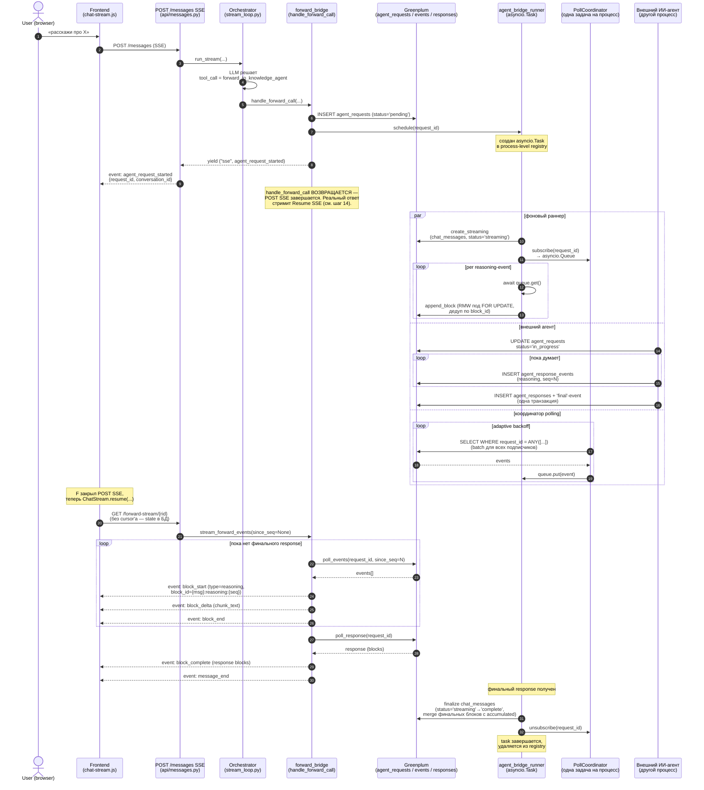
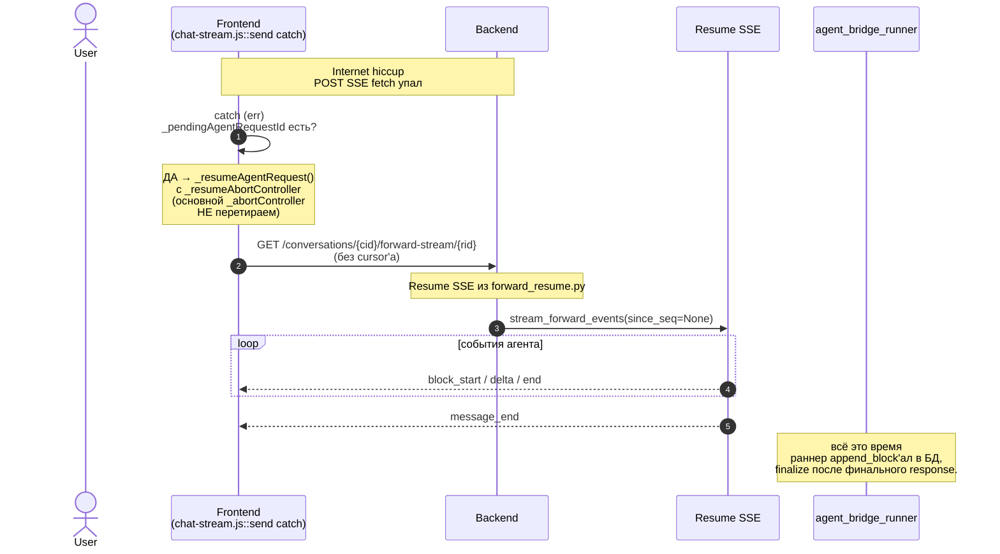

# Forward к внешнему ИИ-агенту — sequence-диаграмма

Документ описывает полный путь от пользовательского сообщения до ответа
внешнего ИИ-агента через мост-таблицы в Greenplum. Покрывает live-сценарий
(пользователь не закрывает вкладку), reload-сценарий (Resume SSE после
перезагрузки страницы) и refresh после обрыва соединения.

См. также:
- [`docs/developer-guide.md §7.8`](developer-guide.md#78-внешний-ии-агент-через-таблицы-бд) — внешний ИИ-агент через таблицы БД (обзор)
- [`docs/developer-guide.md §11.6`](developer-guide.md#116-agent_bridge_runner-и-pollcoordinator-фоновое-сохранение-ассистент-сообщений) — `agent_bridge_runner` + `PollCoordinator` (детали)
- [`docs/developer-guide.md §11.7`](developer-guide.md#117-server-authoritative-state-для-forwardа-chat_messagesstatus) — server-authoritative state и `chat_messages.status`
- [`docs/chat-frontend-architecture.md`](chat-frontend-architecture.md) — frontend SSE-клиент и Resume-стрим

---

## 1. Live-сценарий: пользователь ждёт ответа



**Ключевые контракты:**

- **POST SSE короткий**: эмитит только `agent_request_started` и
  возвращается (≤ 50 мс). Реальный ответ — через Resume SSE. Причина —
  Chrome HTTP/1.1 limit = 6 per-origin connections, долгие POST SSE
  накапливались при переключениях между чатами.
- **Раннер — единственный source of truth** для сохранения
  ассистент-message. Resume SSE только транслирует события, не пишет в БД.
- **PollCoordinator батчит SELECT**: при N параллельных forward'ах
  выполняется ровно один SELECT за тик. См. §11.6.

---

## 2. Reload/switch-сценарий: пользователь перезагрузил вкладку или переключил чат посреди ответа

Phase 1 «D»: state восстанавливается из БД через `GET /messages`, потому что
runner инкрементально пишет reasoning'и в `chat_messages.content` со
`status='streaming'`. Фронт идемпотентно мерджит блоки по `data-block-id`;
курсорная логика во фронте удалена.

```mermaid
sequenceDiagram
    autonumber
    actor U as User
    participant F as Frontend
    participant MSG as GET /messages<br/>(история беседы)
    participant AF as GET /active-forward
    participant FB as Resume SSE<br/>(stream_forward_events)
    participant DB as Greenplum
    participant RUN as agent_bridge_runner<br/>(всё ещё крутится в фоне)

    Note over RUN: runner продолжал append_block<br/>пока юзер был в другом чате/вкладке
    U->>F: Reload вкладки / switch обратно
    F->>MSG: загрузить историю беседы
    MSG->>DB: SELECT chat_messages
    DB-->>MSG: messages (вкл. streaming-сообщение со<br/>всеми накопленными reasoning'ами)
    MSG-->>F: messages [..., {role:'assistant', status:'streaming', content:[N×reasoning]}]

    Note over F: ChatRenderer.appendBlock рисует<br/>reasoning'и из истории;<br/>сообщение со status='streaming'<br/>получает typing-облако.

    F->>AF: GET /active-forward?conversation_id=X
    AF->>DB: SELECT agent_requests<br/>WHERE conversation_id AND status IN<br/>('pending','dispatched','in_progress')
    DB-->>AF: agent_request (still running)
    AF-->>F: {request_id, status, created_at}

    F->>FB: GET /forward-stream/{rid}<br/>(без cursor'а)
    Note over FB: since_seq=None — Resume SSE отдаёт<br/>все события заново, фронт идемпотентно<br/>мерджит по data-block-id (no-op для уже отрисованных)

    loop пока нет финального response
        FB-->>F: block_start (block_id={msg}:reasoning:{seq})
        Note over F: ChatRenderer.appendBlock:<br/>если [data-block-id] уже в DOM →<br/>replaceWith вместо append (no-op для<br/>идентичного контента)
        FB-->>F: block_delta + block_end
    end
    FB->>DB: poll_response(request_id)
    DB-->>FB: финальный response (если уже готов)
    FB-->>F: block_complete + message_end

    RUN->>DB: finalize chat_messages<br/>(status='complete', merge финальных блоков)
```

**Ключевые контракты:**

- `block_id = "{message_id}:reasoning:{seq}"` — детерминированный.
  При одном и том же `(message_id, seq)` фронт получит тот же id, и
  `ChatRenderer.appendBlock` сделает replaceWith вместо append.
- `chat-message-bot--streaming` класс-маркер на корневом `<div>`
  сообщения, рендеримого со `status='streaming'`. `_maybeResumeActiveForward`
  ищет существующий маркированный bubble прежде чем создавать новый,
  `_handleSSEEvent` снимает маркер при первом контентом блоке.
- `_active_streams_per_user` семафор лимитирует **только** POST SSE,
  Resume SSE не учитывается. Иначе при reload счётчик удваивался бы.

---

## 3. Refresh-сценарий: соединение оборвалось без reload

(Например: Wi-Fi-обрыв, TCP timeout, vpn-rotate. Юзер вкладку не
закрывал, но fetch упал.)



---

## 4. Граничные случаи

| Случай | Что произойдёт |
|---|---|
| Раннер уже сохранил response в БД к моменту открытия Resume SSE | Resume SSE прочитает `agent_responses` через `poll_response` и сразу эмитит `block_complete` + `message_end` без polling-петли |
| Раннер упал после `create_streaming` до `finalize` | Reconcile в lifespan (`schedule_pending`, `older_than_sec=30`) подхватит зависший запрос при следующем старте uvicorn. `chat_messages` со `status='streaming'` остаются видимыми в истории; повторный INSERT того же `message_id` ловит `UniqueViolation` → runner продолжает с тем же id |
| Раннер упал между `append_block`'ами | Часть reasoning'ов уже в БД, фронт видит их в истории; runner после restart'а продолжит `append_block` поверх (дедуп по `block_id` гарантирует, что повторные события не задвоятся) |
| Внешний агент сделал retry с тем же `seq` | UNIQUE(request_id, seq) на `agent_response_events` отвергнет дубль на уровне БД (`UniqueViolation`); polling даже не увидит лишнее событие |
| PollCoordinator завис внутри SELECT | Watchdog (`_watchdog_loop`) детектит heartbeat-stale, делает cancel + start нового `_poll_loop`. Подписчики и `since_seqs` сохраняются. Лог `restart_count=N` |
| User отправил два forward'а параллельно в разных вкладках | Каждый получит свой `request_id`. `_active_streams_per_user` семафор лимитирует одновременные POST SSE (default 3). Resume SSE не лимитируется |

---

## 5. Где смотреть в коде

- POST SSE — `app/domains/chat/api/messages.py::send_message`
- Orchestrator stream loop — `app/domains/chat/services/stream_loop.py`
- forward_bridge.handle_forward_call — `app/domains/chat/services/forward_bridge.py`
- forward_stream — `app/domains/chat/services/forward_stream.py`
- Resume SSE — `app/domains/chat/api/forward_resume.py` (`since_seq` параметр оставлен deprecated, игнорируется)
- agent_bridge_runner — `app/domains/chat/services/agent_bridge_runner.py` (фазы: `create_streaming` → `append_block` per event → `finalize`/`mark_failed`)
- MessageRepository streaming-методы — `app/domains/chat/repositories/message_repository.py::create_streaming/append_block/finalize/mark_failed`
- PollCoordinator + watchdog — `app/domains/chat/services/poll_coordinator.py`
- Frontend SSE-клиент — `static/js/shared/chat/chat-stream.js`
- Frontend обработчик событий — `static/js/shared/chat/chat-messages.js`
- Frontend идемпотентный merge — `ChatRenderer.appendBlock` (`static/js/shared/chat/chat-renderer.js`), дедуп по `data-block-id` в DOM
